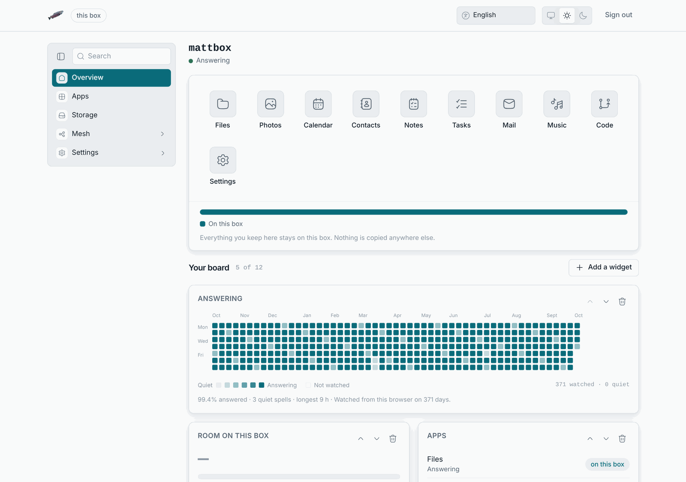

# LosOS handbook

LosOS is a small box for your home or your company. It keeps your files,
photos, calendar and code, and it looks after itself. It has no screen to log
in to, no shell and no SSH. You reach it from a web browser on the same
network, and once a night it rebuilds and restarts itself.

This handbook is the owner's manual, for the person who has the box on their
desk. The people who build LosOS use the
[wiki](https://github.com/dasmatus/losos/wiki).

## Where this handbook is

- **On the box itself**, at `http://<address>/handbook/`, where `<address>`
  is what the box's own screen shows. The box carries the whole handbook with
  its search, so you can read it when the internet is down or when only your
  local network reaches the box. The **About** pane of the admin pages links
  to it.
- **On the web**, at [losos.dasmat.us](https://losos.dasmat.us). The text is
  the same, with a newer date on it.

## Start here

- New box in hand: [What LosOS is](./start/what-is-losos.md), then
  [Install](./start/install.md) and [The first run](./start/first-run.md).
- Deciding how to deploy it: [Types of setup](./types/index.md) lists every shape a
  LosOS installation can take, from one box on a home network to a company
  with its own edge.
- Something is wrong and all you have is the local network:
  [When something goes wrong](./troubleshooting/index.md) is organised by what you see,
  and every page starts with the steps that need nothing but the LAN.
- The box works but something outside it does not, such as the provider, the
  router or the edge: [Only the local network works](./troubleshooting/only-the-lan-works.md)
  says what keeps working, what waits, and that you redo nothing afterwards.

## How to read the addresses

Throughout this handbook `<address>` means the IP address on the box's
screen, such as `192.168.1.23`, and `<name>` means the name you gave the box
when you set it up. The box answers to both `http://<address>` and
`http://<name>.local`. Only computers that resolve mDNS names find the second
one, so the address is always the safe choice. See
[Reaching the box](./start/reaching-the-box.md).
