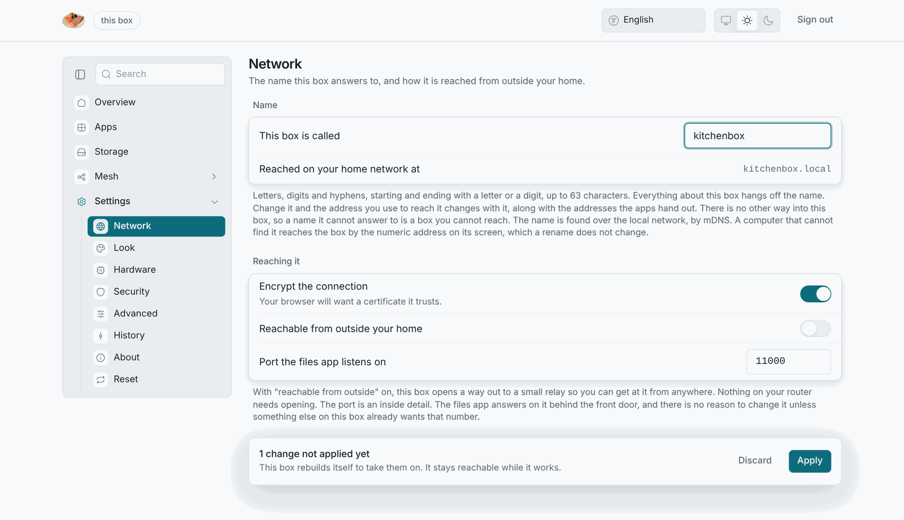
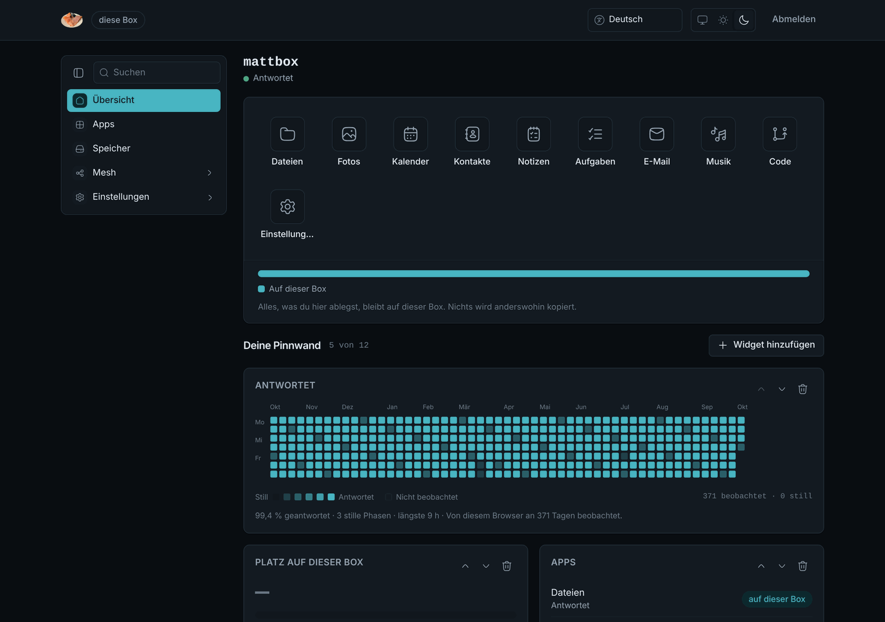

# The admin pages

The admin pages are the box's own web page at `http://<address>/`. They are
reachable from your local network only, even on a box that is published
through an edge, and every tab asks for the owner's password before it shows
anything that can be changed.

## The sections

The sidebar on the left (an icon rail when collapsed, a sheet on a phone)
has five sections.

| Section      | What is there                                                                                              |
| ------------ | ---------------------------------------------------------------------------------------------------------- |
| **Overview** | Whether the box is answering and for how long, the storage card, the app tiles and your board of widgets.  |
| **Apps**     | The apps on this box with their mode, and a search of LosOS cloud's app catalogue.                         |
| **Storage**  | How full the disk is, what is holding the room, and the reserve to claim.                                   |
| **Mesh**     | Joining other boxes, the hours this one lends its spare time, and (greyed out) **Market** with disk sharing. |
| **Settings** | Network, Look, Hardware, Security, Advanced, History, About and Reset, each a pane. A search box filters the panes.             |

 

## Notifications

Short status messages appear at the top right: a change being applied, a
change that took, a widget added. A message that needs an answer (reset the
box? use the reserve?) opens a dialog instead, with the safe choice first.

## Theme and language

The bar at the top switches between English, Slovak and German, and between
"match the browser", light and dark. Both are kept in this
browser.

## Sign out

**Sign out** forgets the admin key in this tab. The tab was unlocked only
until it was closed anyway; see
[Sign-in and the spare key](sign-in-and-spare-key).

## What the admin pages cannot do

There is no file browser (that is LosOS cloud), no terminal and no log
viewer. The box has no shell, so neither do the pages. What the box reports
about itself, it reports through the Overview, the Storage pane and the
About pane; when those are not enough, [When something goes wrong](../troubleshooting)
says what else there is.
