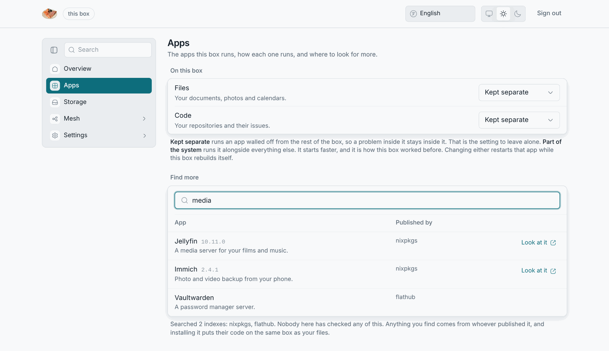

# The apps

## LosOS cloud

Your files, photos, calendar, contacts, notes, tasks, mail and music, at
`http://<address>/nextcloud`. It is Nextcloud wearing the box's colours and
name. Sign in with the owner's password. Everything Nextcloud can do, LosOS
cloud can: the desktop client syncs a folder on your computer, the phone apps
upload photos, calendars and contacts sync over CalDAV and CardDAV.

The Overview's **app tiles** open each of these directly. They go through
`index.php` on purpose, which every configuration answers.

Accounts for family or colleagues are made inside LosOS cloud (Users), not
on the admin pages; only the owner's account unlocks the admin pages.

## LosOS Git

Your repositories, at `http://<address>/forgejo/`. It is Forgejo in the same
colours. Sign up inside it the first time; its accounts are its own. Clone
URLs use the box's name, so a computer that does not resolve `.local` should
use the address instead. Turn it off in the **Apps** pane if the box is not
for code.

### Federation

LosOS Git speaks ActivityPub with other Forgejo servers (Forgejo still calls
this experimental): stars given to your repositories from another server are
counted here, people on other servers can follow an account on your box and
see what it does, and the box answers the fediverse's discovery address,
`/.well-known/nodeinfo`. How far that reaches is how far the box is reachable:
through an [edge](../types/official-edge) it is the internet, on a box that
is only on your local network it is other boxes on that network. The box never
publishes how many accounts it has or how active they are.

To take part, a repository's **Settings → Federation** page lists the other
servers whose stars count. Turn the whole thing off with
`losos.forgejo.federation.enable` on the **Advanced** pane.

## The Apps pane

For each app: whether it is on, which [mode](../types/app-modes) it runs in,
and a link. Below that, **Find more** searches LosOS cloud's app catalogue
(the box fetches the catalogue; the search needs the internet). An app you
like is installed from inside LosOS cloud, by its owner account.

## Trusted addresses

LosOS cloud answers on the box's name and on whichever address the request
arrived at (the box tells it, per request), and never on a wildcard. That is
why a box reached by its IP address works without an "untrusted domain" page;
if you ever see one, [Untrusted domain](../troubleshooting/app-tile-404#access-through-untrusted-domain)
says why.
