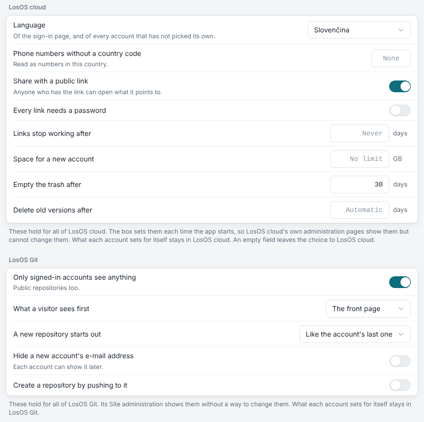
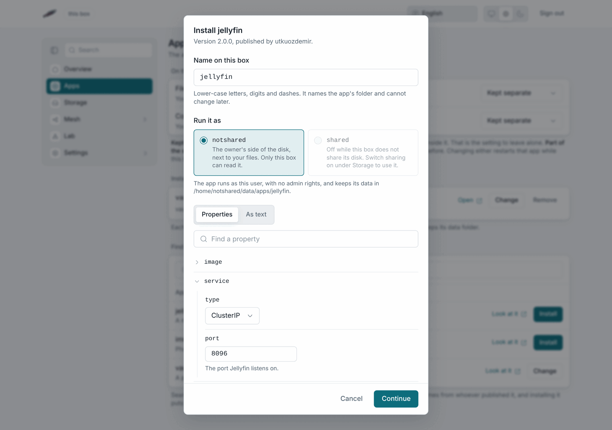

# The apps

## LosOS cloud

Your files, photos, calendar, contacts, notes, tasks, music and the rest of
the apps below, at `http://<address>/nextcloud`. It is Nextcloud with the box's colours and
name. Sign in with the owner's password. LosOS cloud does everything
Nextcloud does. The desktop client syncs a folder on your computer, the phone
apps upload photos, and calendars and contacts sync over CalDAV and CardDAV.

The Overview has a tile for each app in LosOS cloud's own menu, in the same
order: Files, Dashboard, Photos, Activity, Contacts, Calendar, Notes,
Bookmarks, Deck, Music, Collectives, Polls, Forms, Tables, Memories, News,
Tasks and Maps. The box turns all of them on at every start. Mail is not
among them, because the box runs no mail server for it to read. If you
install Mail from the App Store anyway, its tile appears on the Overview the
next time the page loads. The links go through `index.php` on purpose,
because every configuration answers that path.

You make accounts for family or colleagues inside LosOS cloud, under Users,
not on the admin pages. Only the owner's account unlocks the admin pages.

## LosOS Git

Your repositories, at `http://<address>/forgejo/`. It is Forgejo in the same
colours. Sign up inside it the first time. It keeps its own accounts. Clone
URLs use the box's name, so a computer that does not resolve `.local` should
use the address instead. Turn it off in the **Apps** pane if the box is not
for code.

### Federation

LosOS Git speaks ActivityPub with other Forgejo servers. Forgejo still calls
this experimental. Stars that people on another server give your repositories
count here. People on other servers can follow an account on your box and see
what it does. The box also answers the fediverse's discovery address,
`/.well-known/nodeinfo`. All of this reaches as far as the box does. Through
an [edge](../types/official-edge) that is the internet. On a box that is only
on your local network, it is the other boxes on that network. The box never
publishes how many accounts it has or how active they are.

To take part, list the other servers whose stars count on a repository's
**Settings → Federation** page. To turn federation off entirely, use
`losos.forgejo.federation.enable` on the **Advanced** pane.

LosOS cloud federates too: you can share files and calendars with people
whose accounts are on other Nextcloud servers, by their `user@server`
address. `losos.nextcloud.federation.enable` turns that off.

Both kinds of federation work only while the box shares its disk
(`losos.sharingMyStorage`), because that is when the shared part of the
disk is unlocked. With sharing off, the box talks to no other server, and
the **Advanced** pane shows both federation switches as unavailable.

## The Apps pane

For each app the pane shows whether it is on, which
[mode](../types/app-modes) it runs in, and a link. Below that, **Find more**
searches [Artifact Hub](https://artifacthub.io) for Helm charts. The box
fetches the results, so the search needs the internet. Every row names who
published the chart. Nobody on the LosOS side has checked any of them.

## Settings for everyone

Under the two apps, the Apps pane has the settings that hold for every
account in LosOS cloud and LosOS Git. You would otherwise find them on each
app's own administration pages.

For LosOS cloud: the language of the sign-in page and of accounts that have
not picked one, the country a phone number without a country code belongs
to, whether files can be shared by public link, whether every link needs a
password, after how many days links stop working, how much space a new
account gets, and how long the trash and old versions are kept. An empty
field leaves the choice to LosOS cloud.

For LosOS Git: whether only signed-in accounts see anything, what a visitor
sees first, whether a new repository starts private or public or like the
account's last one, whether a new account's e-mail address is hidden, and
whether pushing to a repository that does not exist yet creates it.

Press **Apply** to use them, like every other setting. The box sets them
again each time the app starts, so the apps' own administration pages show
these values but cannot change them. Each account's own settings, the
account list and anything not on the pane stay in the app.

## Installing an app from the search

A row the box can fetch has an **Install** button. It opens a dialog in
two steps.

The first step reads the chart and shows three things.

- **Name on this box.** It starts as the chart's name. It also names the
  app's folder, so it cannot change later.
- **Run it as.** `notshared` or `shared`, the box's two users. A
  `notshared` app keeps its data on the owner's side of the disk, next to
  your files. A `shared` app keeps it on the side the box lends to the
  mesh. The dialog greys `shared` out while the box does not share its disk.
- **Properties.** Every setting in the chart's values file, with its
  default, folded by section. When the chart ships a schema, each setting
  also gets its description and its choices. **As text** shows the whole
  values file to edit instead. A property you change on the form wins over
  the same line in the text.

The second step asks once more. It says that the box will download and run
code the publisher wrote, as the user you chose, with no admin rights. The
box gets nothing until you press **Install** there.

The box then installs the chart into its own cluster and changes it to run
the way LosOS cloud and LosOS Git do.

- Every part of the app runs as the chosen user, never as root, with no
  extra privileges and no access to the cluster.
- The storage the chart asks for becomes folders under
  `/home/<user>/data/apps/<name>`.
- The app gets one port of its own from `losos.apps.ports`, 30000 to 30099
  by default, and only your local network can reach it.

The box refuses a chart that needs more than that and says why. Typical
reasons are admin rights, a port below 1024, a port another app already
uses, or a folder of the system. An app built from several services that
call each other by name may not start, because the box's own cluster has
no internal network.

**Installed apps**, above the search, lists each app with its state.
**Open** goes to the app's port on the address you are using. **Change**
opens the same dialog on the app's current properties. **Remove** asks
first, then takes the app off the box. Its data folder stays, so an install
under the same name finds the data again.

The search offers installs only while Files or Code is set to **Kept
separate**, which is [workload mode](../types/app-modes). The box's own
cluster runs only then. To turn installing off, set `losos.apps.enable` to
false on the **Advanced** pane.

## Trusted addresses

LosOS cloud answers on the box's name and on whichever address the request
arrived at. The box passes that address along with each request. LosOS cloud
never answers on a wildcard. That is why a box reached by its IP address
shows no "untrusted domain" page. If you ever see one, [Untrusted domain](../troubleshooting/app-tile-404#access-through-untrusted-domain)
says why.
