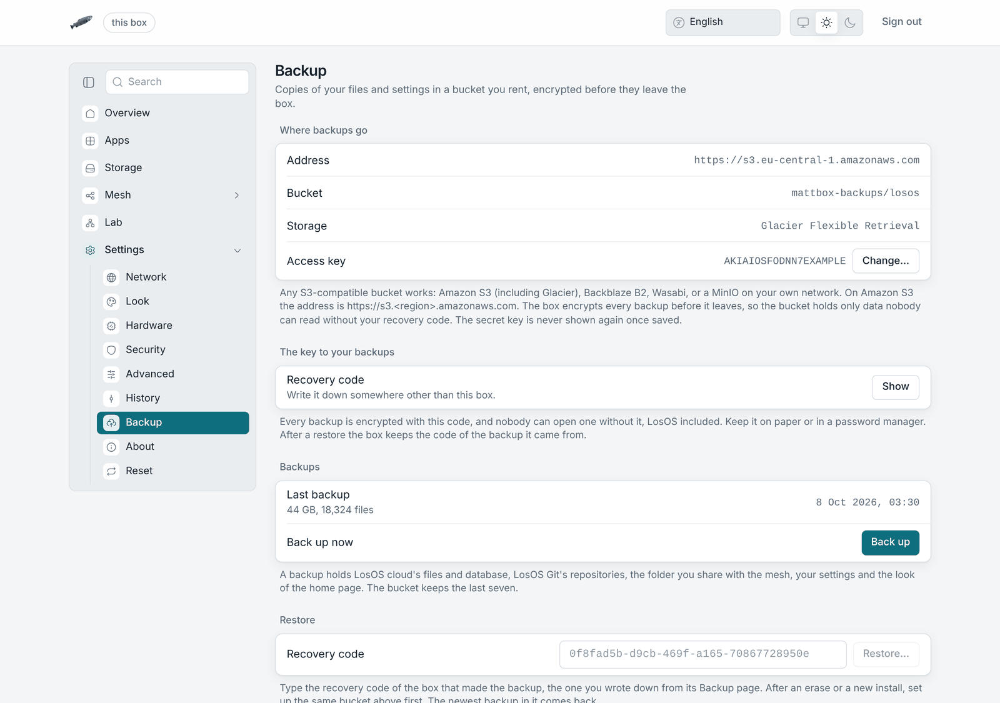
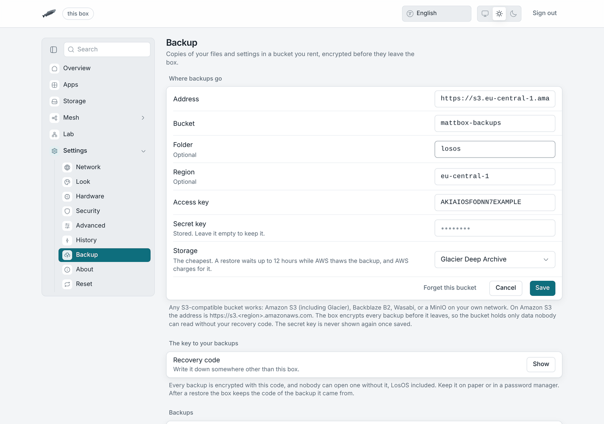
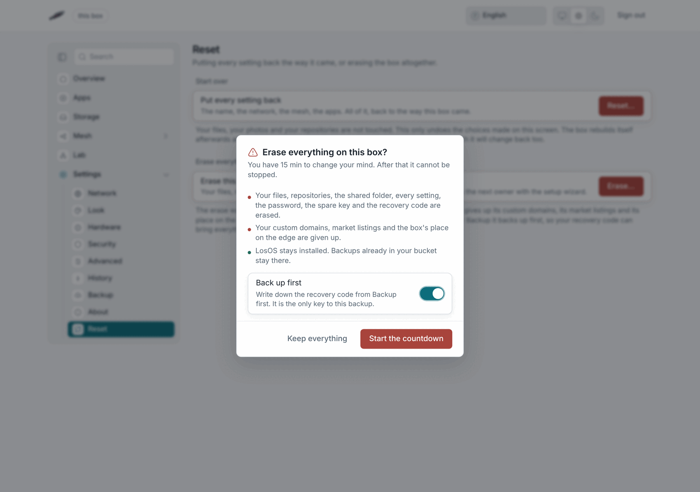
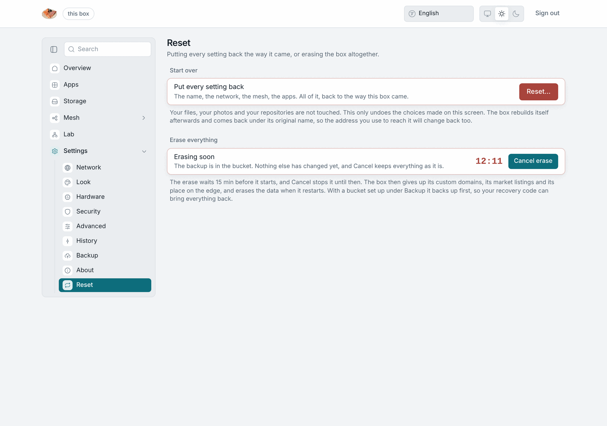

# Backup and erase

A box can copy everything it holds to a storage bucket you rent, and it can
erase itself completely. The two work together: back up, erase, and the
recovery code brings it all back, on the same box or on a new one.

## The bucket

**Settings → Backup** takes any S3-compatible bucket: Amazon S3 (Glacier
included), Backblaze B2, Wasabi, Cloudflare R2, or a MinIO on your own
network. You need five things from the provider:

- the **address**, such as `https://s3.eu-central-1.amazonaws.com`;
- the **bucket** name;
- a **folder** inside it, if you want one;
- the **region**, if the provider asks for one;
- an **access key** and its **secret key**, allowed to read and write that
  bucket.

The address must start with `https://`. Plain `http://` is accepted only for
an address on your own network, such as a NAS. Once saved, the secret key is
never shown again. To change the bucket later, leave the secret field empty
and the stored one is kept.

### Glacier on Amazon S3

With an Amazon S3 address (`https://s3.<region>.amazonaws.com`), **Storage**
puts the backups in one of the Glacier storage classes. They cost less to keep
and more to read back:

| Storage | A restore starts | Good for |
|---|---|---|
| Standard | at once | backups you may need any day |
| Glacier Instant Retrieval | at once, AWS charges per read | a cheaper copy you rarely read |
| Glacier Flexible Retrieval | after 3 to 5 hours | a copy for when the box is gone |
| Glacier Deep Archive | after up to 12 hours | the cheapest copy, for the worst day |

Only the files go into Glacier. The small index that lists the backups stays
in Standard, so the box can still check a recovery code and tidy old backups
at once. With Flexible Retrieval and Deep Archive a restore first asks AWS to
thaw the backup and waits; LosOS cloud and LosOS Git keep running until the
files come back. AWS charges for the thaw, and Glacier classes also have a
minimum storage time, so a backup tidied away early is still billed for it.

Choose the class here rather than with a lifecycle rule on the bucket. A rule
over the whole bucket moves the index into Glacier too, and then no backup
can be listed or opened until AWS thaws it.

## The recovery code

Every backup is encrypted on the box before it leaves, with the box's
**recovery code** as the key. The bucket's owner sees only data that cannot
be read without it, and nobody can open a backup without the code, LosOS
included. **Show** under *The key to your backups* displays it. Write it down
somewhere other than the box.

## What a backup holds

- LosOS cloud's files;
- LosOS Git's repositories;
- the databases of both;
- the folder the box shares with the mesh, if sharing is on (it is opened for
  the copy and locked again afterwards);
- every setting, and the look of the home page.

Thumbnails LosOS cloud can draw again are left out. **Back up now** starts a
backup. The first one copies everything; later ones send only what changed.
The bucket keeps the last seven.

## Restoring

Under **Restore**, type the recovery code of the box that made the backup and
press **Restore…**. The newest backup in the bucket comes back:

- what is on the box now is replaced by what is in the backup;
- LosOS cloud and LosOS Git stop while the files are put back, then start
  again. From Glacier Flexible Retrieval or Deep Archive the backup is
  thawed first, which takes hours;
- the settings in the backup are applied, which rebuilds the box;
- the box keeps the code you typed from then on, so its next backup goes to
  the same place.

Sign in afterwards with the password you had when the backup was made. A
wrong code fails with "the recovery code does not open this backup", and
nothing on the box changes.

On a box that was erased or installed again, run the wizard first, then set
up the same bucket under Backup and restore from there.

## Erasing the box

**Settings → Reset → Erase…** deletes the owner's data, not only the
settings: files, repositories, the shared folder, every setting, the
password, the spare key and the recovery code. LosOS stays installed, and the
box greets the next person with the setup wizard.

In order, the box:

1. backs up to the bucket first, if **Back up first** is on. A failed backup
   stops the erase and nothing is deleted;
2. counts down, fifteen minutes unless `losos.reset.graceMinutes` on the
   Advanced pane says otherwise.
   **Cancel erase** stops everything until the countdown ends, and nothing
   has changed by then;
3. gives up what it holds outside itself: its custom domains, its market
   listings and its place on the edge;
4. puts every setting back, restarts, and deletes the data early in the next
   start, before any app is running.

From step 3 on, the erase cannot be stopped. A step the edge does not
confirm is noted and the erase carries on. After the restart, Settings →
Reset shows what the last erase gave up, as counts, and says when the edge
did not confirm a step.

Backups already in the bucket stay there. The erase never touches the
bucket.

## Erase, reset or reinstall

| | Settings | Files and repositories | Password and codes | Outside the box |
|---|---|---|---|---|
| **Reset** | back to defaults | kept | kept | kept |
| **Erase** | back to defaults | deleted | deleted | given up |
| **Reinstall** | back to defaults | deleted | deleted | left as they were |

[Reset and reinstall](./reset-and-reinstall) covers the other two.
