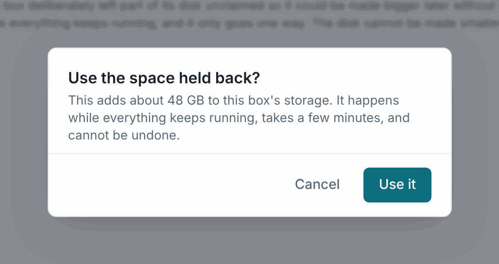
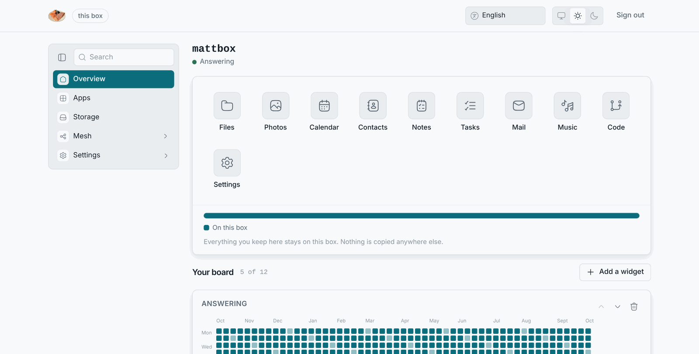

# Disk growth

The installer leaves 10 % of the disk unused on purpose. The box keeps its
own software on the same encrypted volume as your files, and that software
grows with every update. A volume that could never grow would one day fill
up, on a box where nobody can open a shell.

## Claiming the reserve

**Storage pane → Use the reserve.** A dialog says how much this adds. The
box grows the volume, the encryption layer and the filesystem, in that order.
Nothing stops and nothing is unmounted. The pane's capacity meter shows the
reserve as a hatched slice until you claim it.




Once the reserve is used up, the button says there is nothing left to claim.

## Adding a disk

A box is one volume group across every fixed disk the installer found. To add
a disk later, you add it to that group and grow again. That needs the
box's command line, which only exists on the installer medium:

```sh
pvcreate /dev/sdX && vgextend persist-vg /dev/sdX && losos-ctl grow
```

It is a job for whoever maintains the box, not an owner's button. For most
people a full reinstall with the new disk in place is simpler. Back up first,
because the installer wipes everything.

## Running out of room

The Overview shows **Almost full** and then **Out of room**. A full disk
stops LosOS cloud from accepting uploads. Worse, it can stop the nightly
rebuild. [Out of room](../troubleshooting/out-of-room) has the steps.


