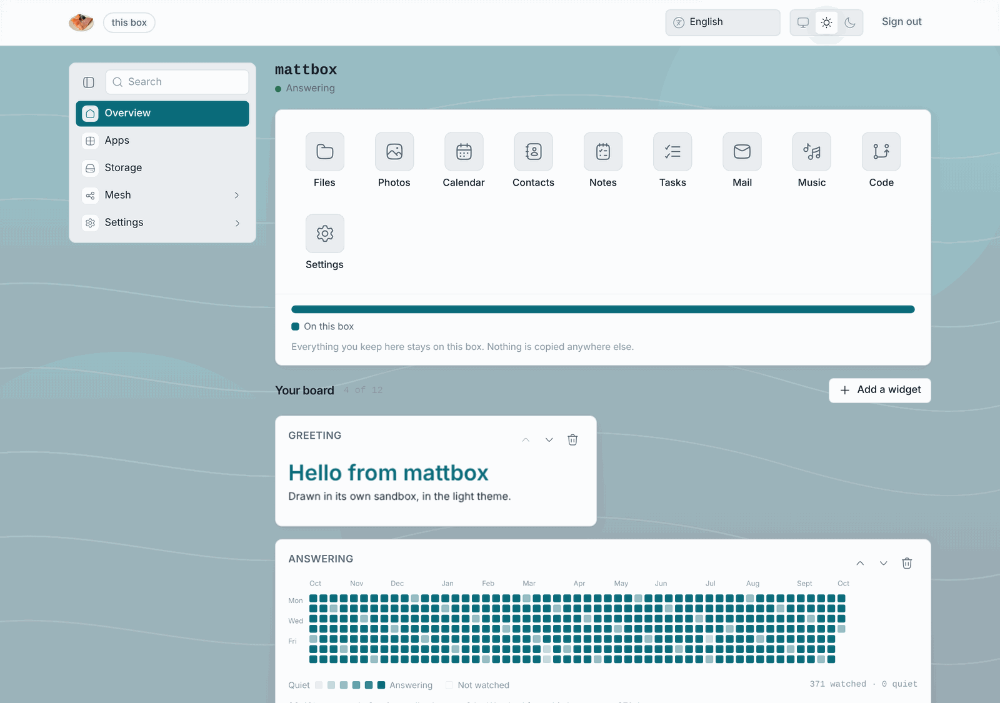
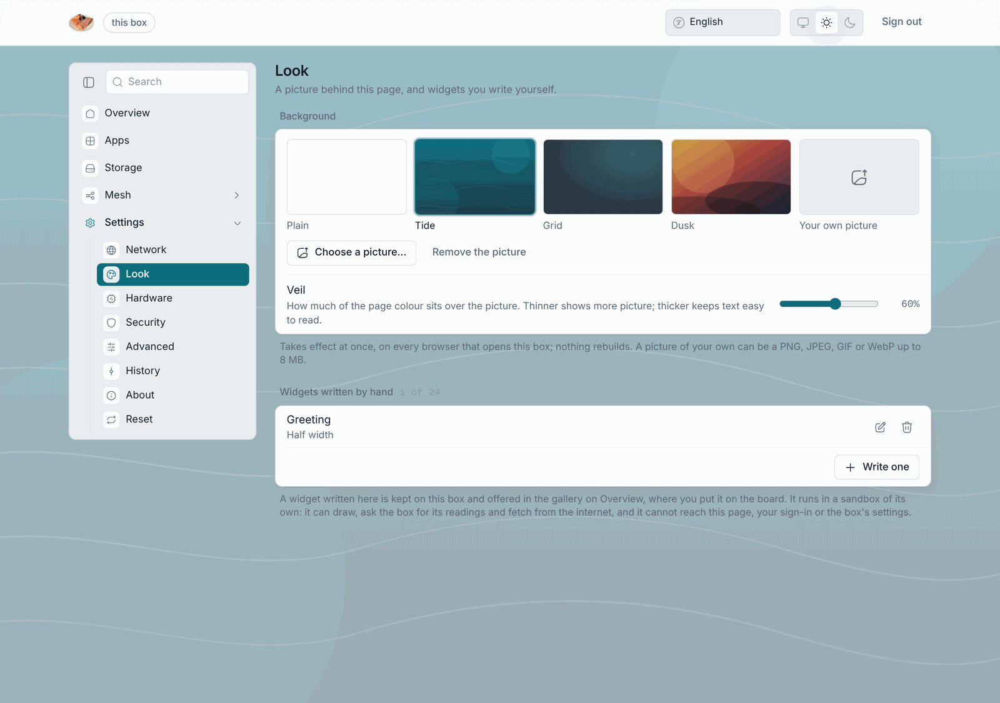
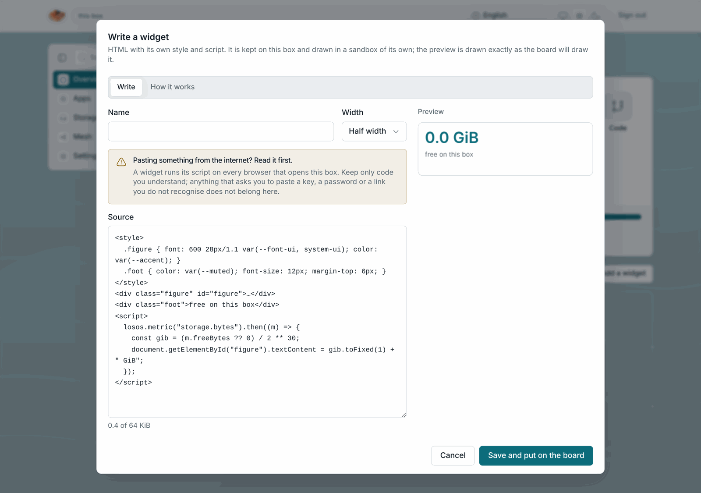

# Look and widgets

## Your board

The Overview's board holds up to a handful of widgets. **Add a widget** opens
the gallery with the three [widget types](../types/widget-types). Each tile
can be moved earlier or later and removed; a widget that fails shows the
error in the tile with **Try again**. The board belongs to the browser you
arranged it in: another computer sees its own board. Adding a built-in or a
widget built from readings changes nothing on the box and starts nothing
running.

## Settings → Look

Changes how the admin pages look, for every browser that opens the box, and
takes effect the moment it is saved; no rebuild.

- **Background**: one of three shipped pictures (Tide, Grid, Dusk), an
  upload of your own (PNG, JPEG, WebP, GIF or SVG, up to 8 MiB), or Plain.
- **Veil**: lays the page colour over the picture, from 20 % to 90 %, so
  text stays readable in the light and the dark theme.
- **Widgets written by hand**: the list of hand-written widgets kept on this
  box, each editable and deletable.

## Writing a widget

**Write one** in the gallery (or the Look pane) opens an editor with Source,
a live preview and a Help tab. The preview is the real sandboxed frame. The
widget gets the box's readings and colours through the `losos` object listed
on the [widget types](../types/widget-types#written-by-hand) page, and
nothing else: no admin key, no API, no access to the page around it. It may
fetch the internet.

Because it runs in every browser that opens the box, read anything pasted
from the internet before you keep it, as the note above Source says.

