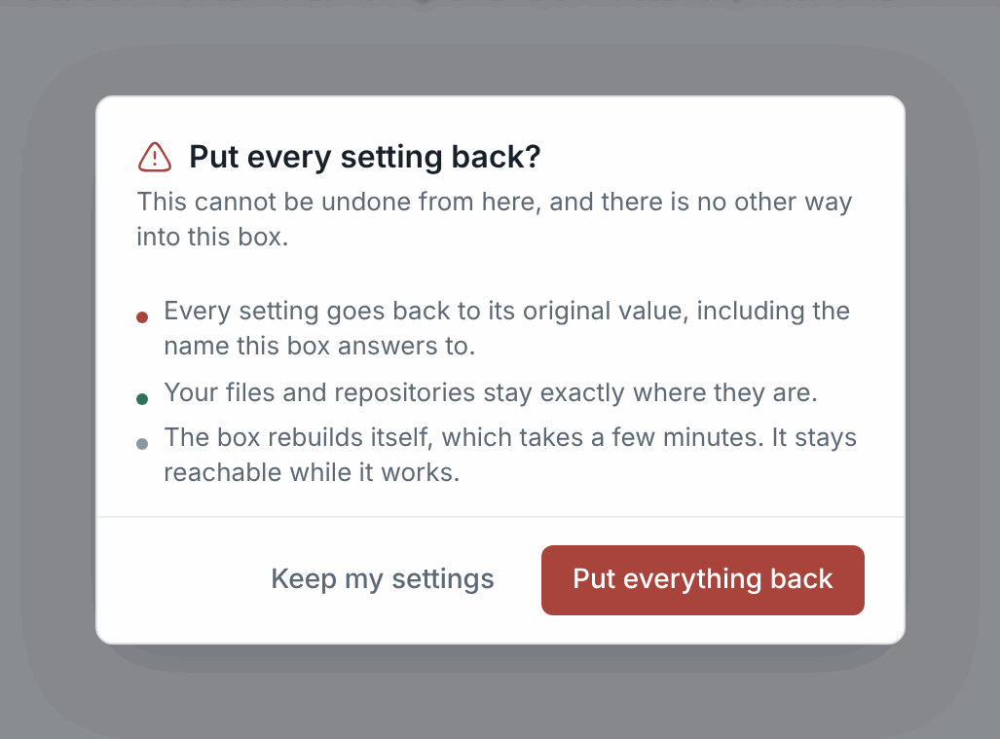
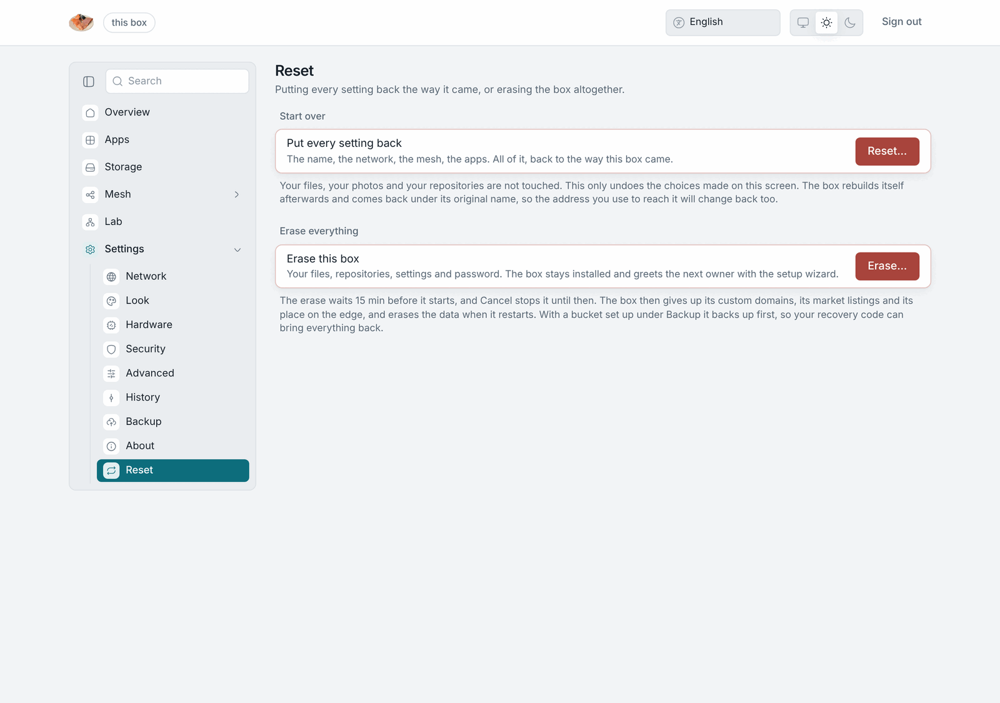

# Reset and reinstall

Reset and reinstall are different things, done from different places.

## Reset: put every setting back

**Settings → Reset → Reset…** puts every setting back the way the box came:
the name, the network, the mesh, the apps. It does not touch your files,
photos or repositories. The box rebuilds itself and comes back under its
original name, so the name you reach it by changes back too. The IP address
stays the same. The dialog lists what goes and what stays, and you have to
press a second time.

A reset does not change the owner's password or the spare key, and does not
re-open the claim window.

To delete the data as well, use **Erase…** below it on the same screen.
[Backup and erase](./backup-and-erase) explains it, and how a backup brings
everything back afterwards.

## Reinstall: wipe and start over

Booting the installer stick again installs from scratch. It **wipes every
disk**, including your files, the password, the spare key, the box's
identity in the mesh and its keys. There is no "keep my data" option, by
design. The box is one copy, and your other copy is where your data is safe.

After a reinstall the box is a new box. Run the wizard again, print a new
spare key and trust the new certificate. With an edge, have the box enrolled
again under its new identity.

## What a reinstall does not need

A machine that boots the installer stick. That is all. The only thing to keep
is the box's firmware settings: Secure Boot off for the installed box, or the
LosOS certificate enrolled for the stick. [Secure Boot](../start/secure-boot)
explains both.
