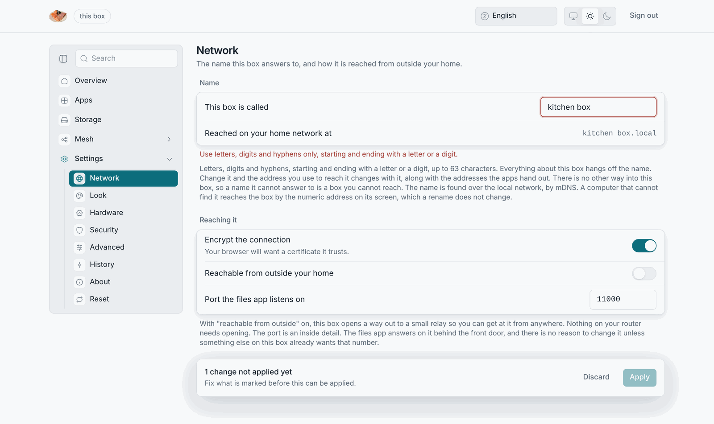
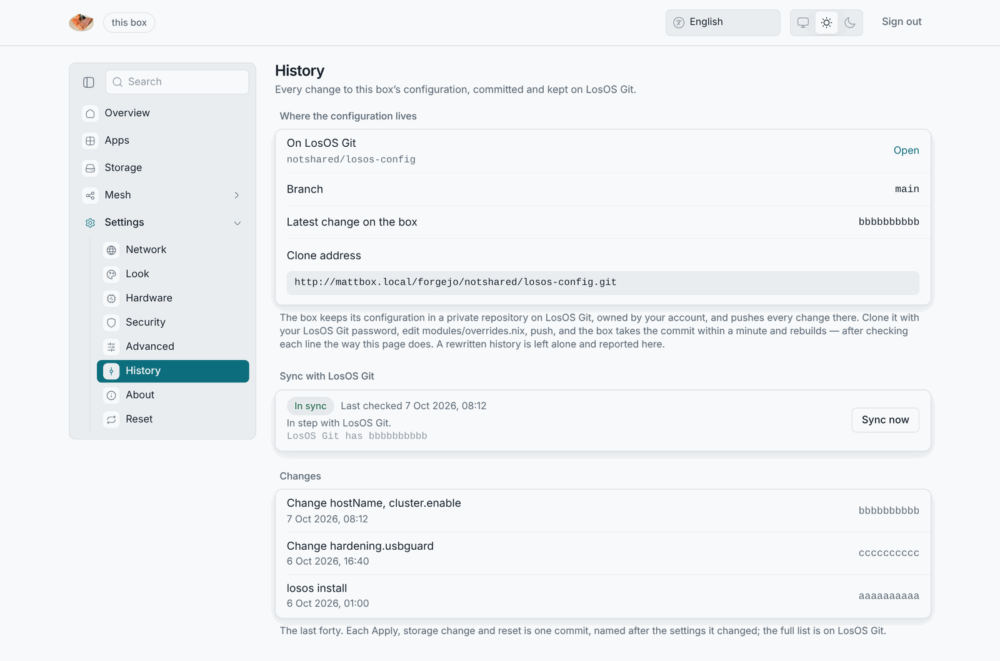

# Settings and Apply

A LosOS box has no settings in the usual sense. It has a description of
itself, written in Nix, and the settings panes edit a small part of it.
Applying a change rebuilds the box from the new description. That is why:

- A change takes a rebuild of a few minutes, not a restart. The box stays
  reachable while it works, and a notification says when it is done.
- A change either takes completely or not at all. A rebuild that fails
  leaves the box running its previous settings.
- Every box can be rebuilt from the LosOS source plus one file that holds
  its choices, `modules/overrides.nix`. The next save resets any setting the
  panes do not write.

## The apply bar

Edit any field and a bar appears at the bottom: *N changes not applied
yet*, with **Discard** and **Apply**. The page marks a field that fails its
check, such as a name with a space or a port out of range, and Apply waits
until you fix it. Nothing reaches the box until you press Apply.

## What Apply does

1. The box writes your choices into its overrides file.
2. It starts a rebuild as a background job (`losos-rebuild-<job>`). The
   Overview's **Changes** widget lists these jobs and whether each one took.
3. The box switches to the new system. Some changes restart the box's control
   daemon part way through. The daemon picks the job back up by itself.
4. A notification says *Changes applied* or *The changes could not be
   applied* with the reason the box gave.

## Two settings that change the address

- **Name**: the box answers to `<name>.local`, and the apps hand out links on
  that name. After a rename, reach the box at the new name or at its IP
  address, which does not change.
- **Encrypt the connection**: turned off, the box speaks plain HTTP only, and
  the certificate step and passkeys go with it.

## Settings that are not Nix

Two things on the admin pages take effect at once, without a rebuild,
because they are documents the box keeps rather than parts of its
description:

- **Look**, meaning the background picture, the veil and hand-written
  widgets. The box's control daemon keeps it, so every browser sees the same.
- **Your board** of widgets. The browser you arranged it in keeps it.

## The full list

The [settings-to-options table](../reference/settings-to-options) maps every
pane field to the Nix option behind it, for the day you want to change
something the panes do not offer.

