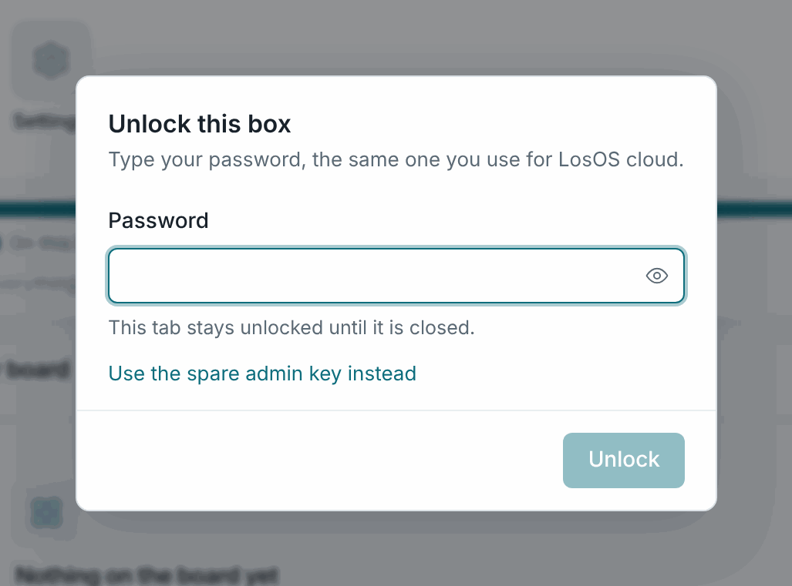
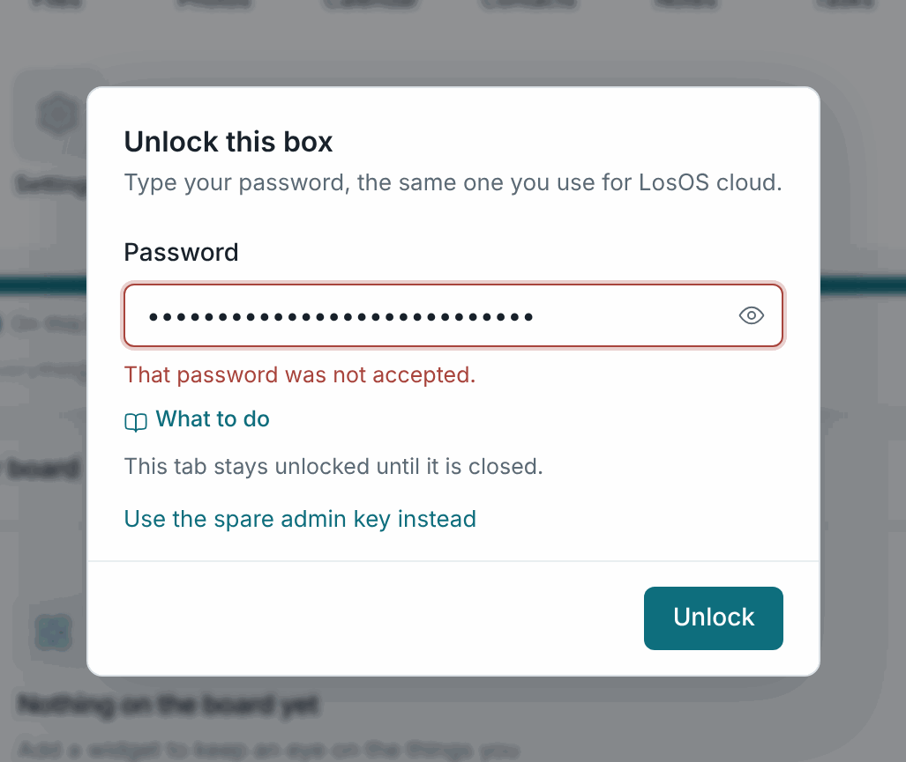
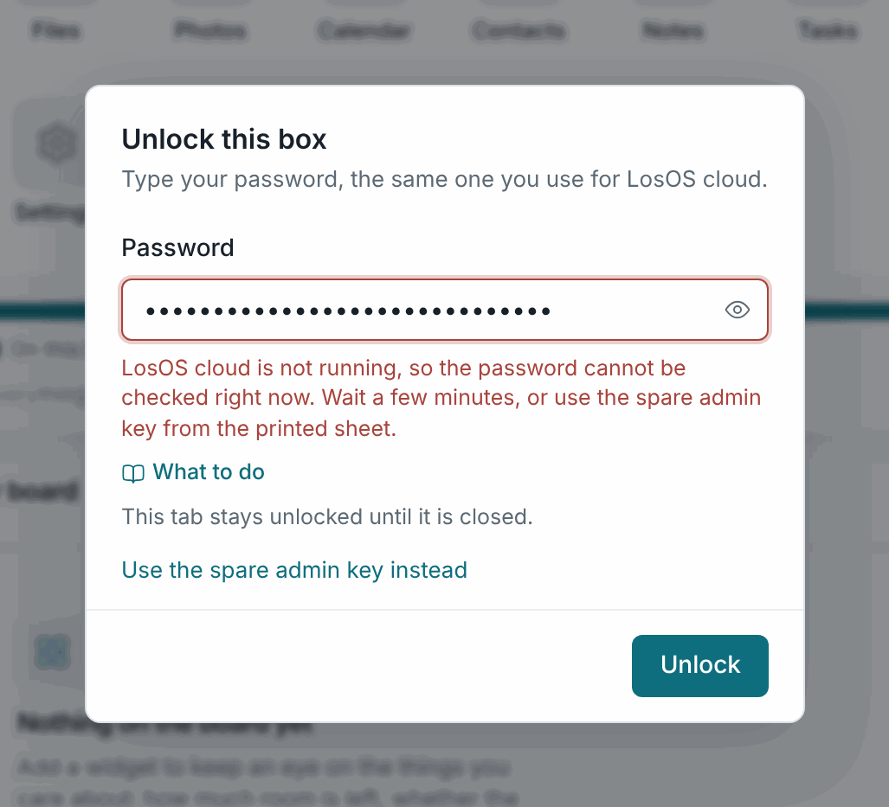

# Sign-in and the spare key

A box has one password and one spare key.

## The password

The password set in the wizard is the owner's password for LosOS cloud. It
also unlocks the admin pages. When you open them, a dialog titled **Unlock
this box** asks for it, and the box has LosOS cloud check it over its own
loopback connection. The box keeps no second copy. Change the password in
LosOS cloud, under Settings → Personal → Security, and the admin pages take
the new one at once.

A new password needs at least 12 characters, a lower-case letter, an
upper-case letter, a digit and a symbol. A password set before that rule
existed still signs in.

The tab stays unlocked until you close it. After ten wrong attempts from one
computer, the box locks that computer out. The lockout starts at one second
and doubles, up to five minutes.

## The spare admin key

What actually unlocks the admin pages is a 64-character key the box made on
its first start. The password is how you get it. The wizard showed you that
key once, after you set the password, with **Copy** and **Print** buttons.
It is the spare for the one case the password cannot cover. When LosOS cloud
is not running, nothing can check the password. The unlock dialog then says
so and offers **Use the spare admin key instead**.

Keep the printed sheet away from the box. Anyone with the key can change
every setting, which amounts to root. The box cannot show the key again or
rotate it, because it has no shell. If you lose the password *and* the spare
key, you have to reinstall from the stick, which wipes the disk.

## Passkeys

Once the certificate is installed and you connect over HTTPS, the wizard and
LosOS cloud offer a passkey. A phone or laptop then signs in with its own
unlock instead of the password. A passkey is not a second spare key. LosOS
cloud checks it the same way it checks the password.

## The claim window

A fresh box has no owner. The first browser on the LAN to finish the wizard
becomes the owner and the window closes. So run the wizard soon after the
install, on a network you trust. Nothing outside the LAN can claim a box, and
only a reinstall lets anyone claim it again.
