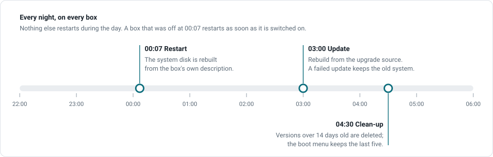
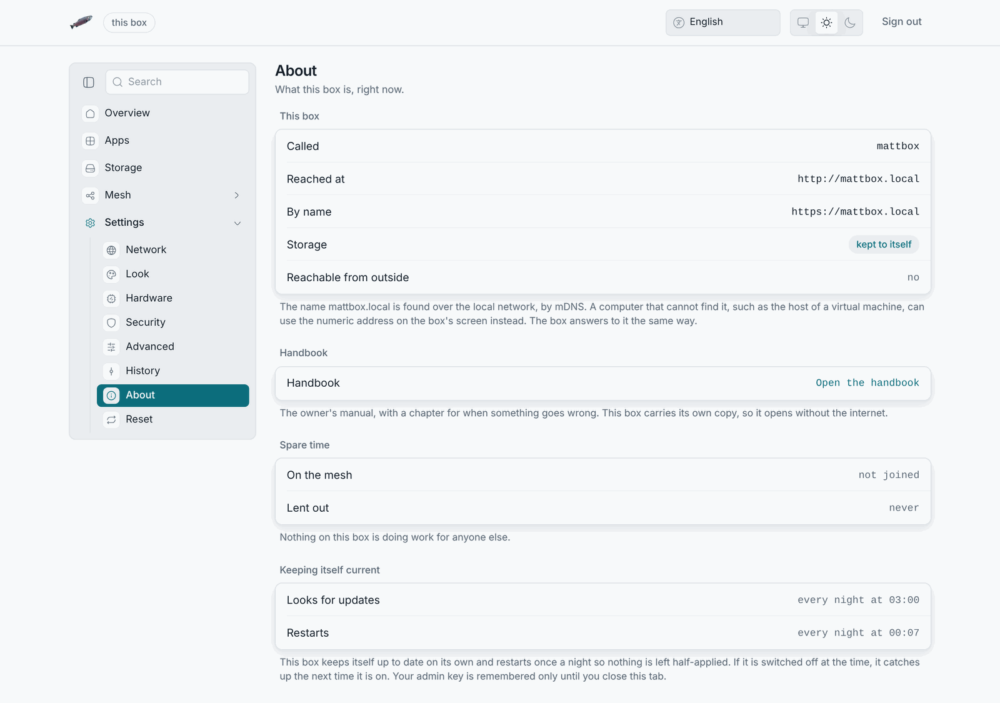

# Updates and reboots

Two timers run on every box. The About pane shows both.

| Time      | What                                                                                                                                     |
| --------- | ---------------------------------------------------------------------------------------------------------------------------------------- |
| **00:07** | **Restart.** Unconditional. The system disk starts blank and the box builds it again from its description, so this restart is how the box repairs itself. A box that was off at 00:07 restarts as soon as it is on. |
| **03:00** | **Update.** The box rebuilds itself from its upgrade source. With the default source it only re-applies its own description. With a published source, a `github:` address, it also fetches new software. |
| **04:30** | **Clean-up.** The box deletes system versions older than 14 days, and the boot menu keeps the last five. That stops the disk and the boot partition from filling up. |

## What survives

Only what is on a short list: your files and LosOS Git's data, the system's
own store, the settings you chose, the box's keys and identity, the mesh
membership. Everything else is gone at 00:07. The
[reference page](../reference/what-survives-a-reboot) has the list.

## While it works

A box stays reachable while it applies an update or a change. The apps keep
answering until the box switches to the new system, which takes seconds. If
an update fails, the previous system keeps running and the box tries again
the next night.

## Choosing the upgrade source

The upgrade source is the Nix setting `losos.upgradeFlakeUri`, and no pane
offers it. The default, the box's own copy of its description, never changes
the software. Point it at the project's GitHub repository,
`github:dasmatus/losos#install`, and the 03:00 run pulls new versions. A
company can point it at a fork. Keep the `#install` suffix. Without it the
rebuild fails every night, and nothing tells you.

A remote source still uses this box's own disk list, firmware mode, unlock
mode and settings. The box reads those from itself, not from the repository.

## When the box is off

Nothing happens, and nothing is lost. Switch it on and it boots, restarts
if it missed a midnight, and updates at the next 03:00.
