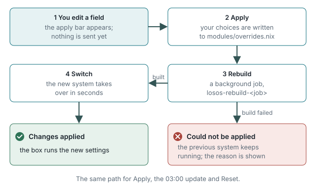
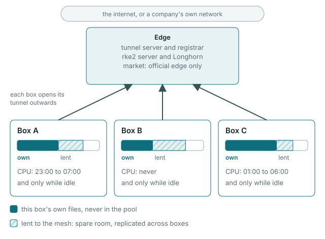

# Architecture

Requirement 1: *design an OS architecture for mesh storage.* This is the
design, from the outside in.

## The idea

Many small boxes, each owned by someone, each holding its owner's files,
each with spare room and spare time. An **edge** server ties the boxes of one
group into a **mesh**: a replicated storage pool across their spare disks and
a scheduler for their spare CPU, both used only within what each owner
allows. The owner's own files never enter the pool; the pool is made of what
the owner is not using.

## The box

Six decisions carry the design:

1. **Stateless root.** The system disk is a RAM filesystem rebuilt from a
   declarative description (NixOS) on every boot. Only a listed set of
   directories survives, on an encrypted volume. The box therefore has no
   configuration drift and no need for a shell: a restart is the repair.
2. **Two accounts, two data domains.** `notshared` owns the owner's files;
   `shared` owns the mesh's copies, in a directory encrypted with its own
   key that is loaded only while sharing is on. Neither can read the other.
3. **Two clusters.** The box's own apps run in its own Kubernetes cluster
   (k3s, no network plugin, pods on the host's network). The mesh is a
   *different* cluster (rke2, agent on the box, server on the edge), so an
   edge outage never takes the owner's apps down, in particular not across
   the unconditional midnight restart.
4. **One front door.** nginx holds the only public ports and routes by path.
   The admin surface is guarded by source address and a strict
   content-security policy; the apps are reachable from anywhere the box is.
5. **A root daemon with a typed API.** `lososd` owns the box's state,
   exposes one method per operation on the system bus and a loopback JSON
   API, runs rebuilds as transient units and re-attaches to them after its
   own restart. The command layer is written against an interface with a
   real and an in-memory implementation, so the state machine is tested
   without a filesystem.
6. **Everything is a rebuild.** Settings, updates and resets all go through
   the same path: write the description, build the system, switch. The
   failure mode is uniform (the previous system keeps running) and the
   nightly update is the same code path owners exercise by hand.

## The mesh

- **Storage**: Longhorn on the edge's cluster replicates volumes across the
  boxes that share room. A box shares only the room it is not using, in its
  `shared` domain; stopping sharing withdraws the node and its copies are
  re-replicated elsewhere.
- **Compute**: the edge taints each node outside its owner's window or while
  the box is busy, so other people's pods run only inside the hours the
  owner chose, on an idle box. The window is evaluated in the box's own time
  zone, on the edge, per node.
- **Gating**: a box with no reachable edge refuses to turn sharing on, so it
  never promises room to a pool it cannot reach. An edge proves it is the
  LosOS edge with a signature a root public key on the box verifies; any
  other edge gets discovery, remote access and local sharing, not trading.

## The edge

A NixOS module (`nixosModules.edge`): Traefik with automatic TLS in front, a
rathole tunnel server behind it, the registrar (`losos-registrar`, Rust)
keeping both configured from the boxes that register and heartbeat, and
optionally the mesh control plane (rke2 server with Longhorn) and the market
(Stripe Connect, with the key held by a separate gate process that never
shows it to the registrar). For presentations, the registrar's router also
runs as one serverless function with its registry in a small database.

## Why NixOS

The whole box, apps included, is one description that can be built, tested in
virtual machines and rebuilt on the box unattended. The repository carries
thirteen VM tests and a set of evaluation-time invariants that fail the
build when a load-bearing default drifts. That is what makes "no shell"
possible: the box is never in a state nobody wrote down.
