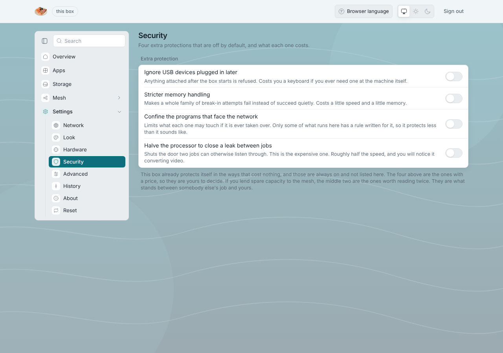

# The kernel

Requirement 2: *choose a suitable kernel.* LosOS runs the **latest upstream
Linux kernel** that NixOS packages (`linuxPackages_latest`) on the installed
appliance, and the NixOS default kernel on the installer medium and the edge.

## The choice

| Candidate                  | What it offers                                                | Why not, or why                                                                          |
| -------------------------- | ------------------------------------------------------------- | ---------------------------------------------------------------------------------------- |
| **Latest upstream**        | Newest drivers, newest fixes, a release every ~10 weeks       | **Chosen.** Repurposed mini-PCs have NVMe, Wi-Fi and sleep quirks that are fixed in mainline first; the box updates itself nightly, so tracking the latest costs nothing in effort. |
| Long-term support (LTS)    | Fewer changes, two to six years of fixes                      | Behind on hardware. A box is an appliance that updates itself unattended, so the stability LTS buys (fewer surprises per manual update) is bought here by the test suite and the nightly rollback instead. |
| A hardened kernel          | Extra mitigations compiled in                                 | NixOS removed `linux_hardened` and its hardened profile in 26.05; it no longer exists to choose. Its useful parts are applied as settings on the latest kernel (below). |
| A real-time kernel         | Deterministic latency                                         | Nothing on the box needs it.                                                              |

## What is layered on it

The hardening module applies, on the latest kernel, the parts of the old
hardened profile that cost nothing: KSPP boot parameters, sysctls (kernel
pointers, logs, eBPF, ptrace, `userfaultfd`, protected files, the network
stack), a module blacklist that also blocks explicit loading, a tmpfs `/tmp`,
`noexec` on `/dev/shm`, and systemd sandboxing of the services that face the
network. Four more that can break something are opt-in: AppArmor, a hardened
memory allocator, disabling SMT, USBGuard.

Three "obvious" hardening settings are deliberately **not** applied, and a
test fails if they are: strict reverse-path filtering (it drops the mDNS
replies that make a shell-less box findable, and breaks the mesh's network
plugin), zero user namespaces (it stops both Kubernetes agents), and
`noexec` on `/tmp` (the nightly rebuild compiles there).

## What tracking the latest kernel costs, and how it is paid

- **Boot partition growth.** Nearly every nightly update brings a new kernel
  into the 500 MiB boot partition. The boot menu is capped at five
  generations and old system versions are collected after 14 days; an
  invariant check pins both.
- **A kernel that breaks something.** The previous system stays in the boot
  menu and the next night rebuilds again; the VM tests boot the installed
  system, the installer, the TPM unlock, the resize path and the hardening
  on every change to those modules.
- **The TPM key is not bound to the kernel.** Measured-boot binding would
  lock the box out after every kernel update with nobody to type a recovery
  key. The trade is stated in the [security model](../reference/security-model).
