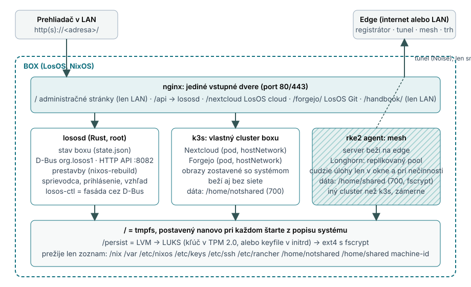
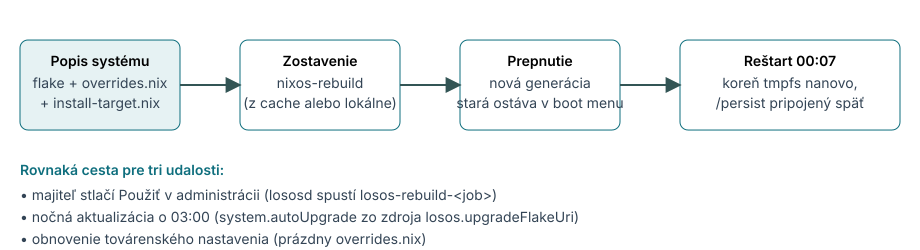

# Architektúra systému

Táto kapitola dopĺňa prvý bod zadania o pohľad dovnútra: ako je systém
navrhnutý a prečo. Je to zároveň návrh architektúry operačného systému pre
mesh úložisko, ktorý bol súčasťou pôvodného zadania projektu.

## Šesť rozhodnutí, ktoré nesú návrh

1. **Bezstavový koreň.** Systémový disk je tmpfs postavený pri každom
   štarte z deklaratívneho popisu (NixOS). Prežije len vymenovaný zoznam
   adresárov na šifrovanom zväzku `/persist`, ktoré modul *impermanence*
   pripojí späť. Box preto nemá drift konfigurácie a nepotrebuje shell:
   reštart je oprava.
2. **Dva účty, dve dátové domény.** `notshared` (uid 1000) vlastní súbory
   majiteľa, `shared` (uid 1001) vlastní kópie pre mesh, v adresári
   šifrovanom vlastným kľúčom (fscrypt), ktorý sa načíta len počas
   zdieľania. Obe domovské zložky majú práva 700 a vlastnú skupinu, takže
   ani jedna nevie čítať druhú. Test `tests/impermanence.nix` to overuje,
   lebo prvý návrh (spoločná skupina `users` a práva 750) izoláciu potichu
   rušil.
3. **Dva clustre.** Vlastné aplikácie boxu bežia v jeho vlastnom Kubernetes
   clustri (k3s, bez sieťového pluginu, pody v sieti hostiteľa). Mesh je
   *iný* cluster (rke2; agent na boxe, server na edge). Agent sa bez svojho
   servera nespustí a box sa každú noc o 00:07 reštartuje, takže keby
   vlastné služby bežali v mesh clustri, výpadok edge cez polnoc by ich
   zhodil. Stavové adresáre oboch sa nekrížia (`/var/lib/rancher/{k3s,rke2}`).
4. **Jedny vstupné dvere.** Nginx drží jediné verejné porty a smeruje podľa
   cesty. Administračný povrch (`/`, `/api/`, `/setup/`, `/handbook/`) je
   chránený podľa zdrojovej adresy (len LAN) a prísnou Content-Security-Policy;
   aplikácie sú dostupné odvšadiaľ, kde je box dosiahnuteľný. Guard zámerne
   odmieta aj loopback, lebo tunel z edge prichádza z `127.0.0.1`.
5. **Koreňový démon s typovaným API.** `lososd` (Rust) vlastní stav boxu
   (`/var/lib/losos/state.json`, jediný zapisovateľ, atomický zápis),
   vystavuje jednu metódu na operáciu na systémovej zbernici D-Bus
   (`org.losos1`) a JSON API na loopbacku (`127.0.0.1:8082`) s tokenom.
   Prestavby spúšťa ako prechodné systemd jednotky (`losos-rebuild-<job>`)
   a po vlastnom reštarte (ktorý `nixos-rebuild switch` spôsobí) sa k nim
   znovu pripojí. `losos-ctl` je tenká fasáda, ktorá volania posiela démonu.
6. **Všetko je prestavba.** Nastavenia, aktualizácie aj reset idú jednou
   cestou: zapísať popis, zostaviť systém, prepnúť. Režim zlyhania je
   jednotný (predchádzajúci systém beží ďalej) a nočná aktualizácia je ten
   istý kód, ktorý majiteľ spúšťa ručne tlačidlom Použiť.

## Dva systémy z jednej sady modulov

Flake exportuje dve konfigurácie NixOS, ktoré zdieľajú moduly v `modules/`:

| Výstup                         | Čo to je                                                                 | Moduly                                              |
| ---------------------------------------- | ------------------------------------------------ | ---------------------------------------- |
| `nixosConfigurations.iso`      | živé inštalačné ISO, nesie rozloženie diskov (disko) a inštalátor         | `options`, `disko`, `installer`, `cache`             |
| `nixosConfigurations.install`  | nainštalovaný systém na disku                                             | všetky: boot, impermanence, hardening, služby, démon, aktualizácie, … |
| `nixosModules.edge`            | serverová strana (VPS alebo stroj v LAN): Traefik, tunel, registrátor, mesh, trh | samostatný modul                                     |

Všetky projektové voľby žijú pod `options.losos.*` (`modules/options.nix`) s
predvolenými hodnotami v `defaults.nix`; moduly nikdy nečítajú holé
`config.X`, vždy `config.losos.X`. Dva súbory sú špecifické pre každý box a
zapisuje ich inštalátor alebo démon: `install-target.nix` (disky, firmvér,
režim odomykania) a `overrides.nix` (voľby majiteľa).

## Úložisko

Každý disk z `losos.targetDrives` dostane GPT a jeden fyzický zväzok LVM;
všetky sa spoja do skupiny `persist-vg` s jedným logickým zväzkom `persist`,
ktorý je LUKS2 a vnútri ext4 s funkciou `encrypt` (fscrypt ju potrebuje a
btrfs ju neponúka). Prvý disk nesie ešte ESP (500 MiB) a v režime BIOS
1 MiB oddiel pre GRUB. Je to zreťazenie, nie RAID: kapacita sa sčíta,
výpadok jedného disku zväzok zničí. Pre zariadenie, ktorého dáta mesh
replikuje Longhornom, je to prijateľné a je to zdokumentované.

Kľúč zväzku je 4096 hexadecimálnych znakov (2048 náhodných bajtov) v
`/etc/keys/persist-keyfile`, úmyselne bez NUL bajtov a bez konca riadka:
disko ho formátovaniu odovzdáva cez substitúciu príkazu, ktorá NUL bajty
zahadzuje, kým initrd a `systemd-cryptenroll` čítajú súbor surový. Pôvodná
verzia zapisovala surové bajty a prakticky každá inštalácia bez TPM sa
formátovala iným kľúčom, než akým sa potom odomykala. Chyba vyšla najavo
až v teste s emulovaným TPM (`tests/tpm.nix`).

## Záťaž a jednotný vzhľad

Nextcloud a Forgejo bežia ako statické pody v k3s s `hostNetwork`, takže
odpovedajú na loopbacku a nginx ich vidí ako lokálne. Obrazy sa zostavujú
spolu so systémom (`flake/images.nix`), takže aktualizácia prinesie
otestovanú dvojicu. Konfigurácia Nextcloudu je jedna dátová štruktúra
(`modules/nextcloud-stack.nix`) pre natívny aj kontajnerový režim.

Obe aplikácie dostanú tému postavenú na spoločnom `tokens.css`: Nextcloud
priečinok témy `losos`, Forgejo tri CSS súbory témy a `DEFAULT_THEME`.
Logá sa kreslia z jedného zdroja (`admin-ui/themes/brand/`) pri zostavení.

## Edge

Edge je modul NixOS: Traefik s automatickým TLS vpredu, server tunela
rathole za ním, registrátor `losos-registrar` (Rust), ktorý oba konfiguruje
podľa boxov, ktoré sa registrujú a posielajú heartbeat, a voliteľne riadiaca
rovina meshu (rke2 server s Longhornom) a trh (Stripe Connect). Tunel
používa šifrovanie Noise; box si verejný kľúč edge zapamätá pri prvom
kontakte a zmenený odmietne. Kľúč Stripe drží oddelený proces
`losos-stripe-gate`, ktorý s registrátorom hovorí cez unixový socket a
nikdy mu kľúč neukáže. Pre prezentácie beží riadiaca časť registrátora aj
ako jedna funkcia na Vercel s registrom v malej databáze (Neon Postgres);
tunel, mesh a platby tam bežať nemôžu.

## Bezpečnostný model v skratke

Hranice dôvery (plný text je v `docs/security-model.md`):

1. **Internet → edge.** Len edge je na internete; box počúva zvonku na ničom
   a tunel otvára smerom von.
2. **Edge → box.** Tunel je šifrovaný od konca po koniec; box pripne kľúč
   edge.
3. **LAN → box.** HTTPS s certifikátom, ktorý si box vydal sám a majiteľ ho
   raz nainštaluje (sprievodca, krok 1). Do tej chvíle by niekto na tej istej
   Wi-Fi mohol zachytiť prvé použitie.
4. **Súbory majiteľa ↔ kópie meshu.** Dva účty, oddelené skupiny, práva 700,
   fscrypt kľúč len počas zdieľania.
5. **Oficiálny edge ↔ ľubovoľný edge.** Verejný kľúč projektu v systéme;
   obchodovanie len s oficiálnym. Súkromnú polovicu kľúča vytvára a používa
   len nástroj na počítači autora projektu (`losos-registrar provision`),
   ktorý najprv prihlási osobu cez GitHub a odmietne každého, kto nie je na
   zozname povolených účtov zapísanom v repozitári; žiadny box ani edge
   kľúč nikdy nedrží. Podpísaný certifikát nástroj odošle na edge cez web
   a edge pred jeho inštaláciou znova overí, že odosielateľ je na tom istom
   zozname.

Administračný kľúč je mocný ako root; vzniká na boxe, box ho vydá raz
v sprievodcovi a inak ho vydá len prehliadaču, ktorý preukáže heslo
majiteľa. Desať neúspešných pokusov z jednej adresy spúšťa narastajúce
oneskorenie; zmeny nastavení sa zapisujú do audit logu. Hardening je
opísaný v kapitole 4.

Známe obmedzenia sú uvedené otvorene: jeden pôvod (origin) pre
administráciu a obe aplikácie, krádež celého boxu s čipom TPM, audit log
bez rotácie, škrtenie podľa adresy, a certifikát boxu, ktorý je zároveň
koreňová autorita bez obmedzení (správny tvar je oddelená CA s obmedzením
mena a krátky serverový certifikát; je to v pláne).

## Prečo NixOS

Celý box vrátane aplikácií je jeden popis, ktorý sa dá zostaviť, otestovať
vo virtuálnych strojoch a na boxe bez obsluhy prestavať. Repozitár nesie
sedemnásť VM testov a sadu invariantov vyhodnocovaných pri zostavení, ktoré
zlyhajú, keď niekto zmení nosnú predvolenú hodnotu. To je to, čo robí
„bez shellu“ možným: box nikdy nie je v stave, ktorý nikto nezapísal.
