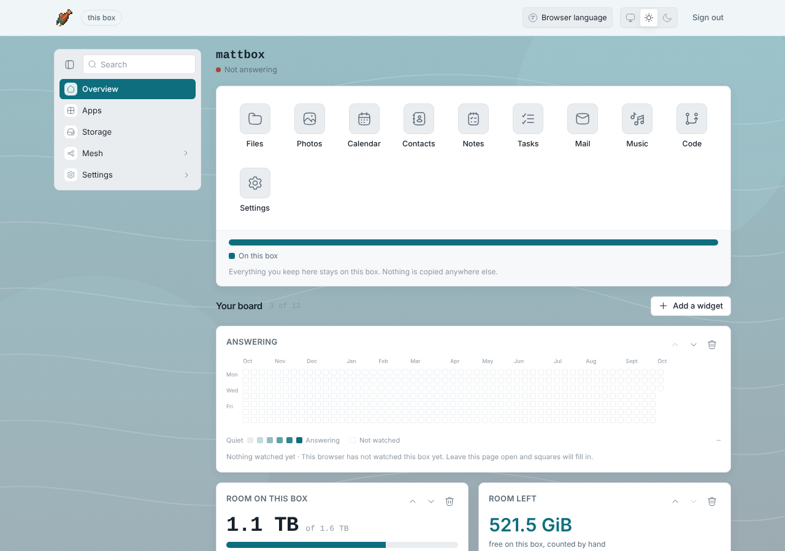
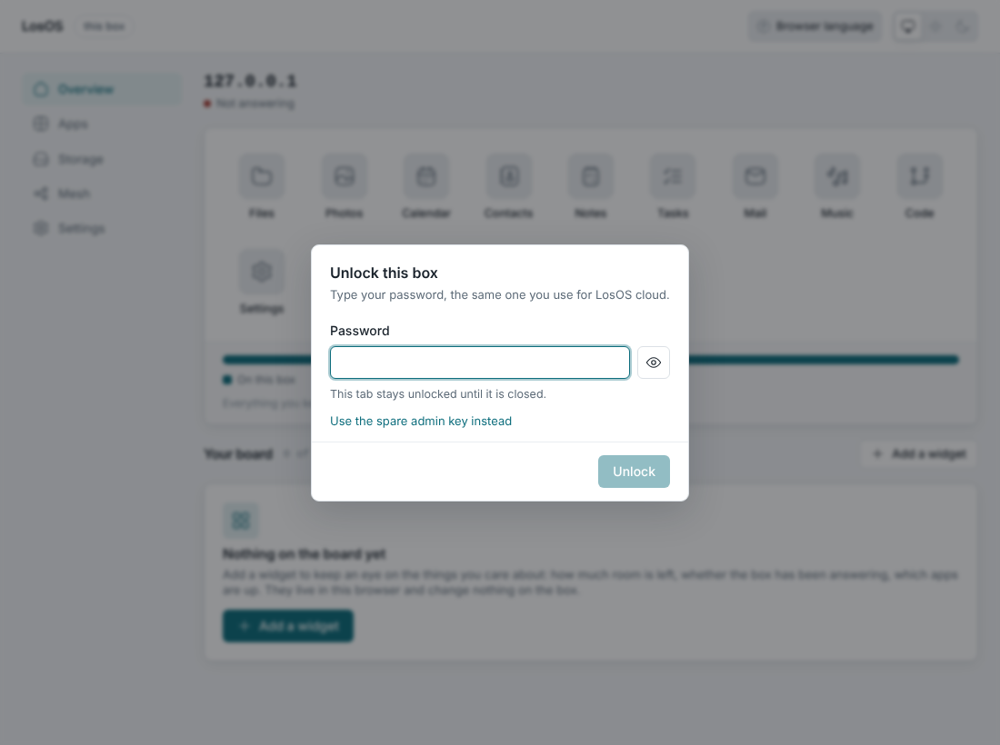
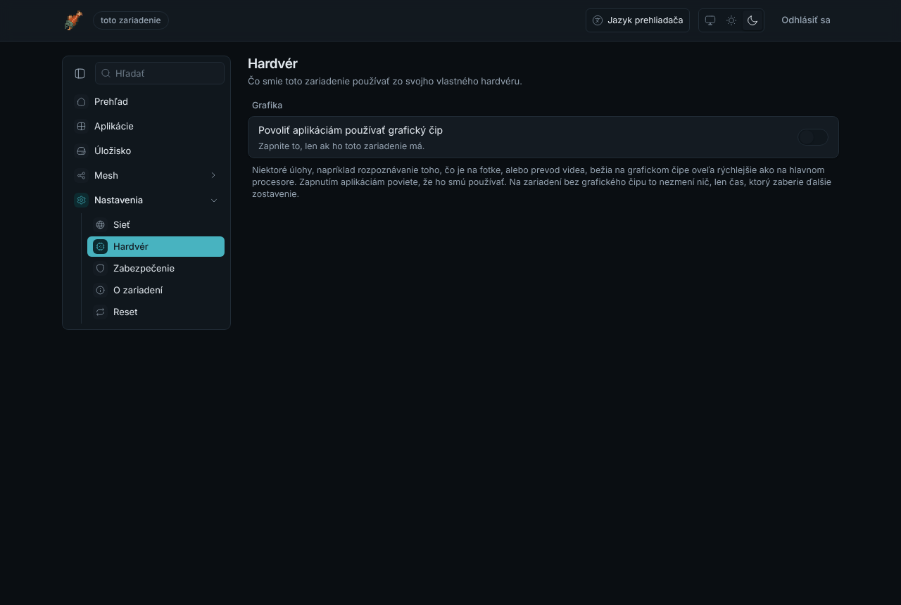
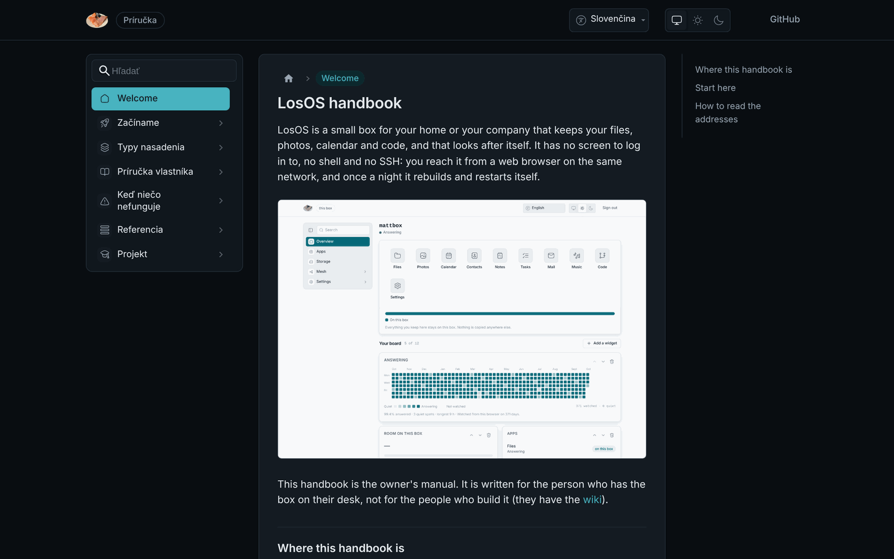
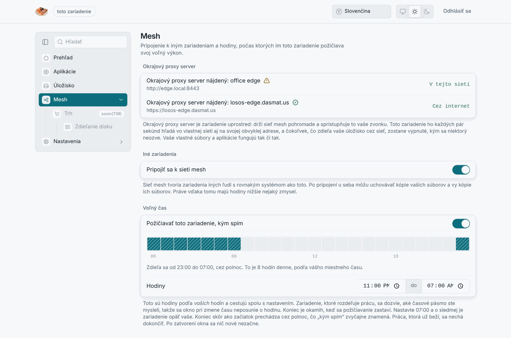
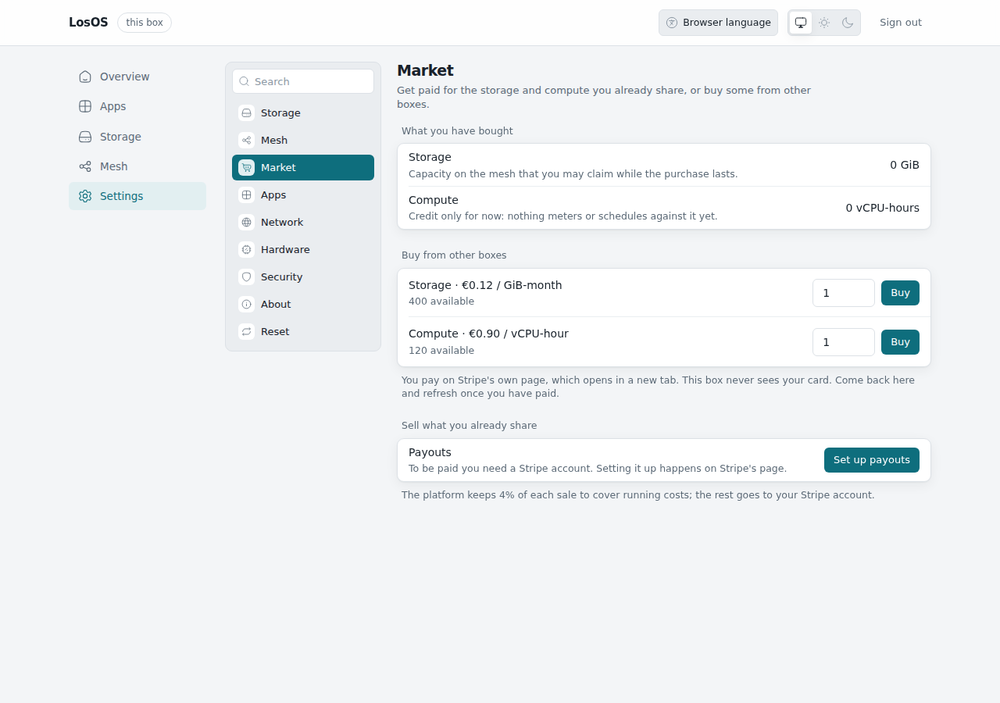

# Hlavné funkcionality a možnosti systému

Táto kapitola odpovedá na prvý bod zadania: *preskúmajte a opíšte hlavné
funkcionality a možnosti vybraného operačného systému.* Opisuje LosOS tak,
ako ho vidí majiteľ boxu; kapitola 3 potom vysvetľuje, ako je to postavené.

## Čo je LosOS

LosOS je operačný systém pre jeden účel: urobiť z malého počítača, spravidla
z vyradeného kancelárskeho mini-PC, **zariadenie** (appliance). Majiteľ ho
raz nainštaluje z USB kľúča, zapojí do siete a napájania, a odvtedy sa s ním
stretáva iba cez webový prehliadač. Box nemá obrazovku na prihlásenie, nemá
shell a nemá SSH server. Každú noc sa sám reštartuje a aktualizuje.

Systém je postavený na **NixOS**, linuxovej distribúcii, v ktorej je celý
systém opísaný jedným deklaratívnym textom (tzv. *flake*). Z toho istého
popisu sa zostavuje inštalačné médium, nainštalovaný systém, obraz pre
virtuálny stroj aj automatizované testy.

## Čo na boxe beží

| Čo majiteľ vidí            | Čo to je                                                                                         |
| -------------------------- | ------------------------------------------------------------------------------------------------ |
| **LosOS cloud**            | Súbory, fotky, kalendár, kontakty, poznámky a úlohy. Postavené na Nextcloude, na adrese `/nextcloud`. |
| **LosOS Git**              | Repozitáre kódu. Postavené na Forgejo, na adrese `/forgejo/`, štandardne zapnuté.                 |
| **Administračné stránky**  | Nastavenie a správa boxu. Na adrese `/`, dostupné len z lokálnej siete.                           |
| **Príručka**               | Kompletný návod majiteľa vrátane vyhľadávania, na adrese `/handbook/`, aj bez internetu.          |
| **Mesh**                   | Voliteľné. Voľný disk a procesor požičaný iným boxom LosOS a požičaný od nich.                     |
| **Vzdialený prístup**      | Voliteľné. Verejná adresa cez server *edge*, bez otvárania portov doma.                           |

Obe aplikácie majú jednotný vzhľad a názvy LosOS cloud a LosOS Git; farby
pochádzajú z jedného súboru tokenov (`admin-ui/themes/tokens.css`), ktorý
zdieľajú administračné stránky, obe aplikácie aj príručka.

## Funkcie pre majiteľa

### Jedno heslo a náhradný kľúč

Heslo nastavené pri prvom spustení je heslo majiteľa pre LosOS cloud a
zároveň odomyká administračné stránky. Box neudržiava druhú kópiu hesla:
pri odomknutí sa opýta Nextcloudu cez vlastné lokálne spojenie, takže zmena
hesla v Nextcloude platí okamžite aj pre administráciu. Nové heslo musí mať
aspoň 12 znakov, malé aj veľké písmeno, číslicu a symbol.

Pre jediný prípad, ktorý heslo nepokryje (LosOS cloud práve nebeží), existuje
**náhradný administračný kľúč**: 64-znakový reťazec, ktorý si box vyrazil pri
prvom štarte a ukázal ho majiteľovi raz, v sprievodcovi, s tlačidlami
Kopírovať a Tlačiť. Na HTTPS spojení sa dá pridať aj **passkey**.

### Administračné stránky

Jednostránková aplikácia (React) s piatimi sekciami: **Prehľad** (stav boxu,
úložisko, dlaždice aplikácií, nástenka), **Aplikácie** (režim každej
aplikácie a vyhľadávanie v katalógu aplikácií Nextcloudu), **Úložisko**
(zaplnenie disku a rezerva, do ktorej box vie narásť), **Mesh** (pripojenie
k iným boxom, hodiny, kedy box požičiava procesor, a zatiaľ sivý **Trh**
so zdieľaním disku) a **Nastavenia** (Sieť, Hardvér, Zabezpečenie, Vzhľad,
O zariadení, Reset). Rozhranie je v angličtine, slovenčine a nemčine,
vo svetlej a tmavej téme.

Zmeny nastavení sa neukladajú „do systému“, ale do popisu boxu: tlačidlo
**Použiť** zapíše voľby majiteľa do jedného súboru (`modules/overrides.nix`)
a box sa z neho prestavia (*rebuild*). Zmena buď prejde celá, alebo vôbec;
box medzitým ostáva dostupný. Kapitola 6 to opisuje podrobne.

### Vzhľad a widgety

Majiteľ si môže nastaviť pozadie a závoj administračných stránok a na
nástenku Prehľadu pridávať **widgety**: vstavané (napríklad história
odpovedania boxu, voľné miesto), widgety zostavené z meraní boxu bez kódu
a widgety **napísané ručne** v HTML a JavaScripte. Ručne písané widgety
bežia v izolovanom rámci (`/widget-frame/`) bez prístupu k administračnému
kľúču a API; podrobnosti sú v kapitole o bezpečnosti.

### Úložisko a rast disku

Inštalátor zámerne necháva asi 10 % disku nevyužitých ako rezervu. Panel
Úložisko ju vie kedykoľvek pripojiť za behu, bez otvárania boxu: príkaz
`losos-ctl grow` postupne vykoná `lvextend`, `cryptsetup resize` a
`resize2fs`. Poradie je jediné správne a je overené testom
(`tests/resize.nix`), lebo chyba v ňom je tichá.

### Aktualizácie a nočný reštart

Na každom boxe bežia tri časovače: o **00:07** bezpodmienečný reštart (koreň
je tmpfs, takže reštart je oprava), o **03:00** prestavba systému zo zdroja
aktualizácií a o **04:30** upratanie starých verzií (staršie ako 14 dní) pri
zachovaní posledných piatich generácií v boot menu. Zlyhaná aktualizácia
nechá bežať predchádzajúci systém a ďalšiu noc sa skúsi znova.

### Príručka na boxe

Každý box nesie celú príručku majiteľa vrátane offline vyhľadávania, lebo
návod je najviac potrebný práve vtedy, keď funguje len lokálna sieť. Chybové
hlásenia v administračných stránkach odkazujú na príslušnú stranu príručky
(„Čo robiť“).

## Možnosti nasadenia

Box má niekoľko nezávislých „typov“, ktoré sa dajú kombinovať.

### Spôsob nasadenia

| Typ                                | Pre koho                                   | Vzdialený prístup       | Mesh                      | Trh                 |
| ---------------------------------- | ------------------------------------------ | ----------------------- | ------------------------- | ------------------- |
| **Samostatný box**                 | domácnosť, jeden stôl                      | nie                     | nie                       | nie                 |
| **Box s oficiálnym edge LosOS**    | majitelia, ktorí chcú verejnú adresu a mesh | áno                     | áno, s ostatnými          | áno, po otvorení    |
| **Firma s vlastným edge**          | firma s viacerými boxmi v jednej sieti      | áno, cez vlastný edge   | áno, medzi vlastnými boxmi | nie, zámerne        |

Každý box začína ako samostatný; ďalšie dva typy sú nastavenie, nie
preinštalovanie. **Edge** je server (na internete alebo v lokálnej sieti),
ku ktorému box drží tunel smerom von: cez neho dostane verejnú adresu bez
otvárania portov, pripojí sa k meshu a (po otvorení) obchoduje na trhu.
Oficiálny edge sa boxu preukazuje podpisom, ktorý box overuje verejným
kľúčom projektu zabudovaným v systéme; firemný edge dostane objavovanie,
vzdialený prístup a zdieľanie medzi vlastnými boxmi, ale nie obchodovanie.

### Odomykanie disku a spôsob štartu

Disk je vždy šifrovaný (LUKS) a formátovaný bez obsluhy z náhodného kľúča.
Na stroji s čipom **TPM 2.0** sa kľúč zapečatí do čipu a na boot oddiele nie
je žiadne tajomstvo; bez čipu (alebo s `--no-tpm`) sa kľúč vloží do initrd
na nešifrovanom boot oddiele, čo je slabšia, ale funkčná konfigurácia pre
virtuálne stroje a testy. Inštalátor podporuje **UEFI** (systemd-boot) aj
**BIOS** (GRUB) a vie režim rozpoznať sám. Jediná podporovaná architektúra
je **x86-64**: flake zostavuje len `x86_64-linux`, takže počítače s ARM,
vrátane Macov s čipom Apple M, LosOS nespustia ani ako hostiteľ virtuálneho
stroja bez pomalej emulácie.

### Režim aplikácií

LosOS cloud a LosOS Git bežia ako **záťaž (workload)** v lokálnom Kubernetes
clustri boxu (k3s), z obrazu zostaveného spolu so systémom, alebo **natívne**
ako systémové služby. Konfigurácia Nextcloudu je jedna pre oba režimy, aby sa
nerozišli.

### Režim úložiska a požičiavanie procesora

Box si disk buď **necháva pre seba**, alebo **zdieľa** voľné miesto s meshom
ako súčasť replikovaného poolu (Longhorn). Zdieľané dáta ležia v oddelenom
účte `shared` v adresári šifrovanom vlastným kľúčom (fscrypt), ktorý sa
načíta len počas zdieľania. Procesor box požičiava len v **okne** hodín,
ktoré majiteľ určí, a len keď je box nečinný; okno sa vyhodnocuje v časovom
pásme boxu, takže sa pri zmene času neposúva.

## Mesh a trh

**Mesh** je sieť boxov jedného edge. Úložisko: Longhorn replikuje zväzky
naprieč boxmi, ktoré zdieľajú miesto; box zdieľa len to, čo sám nepoužíva,
a vlastné súbory majiteľa do poolu nikdy nevstupujú. Výpočty: edge označí
uzol mimo okna alebo pri zaťažení ako neplánovateľný, takže cudzie úlohy
bežia len v hodinách, ktoré majiteľ povolil. Box bez dosiahnuteľného edge
zdieľanie odmietne, aby nesľúbil miesto poolu, ku ktorému sa nedostane.

**Trh** je voliteľná nadstavba: majiteľ predáva GiB-mesiac úložiska alebo
vCPU-hodinu výpočtu, ale iba to, čo už zdieľa. Platby idú cez Stripe
Connect; platforma si necháva 4 % (400 bázických bodov, strop 20 %) a
peniaze sa nikdy nedotknú boxu. Kód trhu je hotový od konca po koniec a
otestovaný proti náhradám Stripe; otvorí sa po založení podnikania, ktoré
musí stáť za platformou Stripe. Dovtedy je karta Trh v rozhraní sivá.

## Porovnanie s bežnými riešeniami

| Vlastnosť                               | Bežný NAS (Synology, QNAP)              | Server s Nextcloudom (Ubuntu, Docker)     | LosOS                                                        |
| --------------------------------------- | --------------------------------------- | ----------------------------------------- | ------------------------------------------------------------ |
| Správa                                  | webové rozhranie výrobcu                | SSH, terminál, ručná údržba                | len webové rozhranie, žiadny shell                           |
| Stav systému                            | mení sa časom, drift                     | mení sa časom, drift                       | pri každom štarte nanovo z jedného popisu                    |
| Aktualizácie                            | závislé od výrobcu                       | ručné                                      | automatické každú noc, s návratom na predchádzajúci systém    |
| Šifrovanie disku bez zadávania hesla    | zriedka                                  | ručne (LUKS + TPM)                         | štandardne, kľúč v TPM                                        |
| Hardvér                                 | vlastný hardvér výrobcu                  | ľubovoľný                                  | ľubovoľný x86-64, aj vyradený                                  |
| Zdieľanie kapacity s inými              | nie                                      | nie                                        | mesh, voliteľne trh                                            |
| Reprodukovateľnosť                      | nie                                      | čiastočne (Docker Compose)                 | celý systém vrátane aplikácií je jeden zdroj, testovaný vo VM  |

Cena za tieto vlastnosti je obmedzenie: LosOS nie je všeobecný server.
Nedá sa naň doinštalovať ľubovoľný softvér inak než zmenou popisu systému,
a to je zámer: box sa nedá dostať do stavu, ktorý nikto nezapísal.

## Čo LosOS nie je

- **Nie je záloha.** Box je jedna kópia; ďalšiu si majiteľ drží inde
  (klienti Nextcloudu to uľahčujú).
- **Nie je hotový produkt.** Kapitola 10 hovorí, čo je hotové a čo plánované.
