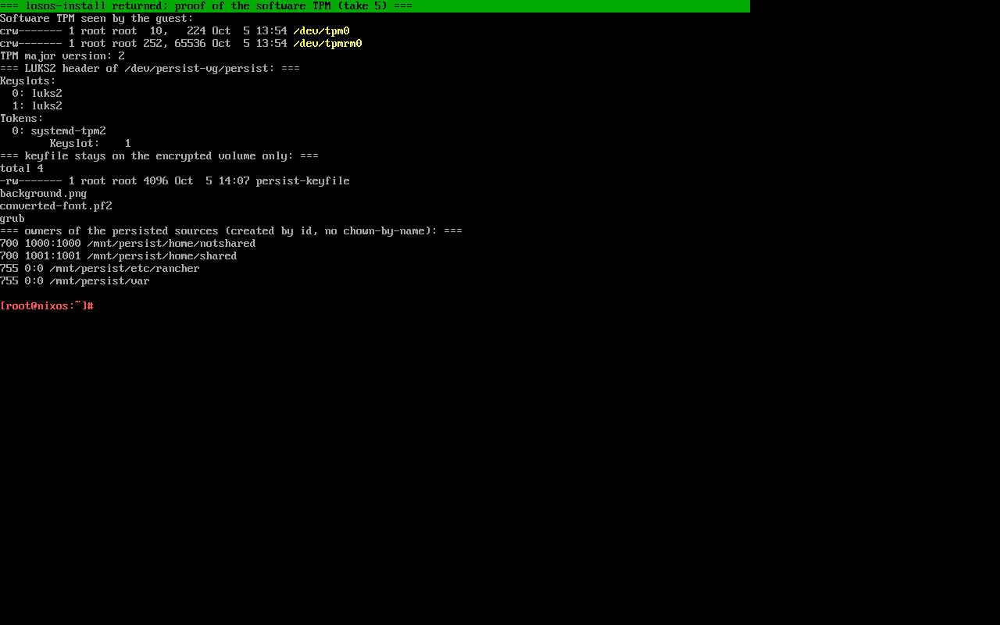

# Inštalácia

Bod 2b zadania: *nainštalujte operačný systém.* Inštalácia je navrhnutá
pre človeka, ktorý nikdy nevidel terminál: jedna otázka a potom čakanie.
Inštalátor **zmaže všetky pevné disky** v stroji.

## Inštalačné médiá

| Médium                              | Veľkosť | Použitie                                                                                  |
| ----------------------------------- | ------- | ----------------------------------------------------------------------------------------- |
| **Inštalačné ISO**                  | malé    | bežná cesta; priložené ku každému vydaniu na GitHube. Cieľ si systém stiahne.              |
| **ISO s celým systémom**            | veľké   | nesie zostavený systém, inštalácia kopíruje namiesto sťahovania. Zostavuje sa ručne.       |
| **Demo obraz disku** (QCOW2)        | veľké   | predinštalovaný virtuálny disk pre QEMU alebo virt-manager, bez šifrovania a inštalátora.  |

Inštalačné ISO sa zostavuje v CI pri každej zmene a CI ho aj **bootuje**
(pod OVMF aj SeaBIOS); test prejde, keď inštalátor pošle DNS dotaz na
`github.com`, teda keď došiel až po klonovanie zdroja. Každá zmena je tak
overená skutočným štartom média.

## Požiadavky

- Procesor **x86-64** (Intel alebo AMD), aspoň 4 GiB pamäte a disk 40 GiB
  alebo väčší. Väčšina kancelárskych mini-PC má firmvérový TPM 2.0.
  Flake zostavuje výlučne pre `x86_64-linux`: na počítači s procesorom ARM,
  teda ani na Macu s čipom Apple M, sa LosOS nainštalovať nedá; aj ukážka
  vo virtuálnom stroji na takom hostiteľovi beží len s emuláciou x86-64,
  ktorá je rádovo pomalšia. Inak platí, že čokoľvek s x86-64 a dostatkom
  pamäte a disku systém pohodlne utiahne, aj vyradený kancelársky stroj.
- USB kľúč 2 GiB alebo väčší.
- Káblové pripojenie k sieti s prístupom na internet: inštalátor sťahuje
  systém, ktorý inštaluje (z cache, nie kompilovaním).
- Obrazovka a klávesnica len na inštaláciu. Potom obrazovka ukazuje len
  banner s adresou boxu.
- **Secure Boot vypnutý, alebo certifikát LosOS zapísaný do firmvéru.**
  Inštalačné médium je podpísané: zavádzač UEFI je jeden zjednotený obraz
  jadra (jadro, initrd, príkazový riadok) podpísaný certifikátom LosOS a
  pred pripojením systémového obrazu overí jeho odtlačok. Firmvér, ktorý
  dôveruje len kľúčom Microsoftu, médium odmietne (*Access Denied*), kým sa
  doň nezapíše certifikát z `EFI/losos/` na médiu. Nainštalovaný box má
  vlastný zavádzač nepodpísaný, takže sám potrebuje Secure Boot vypnutý.

## Priebeh

1. Stiahnuť ISO a jeho `.sha256` z posledného vydania, zapísať na USB kľúč
   (balenaEtcher, Rufus v režime DD, alebo `dd`).
2. Nabootovať z kľúča. Menu ponúkne **UEFI**, **BIOS** alebo **autodetekciu**
   a po 30 sekundách bez odpovede zvolí autodetekciu, takže aj bezobslužný
   štart nainštaluje. Autodetekcia zvolí režim, v ktorom bol kľúč sám
   nabootovaný (neprítomnosť `/sys/firmware/efi` znamená BIOS).
3. Čakať. Inštalátor nájde všetky pevné disky, spojí ich do jedného
   šifrovaného zväzku, stiahne systém a nainštaluje ho. Ku koncu vypíše
   `unlock: TPM` alebo `unlock: keyfile in the initrd`.
4. Vybrať kľúč a nechať stroj reštartovať. Obrazovka ukáže modrý banner
   s adresou boxu; tú treba otvoriť v prehliadači na ľubovoľnom počítači
   v tej istej sieti a pokračovať prvým spustením (kapitola 6).


## Čo inštalátor robí

Inštalátor je podpríkaz `losos-ctl install` (Rust, `backend/src/installer.rs`),
zabalený ako `losos-install`, ktorý sa na ISO spúšťa automaticky ako shell
na tty1. Jeho plán je **dáta**: funkcia `plan_install` vráti zoznam krokov
a testy overujú poradie deštruktívnych krokov bez toho, aby čokoľvek
formátovali.

1. **Detekcia diskov.** Všetky pevné disky okrem inštalačného média sa
   stanú `losos.targetDrives`.
2. **Zápis `install-target.nix`.** Disky, režim firmvéru (`losos.bios`) a
   režim odomykania (`losos.tpm.enable`) sa zapíšu do súboru, ktorý bude
   súčasťou popisu nainštalovaného boxu. Vďaka tomu neskoršia aktualizácia
   z verejného zdroja (`github:`) nezabudne, aké disky a firmvér box má;
   `flake.nix` uprednostní živú kópiu v `/etc/nixos`, a preto obe cesty
   prestavby bežia s `--impure` (invariant to pripína).
3. **Kľúč.** `ensure_keyfile` zapíše 4096 hexadecimálnych znakov do
   `/etc/keys/persist-keyfile`.
4. **disko.** Rozloženie z `modules/disko.nix`: GPT, ESP 500 MiB (a 1 MiB
   oddiel pre GRUB v režime BIOS), LVM fyzické zväzky → `persist-vg` →
   LV `persist` → LUKS2 → ext4 s `encrypt`. Zväzok sa zámerne nenafúkne na
   celú skupinu: `losos.storage.fillPercent` necháva rezervu na rast za
   behu.
5. **TPM.** Ak je `/dev/tpmrm0` (alebo `--tpm`), hneď po formátovaní sa
   spustí `systemd-cryptenroll --tpm2-device=auto --tpm2-pcrs=
   --unlock-key-file=…`: kľúč sa zapečatí do čipu bez viazania na PCR a
   initrd nenesie žiadne tajomstvo. Bez čipu (alebo `--no-tpm`) sa kľúč
   vloží do initrd ako `/crypto_keyfile.bin`. Obe podoby crypttab sú
   výlučné: systemd-cryptsetup s kľúčovým súborom *aj* `tpm2-device=` by
   čítal súbor ako zapečatený blob.
6. **nixos-install** systému `install` zo zdroja flake, so zapísaným
   `install-target.nix`.
7. **Reštart.**



## Inštalácia vo virtuálnom stroji (ukážka)

Ukážka na obhajobe beží vo virtuálnom stroji (dohodnuté s konzultantom).
Dve veci sú iné než na hardvéri:

- **TPM** musí byť emulovaný (`swtpm`) pri inštalácii aj pri každom
  ďalšom štarte, s rovnakým stavovým adresárom; inak sa box nainštaluje
  v režime kľúčového súboru, čo tiež funguje.
- Hostiteľ virtuálneho stroja spravidla **nerozlišuje `.local` meno** boxu
  (libvirt, VirtualBox NAT), takže sa box otvára cez IP adresu z bannera.

```sh
mkdir -p tpm
swtpm socket --tpmstate dir=tpm --ctrl type=unixio,path=tpm/sock --tpm2 --daemon
qemu-img create -f raw disk.img 40G
qemu-system-x86_64 -m 4096 -smp 2 -enable-kvm -machine q35 \
  -drive file=losos.iso,media=cdrom,readonly=on \
  -drive file=disk.img,format=raw,if=virtio \
  -chardev socket,id=chrtpm,path=tpm/sock -tpmdev emulator,id=tpm0,chardev=chrtpm \
  -device tpm-tis,tpmdev=tpm0 \
  -nic user,hostfwd=tcp:127.0.0.1:80-:80
```

`-enable-kvm` predpokladá hostiteľa s procesorom x86-64 a zapnutou
virtualizáciou. Na hostiteľovi ARM (Mac s čipom Apple M) treba prepínač
vynechať a QEMU emuluje x86-64 softvérovo (TCG); inštalácia potom trvá
desiatky minút namiesto jednotiek a hodí sa len na overenie, nie na
predvádzanie.

Bez `-bios` bootuje QEMU SeaBIOS, takže inštalátor zvolí GRUB; druhý štart
ide bez riadku s `media=cdrom`. Záznamy ukážok (inštalácia od ISO po prvé
prihlásenie, pri emulácii bez KVM asi 45 až 50 minút; so KVM podstatne
rýchlejšie) sú súčasťou materiálov k obhajobe.

Čo sa pri ukážkach vo VM našlo a opravilo, je v kapitole 7: chýbajúce
virtio ovládače v initrd (box po inštalácii nenabootoval v QEMU), kľúčový
súbor s NUL bajtmi (box stál na výzve na heslo) a `/run/nextcloud`
vytváraný bez práv v obraze (Nextcloud nikdy nenaštartoval v režime
záťaže). Každá z nich je dnes pokrytá testom alebo zmenou obrazu.

## Po inštalácii

Box po prvom štarte: odomkne `/persist` z TPM, postaví tmpfs koreň a
pripojí späť trvalé adresáre, spustí lososd (ktorý si pri prvom štarte
vyrazí administračný kľúč), k3s so statickými podmi Nextcloudu a Forgejo,
nginx a banner na tty1. Administračné stránky odpovedajú zhruba do dvoch
minút; Nextcloud dokončí svoj prvý štart o pár minút neskôr (sprievodca na
to čaká a ukazuje dôvod).
