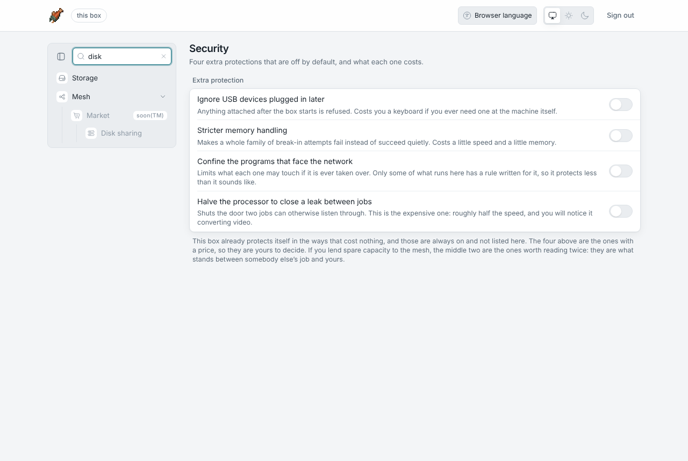

# Výber kernelu

Bod 2a zadania: *vyberte vhodný kernel pre daný operačný systém.* LosOS
beží na nainštalovanom boxe s **najnovším stabilným jadrom Linuxu**, ktoré
NixOS balí ako `linuxPackages_latest` (`modules/boot.nix`). Inštalačné médium
a edge server ostávajú na predvolenom jadre NixOS (LTS), lebo požiadavky na
ne sú iné. Táto kapitola zdôvodňuje tú voľbu proti trom alternatívam a
opisuje, čo je na jadro navrstvené a čo voľba stojí.

## Čo jadro na boxe musí zvládnuť

Kernel sa nevyberá abstraktne; vyberá sa pre konkrétnu triedu hardvéru a
konkrétny spôsob prevádzky.

- **Hardvér:** vyradené kancelárske mini-PC (Intel NUC a jeho klony,
  Lenovo ThinkCentre Tiny, HP EliteDesk Mini, Dell OptiPlex Micro, novšie
  stroje s Intel N100/N305 alebo AMD Ryzen). Majú NVMe disky, 2,5 GbE
  radiče Realtek, moduly Wi-Fi 6/6E Intel, moderné riadenie napájania
  (s2idle, ASPM) a firmvérový TPM 2.0 (Intel PTT, AMD fTPM). Ovládače
  a opravy pre tento hardvér vznikajú v hlavnej vývojovej vetve (mainline)
  a do LTS vetiev sa dostávajú neskôr alebo vôbec.
- **Prevádzka:** box sa aktualizuje každú noc sám, bez obsluhy, a nemá
  shell, z ktorého by sa problém riešil ručne. Stabilita sa teda musí
  zabezpečiť inak než „nemeniť nič“: testami pred vydaním a návratom
  k predchádzajúcej generácii pri zlyhaní.
- **Záťaž:** dva Kubernetes runtime (k3s a rke2 agent), containerd,
  Longhorn (iSCSI, dm-crypt), fscrypt na ext4, TPM2 v initrd (systemd
  stage 1). Jadro teda musí mať zapnuté overlayfs, user namespaces,
  cgroups v2, nf_conntrack, vxlan, iscsi_tcp a dm_crypt.
- **Bezpečnosť:** box je stále zapnutý, pripojený k sieti a požičiava
  procesor cudzím úlohám. Mitigácie hardvérových zraniteľností a
  obmedzenie útočnej plochy jadra sú dôležitejšie než na pracovnej stanici.

## Kandidáti a rozhodnutie

| Kandidát                              | Čo ponúka                                                                    | Hodnotenie                                                                                                                                                                                 |
| ---------------------------------------------- | ------------------------------------------ | ---------------------------------------------------------------------------------------------------------------- |
| **Najnovšie stabilné jadro** (`linuxPackages_latest`) | nové vydanie približne každých 9 až 10 týždňov, najnovšie ovládače a opravy    | **Zvolené.** Hardvérové problémy mini-PC sa opravujú najprv tu. Box sa aktualizuje sám, takže sledovanie najnovšieho jadra nestojí žiadnu ručnú prácu. Riziko regresie sa platí testami a návratom. |
| **LTS jadro** (predvolené v NixOS)    | menej zmien, dva a viac rokov opráv                                           | Zaostáva v hardvéri. Stabilita, ktorú LTS kupuje („menej prekvapení na ručne aktualizovanom serveri“), je na boxe zabezpečená testami a nočným návratom; za LTS by sa platilo horšou podporou nového hardvéru. Zostáva na ISO a edge, kde hardvér nie je problém. |
| **Hardened jadro** (`linux_hardened`) | mitigácie zakompilované navyše                                                | V nixpkgs, ktoré flake sleduje, **už neexistuje**: `linux_hardened` je `throw "removed due to lack of maintenance"` a profil `hardened.nix` bol odstránený v NixOS 26.05. Jeho užitočná časť sa dá nastaviť na bežnom jadre (nižšie), čo je presne to, čo robí `modules/hardening.nix`. |
| **Real-time jadro** (PREEMPT_RT)      | deterministická latencia                                                     | Nič na boxe to nepotrebuje; stálo by priepustnosť.                                                                                                                                         |
| Jadro iného systému (napr. Windows, FreeBSD) | iný ekosystém                                                           | Bezstavový systém postavený z textu pri každom štarte, fscrypt, TPM2 v initrd a Kubernetes runtime viažu projekt na Linux; na Windows sa takýto návrh postaviť nedá.                       |

Rozhodnutie je v kóde jedným riadkom a jeho zdôvodnenie v komentári nad ním
(`modules/boot.nix`):

```nix
# Latest upstream kernel. The losos appliance runs on repurposed mini-PCs
# whose NVMe/Wi-Fi/sleep hardware quirks are fixed fastest in mainline, so
# track linuxPackages_latest rather than the nixpkgs default LTS. ...
boot.kernelPackages = pkgs.linuxPackages_latest;
```

Voľba je **ohraničená na nainštalovaný box**: `boot.nix` importuje len
systém `install`. Inštalačné ISO potrebuje predovšetkým načítať squashfs a
nestarať sa o nič iné, a edge beží na VPS s virtuálnym hardvérom, kde
najnovšie ovládače nič neprinášajú.

## Čo je na jadro navrstvené

Projekt nezabalil upstreamový profil (nijaký už nie je), ale skladá
hardening z primitív odporúčaných projektom KSPP (Kernel Self Protection
Project). Vrstva `losos.hardening.enable` (predvolene zapnutá) je tá, ktorá
„nič nestojí“: nemôže box odpojiť od siete, zastaviť službu ani zabrániť
naplánovaniu podu.

**Parametre jadra pri štarte** (`boot.kernelParams`): `slab_nomerge`,
`init_on_alloc=1`, `init_on_free=1`, `page_alloc.shuffle=1`,
`randomize_kstack_offset=on`, `vsyscall=none`, `debugfs=off`, vynútené
mitigácie `spectre_v2=on`, `spec_store_bypass_disable=on`, `l1tf=flush`,
`mds=full`, `tsx=off`, `tsx_async_abort=full`, `kvm.nx_huge_pages=force`,
a IOMMU (`intel_iommu=on`, `amd_iommu=force_isolation`, `iommu.strict=1`,
`efi=disable_early_pci_dma`) proti DMA útokom cez periférie.

**Sysctl:** skrytie ukazovateľov a logov jadra (`kernel.kptr_restrict=2`,
`dmesg_restrict=1`), `perf_event_paranoid=3`, `yama.ptrace_scope=2`,
`kernel.sysrq=0`, `unprivileged_bpf_disabled=1`, `randomize_va_space=2`,
vypnuté core dumpy, `fs.protected_*`, `vm.unprivileged_userfaultfd=0` a
sprísnený sieťový stack (SYN cookies, žiadne ICMP redirecty a zdrojové
smerovanie, voľné `rp_filter=2`).

**Blacklist modulov**, ktorý blokuje aj ručný `modprobe` (samotné
`boot.blacklistedKernelModules` bráni len automatickému načítaniu): staré a
zriedkavé sieťové protokoly (dccp, sctp, rds, tipc, …), ovládače súborových
systémov, ktoré parsujú cudzie obrazy, a cesty s DMA (FireWire,
Thunderbolt). Nič z toho, čo potrebuje container runtime, CNI alebo
Longhorn, na zozname nie je.

**Ďalšie:** tmpfs `/tmp`, `noexec` na `/dev/shm`, `security.protectKernelImage`
(zakázaný kexec a hibernácia), dbus-broker, a systemd sandboxing služieb,
ktoré čelia sieti (`nginx`, `avahi-daemon`, `lososd`: `ProtectHome`,
`ProtectKernelModules`, `ProtectKernelTunables`, …).

**Štyri voliteľné prepínače**, ktoré môžu niečo pokaziť, má majiteľ na
paneli Zabezpečenie: AppArmor, hardened_malloc (GrapheneOS), vypnutie SMT
(polovica jadier) a USBGuard (zariadenia pripojené po štarte sa odmietnu).



## Tri odporúčania, ktoré sú zámerne vypnuté

Publikované bezpečnostné zoznamy sú písané pre stroje bez container
runtime. Tri ich položky by box rozbili, a preto sú vypnuté a test
`tests/hardening.nix` **zlyhá, ak ich niekto zapne**:

| Nastavenie                             | Prečo nie                                                                                              |
| -------------------------------------- | ------------------------------------------------------------------------------------------------------ |
| prísny `rp_filter=1`                   | zahadzuje multicast odpovede mDNS, jediný spôsob, ako nájsť box bez shellu; a nefunguje pod ním Calico |
| `user.max_user_namespaces=0`           | zastaví oba kubelety aj containerd                                                                     |
| `noexec` na `/tmp`                     | tam bežia zostavenia Nix a nočná prestavba je jediná cesta samoopravy                                   |

Pre rovnaký dôvod musia ostať načítateľné `overlay`, `br_netfilter`,
`veth`, `vxlan`, rodina `nf_conntrack`, `iscsi_tcp` a `dm_crypt`, a
`net.ipv4.ip_forward` ostáva zapisovateľné za behu, lebo k3s a rke2 si ho
nastavujú samy.

## Čo sledovanie najnovšieho jadra stojí a ako sa to platí

- **Rast boot oddielu.** Takmer každá nočná aktualizácia prinesie nové
  jadro a initrd do 500 MiB ESP. Boot menu je obmedzené na päť generácií
  (`configurationLimit = 5` pre systemd-boot aj GRUB) a `nix.gc` o 04:30
  maže verzie staršie ako 14 dní; `tests/invariants.nix` oboje pripína, lebo
  bez nich sa box za pár mesiacov zaplní a prestavba o 03:00 zlyhá na kroku
  bootloadera. Toto bola skutočná medzera nájdená recenziou (kapitola 7).
- **Jadro, ktoré niečo pokazí.** Predchádzajúci systém ostáva v boot menu
  a ďalšiu noc sa prestavba skúsi znova. VM testy bootujú nainštalovaný
  systém, inštalátor, odomykanie z TPM, rast disku a hardening pri každej
  zmene týchto modulov.
- **Kľúč v TPM nie je viazaný na merania (PCR).** Viazanie na merania by po
  každej aktualizácii jadra alebo firmvéru box zamklo a nikto by nemal kde
  zadať obnovovací kľúč. Dôsledok (zlodej s celým boxom ho vie nabootovať) je
  priznaný v bezpečnostnom modeli.
- **Rýchlosť aktualizácie.** Jadro sa sťahuje z verejnej cache NixOS a
  z vlastnej cache projektu (`proxy.losos.dasmat.us`), takže sa na boxe
  nekompiluje.

## Zhrnutie

Najnovšie stabilné jadro je pre túto triedu hardvéru a tento spôsob
prevádzky správna voľba: podpora hardvéru je najlepšia, cena (viac zmien)
je zaplatená mechanizmami, ktoré box aj tak potrebuje (testy, generácie,
GC), a bezpečnosť, ktorú by prinieslo hardened jadro, je navrstvená ako
konfigurácia s testom, ktorý chráni každé rozhodnutie vrátane tých
„vypnutých“.
