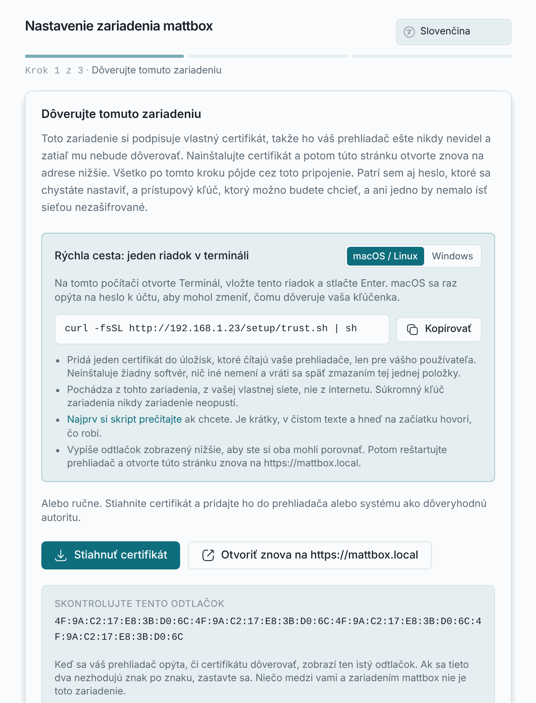
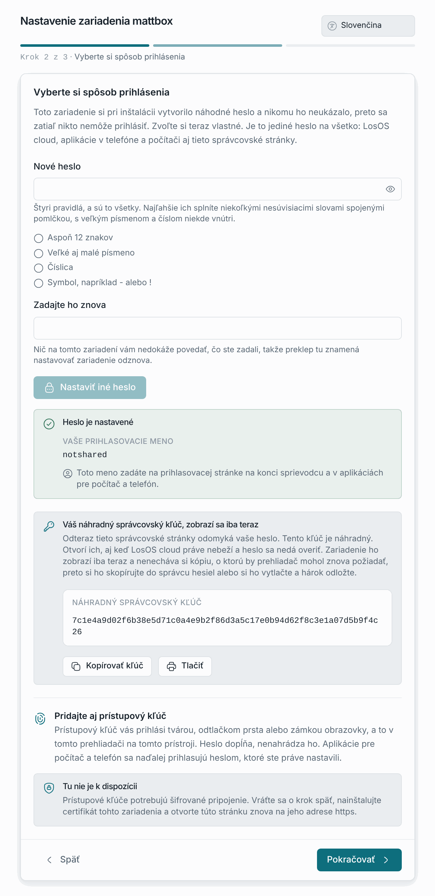
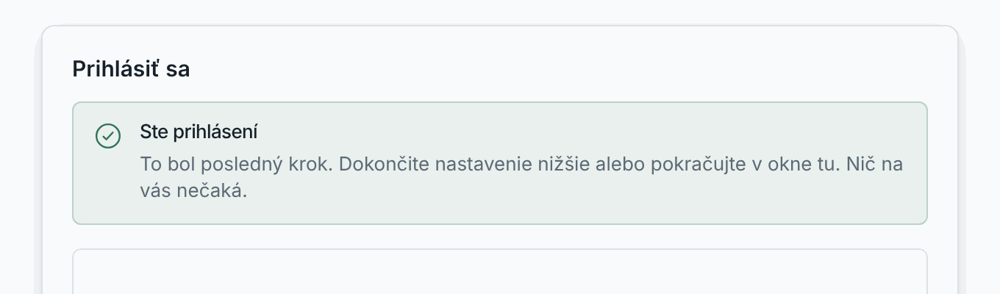

# Základná konfigurácia

Bod 2c zadania: *vykonajte základnú konfiguráciu operačného systému.* Na
boxe LosOS sa konfiguruje dvoma spôsobmi: pri **prvom spustení** cez
sprievodcu a potom priebežne cez **administračné stránky**. Oba zapisujú do
toho istého popisu systému; terminál sa nepoužíva nikdy.

## Prvé spustenie: sprievodca

Pri prvom otvorení adresy boxu sa zobrazí trojkrokový sprievodca. Treba ho
prejsť z počítača vo vlastnej sieti krátko po inštalácii: kým nie je
dokončený, box patrí tomu, kto ho dokončí ako prvý (tzv. *claim*). Zvonku
siete box nikto zabrať nemôže a bez preinštalovania ho zabrať znova nejde.

### Krok 1: Dôverovať tomuto boxu

Box obsluhuje HTTPS s certifikátom, ktorý si vydal sám. Sprievodca ukáže
jeden riadok pre terminál počítača, na ktorom sa stránka otvorila
(`curl -fsSL http://<adresa>/setup/trust.sh | sh` na macOS a Linuxe,
`irm http://<adresa>/setup/trust.ps1 | iex` na Windows), ktorý pridá
**jeden certifikát** do úložísk, ktoré prehliadače čítajú, len pre
aktuálneho používateľa a bez práv správcu. Skript pochádza z boxu v
lokálnej sieti, dá sa prečítať vopred a vypíše odtlačok certifikátu na
porovnanie so stránkou. Telefóny dostanú súbor `losos-ca.crt` na ručné
pridanie. Krok sa dá preskočiť; bez neho nebude k dispozícii passkey.

### Krok 2: Prihlasovanie

Majiteľ zvolí **heslo**: aspoň 12 znakov, veľké aj malé písmeno, číslica
a symbol; sprievodca odškrtáva pravidlá počas písania. Krok počká, kým
LosOS cloud dokončí svoj prvý štart (na čerstvom boxe pár minút), a potom
heslo nastaví. Prihlasovacie meno je `notshared`. Po nastavení sa raz
zobrazí **náhradný administračný kľúč** s tlačidlami Kopírovať a Tlačiť.
Na HTTPS spojení sa dá pridať passkey.

### Krok 3: Prihlásenie

Sprievodca otvorí LosOS cloud vo vlastnej stránke, majiteľ sa prihlási
práve nastaveným heslom a sprievodca ho prevedie na prehľad
administračných stránok.

## Administračné stránky: panely a Použiť

Box nemá nastavenia v bežnom zmysle; má **popis seba samého** v Nixe a
panely nastavení upravujú jeho malú časť. Pri úprave poľa sa dole zobrazí
lišta *N zmien ešte nepoužitých* s tlačidlami Zahodiť a Použiť. Pole, ktoré
neprejde kontrolou (názov s medzerou, port mimo rozsahu), je označené a
Použiť čaká. Nič sa boxu nedotkne, kým sa Použiť nestlačí.

Čo Použiť robí:

1. Démon zapíše voľby do `modules/overrides.nix` na `/etc/nixos`
   (jediný zdroj pravdy pre voľby majiteľa; `backend/src/overrides.rs`).
2. Spustí prestavbu ako úlohu na pozadí (`losos-rebuild-<job>`); widget
   **Zmeny** na Prehľade ukazuje, či každá prešla.
3. Nový systém sa prepne. Niektoré zmeny reštartujú samotný démon
   uprostred; ten úlohu po štarte znovu prevezme (`startSupervisor`).
4. Oznámenie povie *Zmeny použité* alebo *Zmeny sa nepodarilo použiť*
   s dôvodom.

Zmena buď prejde celá, alebo vôbec: zlyhaná prestavba nechá bežať
predchádzajúce nastavenia. Prestavba trvá niekoľko minút; box je medzitým
dostupný.

### Čo sa dá nastaviť

| Panel         | Nastavenia                                                                                                              |
| ------------- | ----------------------------------------------------------------------------------------------------------------------- |
| Sieť          | názov boxu (`<názov>.local`), šifrované spojenie (HTTPS), dostupnosť zvonku (tunel k edge), adresa edge                 |
| Hardvér       | povoliť aplikáciám grafický čip                                                                                          |
| Zabezpečenie  | štyri voliteľné ochrany: USBGuard, hardened_malloc, AppArmor, vypnutie SMT                                               |
| Vzhľad        | pozadie, závoj, ručne písané widgety (bez prestavby)                                                                     |
| O zariadení   | verzia, časovače, odkaz na príručku, odznak režimu úložiska                                                              |
| Reset         | obnovenie továrenského nastavenia (prázdny `overrides.nix` a prestavba)                                                  |
| Aplikácie     | LosOS Git zapnuté či vypnuté, režim aplikácií, vyhľadávanie v katalógu Nextcloudu                                        |
| Úložisko      | zaplnenie disku, použitie rezervy (`losos-ctl grow`)                                                                     |
| Mesh          | pripojiť sa k meshu, požičiavať procesor, okno hodín (v časovom pásme boxu)                                              |
| Trh           | zdieľanie disku a obchodovanie; zatiaľ sivé                                                                              |

Tabuľka zobrazení na voľby `losos.*` je v príručke (*Settings to
options*). Všetky voľby žijú pod `options.losos.*`, takže to, čo panely
neponúkajú, sa dá nastaviť úpravou popisu systému (napríklad zdroj
aktualizácií `losos.upgradeFlakeUri`).

Prepínače meshu a zdieľania disku sú **len na zapnutie s edge v dosahu**
(*enable-only* brána): kým box edge nenašiel (`GET /api/edge` hlási
*none*), sú sivé s dôvodom a priame volanie API odpovie 409. Zapnuté
zdieľanie sa pri strate edge nevypína samo, box ho však znovu ponúkne až
po jeho návrate. Kapitola 7 to overuje ako scenár A a B.

## Dve veci, ktoré nie sú súčasťou popisu

**Vzhľad** (pozadie, závoj, ručne písané widgety) drží démon ako dokument
v `/var` a platí okamžite pre každý prehliadač. **Nástenka** widgetov je
uložená v prehliadači, v ktorom ju majiteľ poskladal. Obe prežijú reštart,
ale ani jedna nepotrebuje prestavbu.

## Konfigurácia na úrovni systému

Pre úplnosť, konfigurácia, ktorú inštalátor a predvolené hodnoty vykonajú
bez zásahu majiteľa, a ktorá sa dá zmeniť len úpravou popisu:

- **Používatelia:** `notshared` (uid 1000) a `shared` (uid 1001), bez
  hesla, s vlastnými skupinami a domovmi 700; žiadne iné interaktívne účty,
  `services.openssh.enable = false`.
- **Sieť:** DHCP, mDNS/DNS-SD cez Avahi (box sa hlási ako `<názov>.local`),
  nginx na portoch 80 a 443, časové pásmo a locale v `configuration.nix`.
- **Trvalé adresáre:** zoznam v `modules/impermanence.nix`; čokoľvek nové,
  čo má prežiť reštart, musí pribudnúť tam.
- **Aktualizácie:** `system.autoUpgrade` o 03:00 zo zdroja
  `losos.upgradeFlakeUri` (predvolene vlastná kópia popisu
  `git+file:///etc/nixos#install`, ktorá softvér nemení; verejný zdroj
  `github:dasmatus/losos#install` ho mení). Fragment `#install` je nosný:
  bez neho `nixos-rebuild` hľadá konfiguráciu podľa názvu hostiteľa, ktorú
  flake neexportuje, a nočná aktualizácia potichu zlyháva.
- **Reštart** o 00:07 s `Persistent=true`, **GC** o 04:30.
- **Cache:** box sťahuje zostavené cesty z `cache.nixos.org` a z vlastnej
  cache projektu (`losos.cache.*`).

## Príklad: zapnutie vzdialeného prístupu

1. Prevádzkovateľ edge zapíše box do zoznamu povolených
   (`losos.edge.tenants.<id>` s tokenom).
2. Majiteľ na paneli Sieť zapne *Dostupný zvonku* a (ak edge nie je v tej
   istej sieti) zadá jeho adresu; Použiť.
3. Box sa zaregistruje na registrátore, stiahne verejný kľúč tunela a
   pripne ho, otvorí tunel smerom von. Edge vytvorí trasu a certifikát pre
   `https://<názov>.<doména edge>`.
4. Administračné stránky ostávajú aj cez tunel len pre LAN: tunel
   prichádza z loopbacku a guard loopback odmieta.
