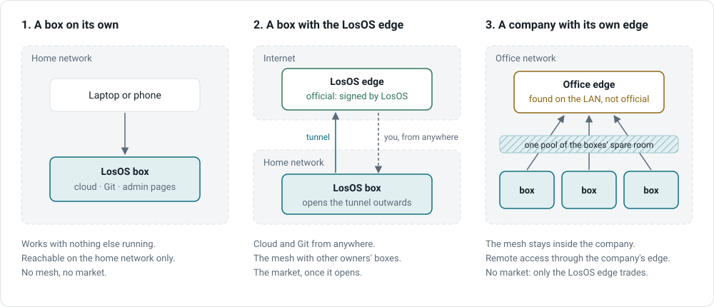

# Glossary

**Admin pages.** The box's own web page at `/`, LAN-only, where the box is
set up and looked after. Built as a single-page app the box serves itself.

**Apply.** Pressing the button that turns edited settings into a rebuild of
the box.

**Board.** The grid of widgets on the Overview page, kept in your browser.

**Box.** A machine running LosOS. The admin pages say "this box".

**Edge.** A server on the internet (or on a company's network) that boxes
keep a tunnel open to, for a public address, the mesh and the market. The
**LosOS edge** is the project's; a **company edge** is anyone else's.

**Find my box.** The page on the LosOS edge that finds a box on your LAN
from a Chrome browser.

**Keyfile mode.** The disk unlock mode for machines without a TPM: the key is
on the boot partition.

**LosOS cloud.** Nextcloud, in the box's colours: files, photos, calendar,
contacts, notes, tasks.

**LosOS Git.** Forgejo, in the box's colours: repositories.

**Market.** Being paid for shared disk and CPU, and buying some. Built, not
open. Lives on the LosOS edge only.

**Mesh.** The cluster of boxes behind one edge that pool spare disk
(replicated) and spare CPU (inside each box's hours, while idle).

**Overrides.** The one file holding the settings you chose
(`modules/overrides.nix`). The box is the LosOS source plus this file.

**Rebuild.** The box building a new version of its whole system from its
description and switching to it. Settings changes and the 03:00 update are
rebuilds.

**Reserve.** The 10 % of the disk the installer left unused, claimable from
the Storage pane.

**Spare admin key.** The 64-character key shown once in the wizard, for
unlocking the admin pages when LosOS cloud cannot check the password.

**TPM.** The security chip in the machine's firmware that holds the disk key
in the default unlock mode.

**Veil.** The slider on the Look pane that lays the page colour over the
background picture.

**Widget.** A tile on the board. Built-in, built from readings, or written
by hand.

**Wizard.** The three steps the admin pages show on a new box: trust the
certificate, set the password, sign in.

**Window.** The daily hours between which a box lends spare CPU.
