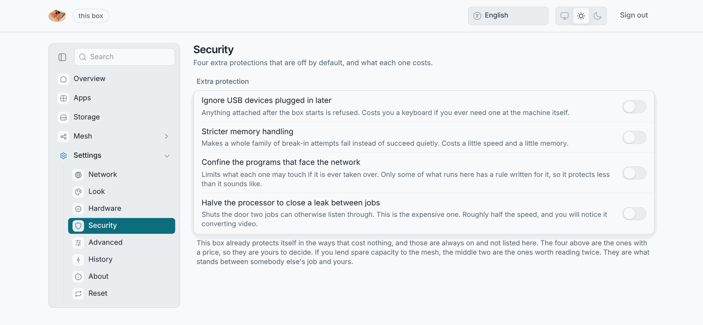

# Security model

This page is a summary for owners. The full document is
[`docs/security-model.md`](https://github.com/dasmatus/losos/blob/main/docs/security-model.md)
in the repository. It is versioned with the code, and it is written so you
can argue with it.

## Trust boundaries

1. **Internet → edge.** Only the edge is internet-facing. A box opens a
   tunnel outwards and listens on nothing from outside.
2. **Edge → box.** Noise encrypts the tunnel end to end. The box pins the
   edge's key on first contact and refuses a changed one.
3. **LAN → box.** The box serves HTTPS with its own certificate, which you
   trust once per computer. Until you do, someone on the same Wi-Fi who can
   intercept traffic could intercept first use.
4. **Your files ↔ the mesh's copies.** The box has two accounts with
   separate groups and mode-700 homes. The mesh's directory is encrypted
   with its own key, which the box loads only while sharing is on.
5. **An official edge ↔ any edge.** The box carries a root public key that
   lets it tell the LosOS edge from a company's own. Trading needs the LosOS
   edge, and everything else works with either. The private half is made and
   used only on the project owner's own computer. The tool that uses it signs
   the person in with GitHub and checks the account against a committed
   allowlist. No box and no edge ever holds the private key. The signed
   certificate reaches the edge over the web, and the edge checks the
   pusher's GitHub account against the same list before it installs it.

## What the admin key is

The 64-character spare key is as powerful as root: it can write any setting
and rebuild the box. The box creates it and shows it once, on a wizard
page. After that the box hands it only to a browser that proves the owner's
password. The control API listens on the box's loopback only, behind the
LAN-only guard. Ten failed attempts throttle an address. The box keeps an
audit log of settings changes, password resets and resets.

## Hardening

On by default: kernel hardening parameters and sysctls, a kernel-module
blacklist, a tmpfs `/tmp`, systemd sandboxing of the web server, mDNS and the
control daemon. Four protections that can break something are opt-in on the
Security pane: AppArmor, a hardened memory allocator, no SMT, USBGuard.
[Hardening](/in-depth/hardening.md) covers each flag and what it costs.

## Known limitations, stated plainly

- **The installer medium is signed; the installed system is not.** A
  firmware with the LosOS certificate enrolled verifies the stick's loader,
  one signed image holding the kernel, the initrd and the command line. That
  loader checks the system image's hash before mounting it, so an altered
  stick does not start. The box's own loader and nightly kernels are
  unsigned. The box therefore runs with Secure Boot off, and only physical
  possession protects its boot chain. [Secure Boot and signed
  media](../start/secure-boot) has the details.

- **One origin.** The admin pages, LosOS cloud and LosOS Git share one
  address. A cross-site scripting hole in either app could read the admin
  key from a tab that has it. The defences are the strict content-security
  policy on the admin pages, the LAN-only guard, and keeping the apps
  patched. The project weighed a separate name for the admin pages and kept
  one address.
- **Theft of the whole box.** The TPM releases the disk key to any software
  booted on that machine, so a thief with the box can read it. The
  encryption protects only a disk taken out on its own. On a box without a
  TPM, even the disk alone is readable. [TPM and the disk key](tpm) explains
  the difference.
- **The audit log** does not rotate, and root can rewrite it.
- **Throttling is per address**, so an attacker on the LAN who spoofs
  addresses gets a fresh budget each time.
- **A hand-written widget** runs in every browser that opens the box. It is
  sandboxed away from the admin key and the API, but it can show whatever its
  author wrote and fetch anything from the internet.
