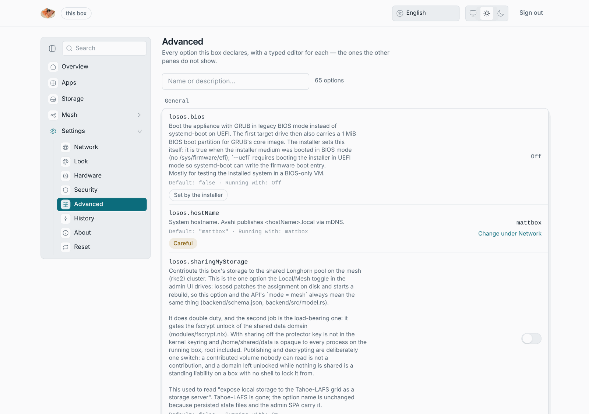

# Settings to options

Every field on the settings panes writes one option in the box's Nix
description (`losos.*`). Use this table when you want something the panes
do not offer. A maintainer sets these options in `modules/overrides.nix`,
and [Administration](/in-depth/administration.md#settings) documents
them in full.

## On the panes

| Pane     | Field                       | Option                                              | Default                 |
| -------- | --------------------------- | --------------------------------------------------- | ----------------------- |
| Network  | Name                        | `losos.hostName`                                    | `losos`                 |
| Network  | Encrypt the connection      | `losos.tls.enable`                                  | on                      |
| Network  | Reachable from outside      | `losos.proxy.enable`                                | off                     |
| Network  | Edge address                | `losos.proxy.registrarUrl`                          | the LosOS edge          |
| Apps     | LosOS Git                   | `losos.forgejo.enable`                              | on                      |
| Apps     | mode (read-only)            | `losos.nextcloud.mode`, `losos.forgejo.mode`        | `container`             |
| Storage  | Use the reserve             | runs `losos-ctl grow`, and the reserve is `losos.storage.fillPercent` | 90 %  |
| Mesh     | Join the mesh               | `losos.cluster.enable`                              | off                     |
| Mesh     | Share my spare time         | `losos.cluster.shareCompute`                        | off                     |
| Mesh     | Hours                       | `losos.cluster.computeWindow.{start,end}`           | unset                   |
| Market   | Share my disk               | `losos.sharingMyStorage`                            | off                     |
| Hardware | Graphics                    | `losos.gpu.enable`                                  | off                     |
| Security | AppArmor                    | `losos.hardening.apparmor`                          | off                     |
| Security | Hardened memory allocator   | `losos.hardening.malloc`                            | off                     |
| Security | No SMT                      | `losos.hardening.nosmt`                             | off                     |
| Security | USBGuard                    | `losos.hardening.usbguard`                          | off                     |

## Not on the panes

| What                                 | Option                             | Default                                    |
| ------------------------------------ | ---------------------------------- | ------------------------------------------ |
| Where updates come from              | `losos.upgradeFlakeUri`            | `git+file:///etc/nixos#install`, which brings no new software |
| The hardening baseline               | `losos.hardening.enable`           | on                                         |
| LosOS Git federation (ActivityPub)   | `losos.forgejo.federation.enable`  | on, while the disk is shared               |
| LosOS cloud federation               | `losos.nextcloud.federation.enable` | on, while the disk is shared              |
| The disk unlock mode                 | `losos.tpm.enable`                 | what the installer found                    |
| UEFI or BIOS                         | `losos.bios`                       | what the installer found                    |
| The disks                            | `losos.targetDrives`               | what the installer found                    |
| Certificate lifetime                 | `losos.tls.validityDays`           | 730                                         |
| Idle threshold for lending CPU       | `losos.cluster.idleLoadThreshold`  | 0.25 per core                               |
| The binary cache                     | `losos.cache.substituters`         | `https://proxy.losos.dasmat.us`, then `https://losos-cache-proxy.vercel.app`, then `https://losos.dasmat.us/proxy` |
| Who may read `/setup/state.json` from a web page | `losos.setup.finderOrigins` | the LosOS edge's find page             |

## Rules the panes enforce

- A name is letters, digits and hyphens, starting and ending with a letter
  or a digit, up to 63 characters.
- A port is between 1024 and 65535.
- The hours are two 24-hour times, `HH:MM`, in the box's own time zone. The
  window may cross midnight.
