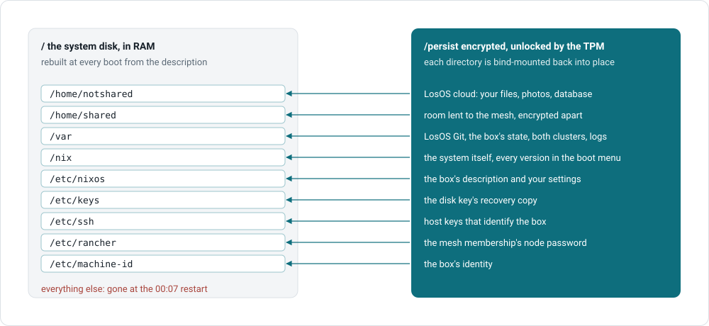

# What survives a reboot

The box rebuilds its system disk from nothing at every boot. It keeps only
these directories, on the encrypted volume, and bind-mounts them back into
place:

| Kept                       | Holds                                                                 |
| -------------------------- | --------------------------------------------------------------------- |
| `/home/notshared`          | LosOS cloud's data: your files, photos, database                      |
| `/home/shared`             | Room lent to the mesh, encrypted separately and unreadable while sharing is off |
| `/var`                     | LosOS Git's data, the box's state and secrets, the two clusters' state, logs |
| `/nix`                     | The system itself, every version kept for the boot menu               |
| `/etc/nixos`               | The box's own description: its disks, firmware mode, unlock mode, your settings |
| `/etc/keys`                | The disk key's recovery copy                                          |
| `/etc/ssh`                 | Host keys, which identify the box. There is no SSH server.            |
| `/etc/rancher`             | The mesh membership's node password                                   |
| `/etc/machine-id`          | The box's identity                                                    |

Everything else, including anything an attacker or a bug wrote anywhere
else, is gone at 00:07.

## Two things that are documents, not settings

The box keeps the **Look**, meaning the background, the veil and the
hand-written widgets, under `/var`. Your browser keeps the board layout. Both survive a
reboot, but neither is part of the box's description, and you can change
either without a rebuild.

## What a reinstall does

Wipes all of it. See [Reset and reinstall](../manual/reset-and-reinstall).
