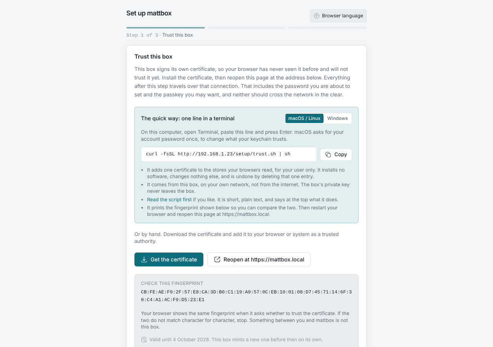
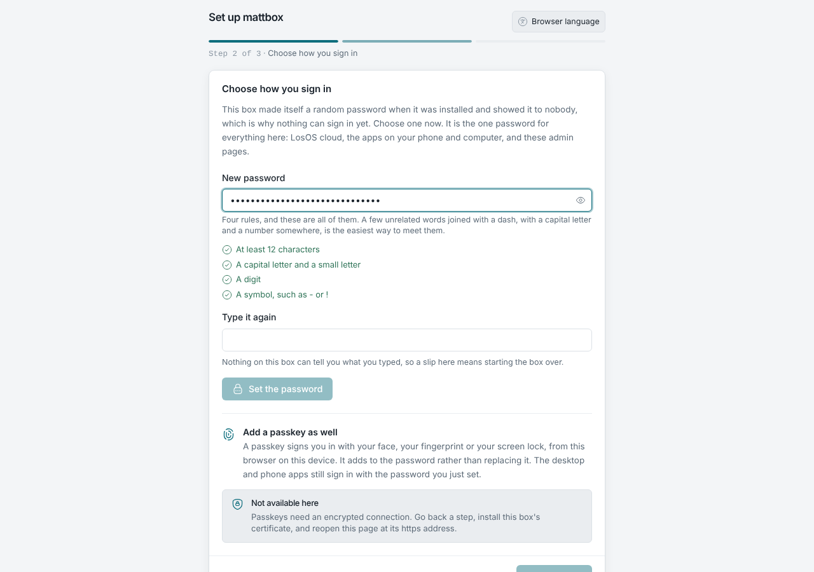
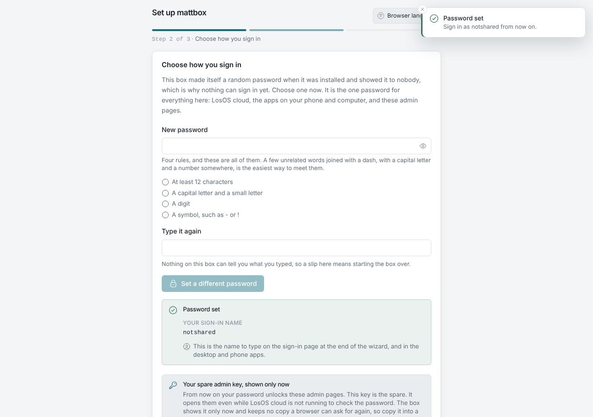
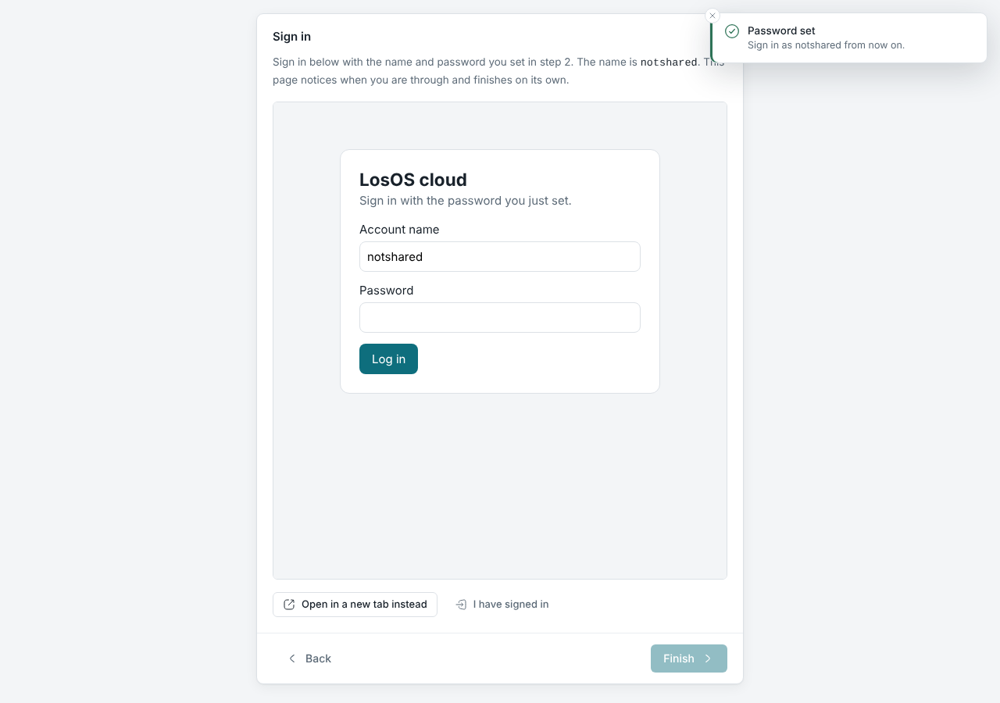

# The first run

The first time you open the box's address, the admin pages show a three-step
wizard. Do it from a computer on your own network, soon after the install:
until it is done, the first person to finish it owns the box.

## Step 1: Trust this box

The box serves HTTPS with a certificate it made itself, so your browser has
never seen it and will not trust it yet. Everything after this step, the
password you are about to set included, should travel over that encrypted
connection, so the wizard asks you to install the certificate first.

[](./img/wizard-trust.png)

The quick way is one line in a terminal, shown for the computer you are on:

```bash title="macOS and Linux"
curl -fsSL http://<address>/setup/trust.sh | sh
```

```powershell title="Windows (PowerShell)"
irm http://<address>/setup/trust.ps1 | iex
```

What that line does, and does not do:

- It adds **one certificate** to the stores your browsers read, for your
  user only: the login keychain on macOS, the user's Trusted Root store on
  Windows, the NSS stores Chrome and Firefox use on Linux. It installs no
  software and never asks for administrator rights. Deleting that one entry
  undoes it.
- It comes **from the box, on your own network**, not from the internet. You
  can open the link in a tab and read it first; it is short.
- It prints the certificate's **fingerprint**, which you compare with the one
  on the wizard page.
- macOS asks for your account password once (that is the keychain, not the
  script); Windows shows its own "install this root certificate?" dialog.

Phones have no terminal: download `losos-ca.crt` from the same page and add it
as a trusted certificate in the phone's settings. The manual route exists on
computers too.

Then restart the browser and reopen the page at `https://<name>.local` (or
`https://<address>`). You can also skip this step and come back to it; the
[certificate warning](../troubleshooting/certificate-warning) page is for
when it goes wrong.

## Step 2: Choose how you sign in

Set the **owner password**. It needs at least 12 characters with a lower-case
letter, an upper-case letter, a digit and a symbol such as `-` or `!`; the
wizard ticks each rule as you type. This one password opens LosOS cloud, LosOS
Git and the admin pages.

[](./img/wizard-password.png)

The step waits until LosOS cloud has finished its own first start, which takes
a few minutes on a fresh box ("waiting for" is shown with the reason). It
continues on its own.

When the password is set, the page shows the **spare admin key** once: 64
characters, with **Copy** and **Print** buttons. Print it or write it down and
keep it away from the box. It is for the one situation the password cannot
cover, LosOS cloud not running, and it cannot be shown again. See
[Sign-in and the spare key](../manual/sign-in-and-spare-key).

[](./img/wizard-spare-key.png)

On an HTTPS connection the step also offers a **passkey**, so a phone or a
laptop can sign in without typing the password.

## Step 3: Sign in

The wizard opens LosOS cloud inside the page so you can sign in with the
password you just set, and then takes you to the admin pages' overview. From
here on, see [The admin pages](../manual/admin-pages).

[](./img/wizard-sign-in.png)
