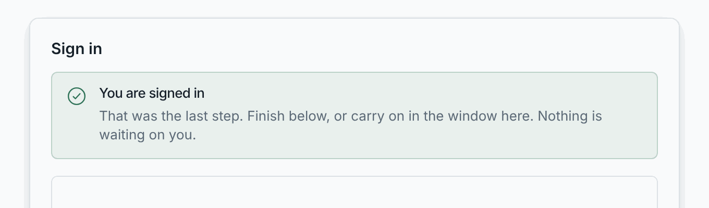

# The first run

The first time you open the box's address, the admin pages show a three-step
wizard. Do it soon after the install, from a computer on your own network.
Whoever finishes the wizard first owns the box.

## Step 1: Trust this box

The box serves HTTPS with a certificate it made itself. Your browser has
never seen that certificate, so it does not trust it yet. Everything after
this step should travel over the encrypted connection, including the password
you are about to set. That is why the wizard asks you to install the
certificate first.


The quick way is one line in a terminal, shown for the computer you are on:

```bash title="macOS and Linux"
curl -fsSL http://<address>/setup/trust.sh | sh
```

```powershell title="Windows (PowerShell)"
irm http://<address>/setup/trust.ps1 | iex
```

What that line does, and does not do:

- It adds **one certificate** to the stores your browsers read, for your
  user only: the login keychain on macOS, the user's Trusted Root store on
  Windows, the NSS stores Chrome and Firefox use on Linux. It installs no
  software and never asks for administrator rights. Deleting that one entry
  undoes it.
- It comes **from the box, on your own network**, not from the internet. It
  is short, and you can open the link in a tab and read it first.
- It prints the certificate's **fingerprint**, which you compare with the one
  on the wizard page.
- macOS asks for your account password once. The keychain asks for it, not
  the script. Windows shows its own "install this root certificate?" dialog.

Phones have no terminal. On a phone, download `losos-ca.crt` from the same
page and add it as a trusted certificate in the phone's settings. You can do
the same by hand on a computer.

Then restart the browser and reopen the page at `https://<name>.local` or
`https://<address>`. You can also skip this step and come back to it later.
If it goes wrong, see the
[certificate warning](../troubleshooting/certificate-warning) page.

## Step 2: Choose how you sign in

Set the **owner password**. It needs at least 12 characters with a lower-case
letter, an upper-case letter, a digit and a symbol such as `-` or `!`. The
wizard ticks each rule as you type. This one password opens LosOS cloud, LosOS
Git and the admin pages.


The step waits until LosOS cloud has finished its own first start, which takes
a few minutes on a fresh box. Meanwhile the page shows "waiting for" and the
reason. It continues on its own.


When the password is set, the page shows the **spare admin key** once: 64
characters, with **Copy** and **Print** buttons. Print it or write it down and
keep it away from the box. It covers the one situation the password cannot:
LosOS cloud not running. The page cannot show it again. See
[Sign-in and the spare key](../manual/sign-in-and-spare-key).


On an HTTPS connection the step also offers a **passkey**, so a phone or a
laptop can sign in without typing the password.

## Step 3: Sign in

The wizard opens LosOS cloud inside the page, and you sign in with the
password you just set. Then the wizard takes you to the admin pages'
overview. From here on, see [The admin pages](../manual/admin-pages).


