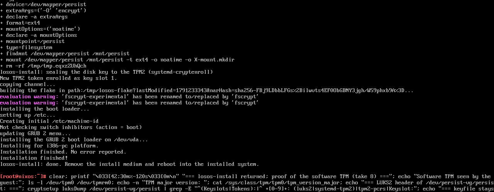
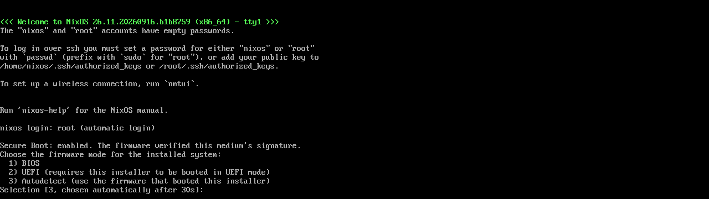

# Install

Installing takes one USB stick, one network cable and about half an hour,
most of it waiting. The installer asks one question and otherwise runs on its
own. **It wipes every fixed disk in the machine.**

## What you need

- A machine with a 64-bit Intel or AMD processor (x86_64) and UEFI or BIOS
  firmware, at least 4 GiB of memory and one disk of 40 GiB or more. Mini-PCs
  built for offices are ideal; most have a TPM 2.0 chip in the firmware
  (Intel PTT or AMD fTPM), which the installer uses to keep the disk key.
  LosOS is built for x86_64 only: it cannot be installed on an ARM machine,
  and in particular **not on an Apple Silicon (M-series) Mac**.
- A USB stick of 2 GiB or more.
- A wired network connection with internet access. The installer downloads
  the system it installs.
- A screen and keyboard for the machine, for the install only. After that the
  screen shows a banner with the box's address and nothing else is needed.

## Steps

1. Download the installer ISO and its `.sha256` from the
   [latest release](https://github.com/dasmatus/losos/releases/latest) and
   write it to the stick (balenaEtcher, Rufus in DD mode, or `dd`).
2. In the machine's firmware, either **turn Secure Boot off** or enrol the
   LosOS certificate so the firmware can verify the stick: see
   [Secure Boot and signed media](secure-boot). A PC trusts only
   Microsoft's keys out of the box, so with Secure Boot on and nothing
   enrolled the stick is refused, sometimes silently. The installed box
   needs Secure Boot off either way (its own loader is not signed).
3. Boot from the stick. A menu offers **UEFI**, **BIOS** or **autodetect**
   and takes autodetect after 30 seconds, so an unattended boot still
   installs. Autodetect picks the mode the stick itself was booted in, which
   is right for almost everyone. [Install variants](../types/install-variants)
   explains the choice.
4. Wait. The installer finds every fixed disk, puts them in one encrypted
   volume, downloads the system and installs it. It prints `unlock: TPM` or
   `unlock: keyfile in the initrd` near the end: see
   [Install variants](../types/install-variants#how-the-disk-is-unlocked)
   for what that means.
5. Remove the stick and let the machine reboot. The screen now shows a blue
   banner with the box's address. Open that address in a browser on any
   computer on the same network and follow [The first run](first-run).

## Trying it in a virtual machine

The box runs fine in QEMU, virt-manager or VirtualBox. Two things to know:

- Give the VM an emulated TPM (`swtpm`) if you want the TPM unlock path;
  without one the box installs in keyfile mode, which also works.
- The VM host usually does not resolve the box's `.local` name. Use the IP
  address from the banner. The wiki's
  [Install page](https://github.com/dasmatus/losos/wiki/Install) has the
  exact QEMU lines, and there is a ready-made demo disk image
  (`losos-disk-qcow2`, no encryption, no installer) for showing the box off.
