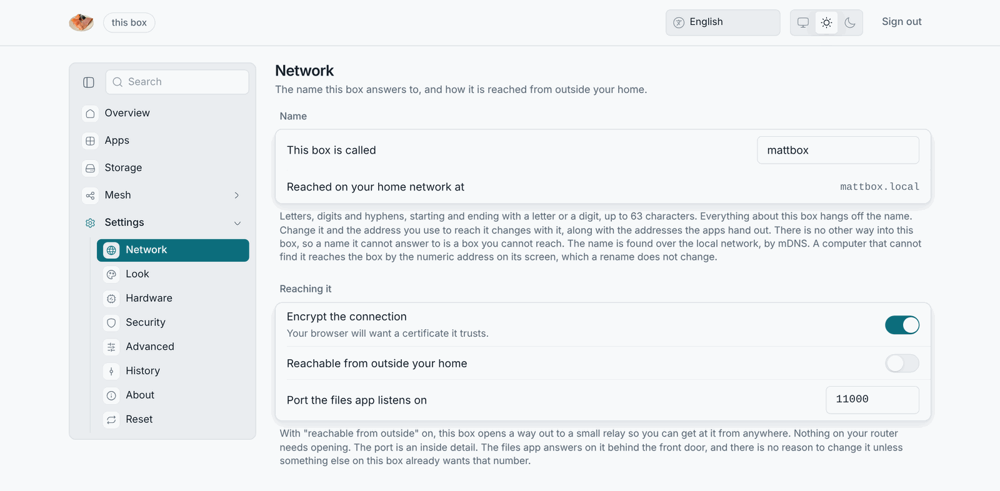

# Reaching the box

Everything on a LosOS box is a web page on one address. There are two ways to
write that address, and they are not equally reliable.

## By IP address (always works)

The banner on the box's screen shows `http://192.168.x.y` (whatever address
your router gave it). Every page answers on it: the admin pages at `/`, LosOS
cloud at `/nextcloud`, LosOS Git at `/forgejo/`, this handbook at
`/handbook/`. The banner redraws by itself when the address changes.

If the box has no screen attached, your router's device list shows the box
under the name you gave it (or `losos` before setup).

## By name (works on most computers)

The box announces `<name>.local` over mDNS. Windows, macOS, iPhones, Android
phones and most Linux desktops resolve it, so `http://<name>.local` opens the
same pages. Two kinds of computer do not:

- the host of a virtual machine on a NAT network (libvirt, VirtualBox), which
  never sees the guest's announcements;
- a computer on a different network, or behind a router that filters
  multicast.

The admin pages' **About** pane shows the address your browser is using right
now, and the `.local` name on its own row, so you can see which one you have.
Links the apps hand out (share links, clone URLs) use the name, because that
is the one that stays the same when the router hands out a new address.

## Over HTTPS

The box serves `https://` on port 443 with its own certificate, valid for two
years, for `<name>.local`. After you install that certificate
([first run, step 1](first-run#step-1-trust-this-box)), `https://<name>.local`
shows no warning. The IP address is not in the certificate, so
`https://<address>` always warns; use plain `http://<address>` instead, or
the name.

## "Find my box"

If reading a screen and typing an address is the scary part, open
[losos-edge.dasmat.us/find](https://losos-edge.dasmat.us/find) in Chrome
(version 142 or newer) and press **Find my box**. Chrome asks once whether the
page may look for devices on your local network; say yes, and the page finds
the box by its name and links you to it. The lookup runs inside your browser
and nothing about your network leaves your computer. Firefox and Safari have no
such permission and show the typed-address instructions instead.

## From outside your network

By default, nowhere. A box is reachable from the local network only. The
[official edge](../types/official-edge) setup gives it a public address
through a tunnel, and even then the admin pages stay LAN-only: only LosOS
cloud and LosOS Git are published.

