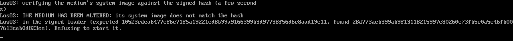
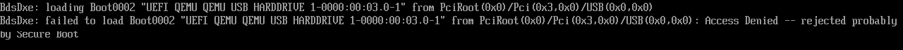
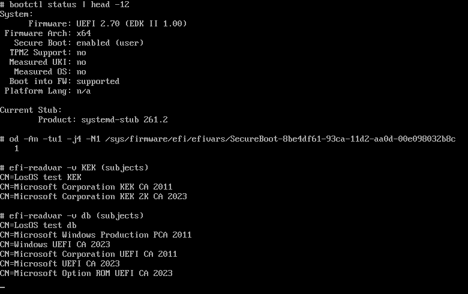

# Secure Boot and signed media

Every release's installer ISO is signed, and a machine with Secure Boot on
can verify it before a single byte of LosOS runs. This page says what the
firmware verifies, how to let your firmware trust LosOS, and how to check a
download by hand.

## What is verified, and by whom

With Secure Boot on, UEFI firmware verifies one thing: the program it is
about to start, against the certificates in its `db` list. LosOS makes that
one check cover the whole boot:

1. **The firmware verifies the loader.** The stick's UEFI loader,
   `EFI/BOOT/BOOTX64.EFI`, is a single *unified kernel image*. It holds the
   Linux kernel, the initial ramdisk and the kernel command line in one file,
   signed with the LosOS certificate. A changed byte in any of the three
   breaks the signature, and the firmware refuses to start it. Nothing from
   the stick runs before this check.
2. **The loader verifies the system.** The rest of the stick is one 1.5 GB
   system image, `nix-store.squashfs`. Its SHA-256 hash is part of the
   signed command line, and the initial ramdisk hashes the image on the
   stick before mounting it. It refuses an altered image, shows *THE MEDIUM
   HAS BEEN ALTERED* on the screen and powers the machine off.



The installer then prints what happened, above its firmware menu:

```
Secure Boot: enabled. The firmware verified this medium's signature.
```

or `Secure Boot: disabled ...` when the firmware checked nothing, or
`Secure Boot: not available (legacy BIOS boot)`. Secure Boot is a UEFI
feature. Nothing verifies a stick booted in BIOS mode, the same as any other
BIOS boot.


What is **not** covered is the installed system. The box boots with
systemd-boot from its own disk. Neither that loader nor the kernels its
nightly rebuilds install are signed, so the box itself needs Secure Boot
**off** to boot. Today the sequence is: enrol the certificate, boot the stick
with Secure Boot on so the firmware verifies the medium, install, then turn
Secure Boot off before the first boot from disk. Or leave it off throughout
and verify the download by hand instead, as described below. Signing the
installed system's boot chain would need a signing key on the box for every
rebuild. That is a separate design and not part of this one.

## Letting your firmware trust LosOS

A PC ships trusting Microsoft's certificates and nothing else, so with
Secure Boot on it refuses the LosOS stick. OVMF and most firmware print
*Access Denied*, and some skip the stick without a message. That refusal
means the signature check works. To boot the stick with Secure Boot on,
add the LosOS certificate to the firmware's `db`, next to Microsoft's:



1. Get the certificate. It is on the stick itself at
   `EFI/losos/losos-secure-boot.cer` in DER form and as `.pem`, and on every
   [release](https://github.com/dasmatus/losos/releases/latest) as
   `losos-secure-boot-db.cer`. The release notes print its SHA-256
   fingerprint, and `openssl x509 -in losos-secure-boot-db.pem -noout
   -fingerprint -sha256` prints the same for the file you have.
2. In the firmware's Secure Boot settings, switch from *Standard* to
   *Custom* mode. Choose *Append to db*, *Enroll key* or *Add signature
   from file*, and pick the `.cer` from the stick's EFI partition. The
   wording differs by vendor. The stick's EFI partition is a plain FAT
   volume every firmware can browse.
3. Boot the stick. The installer's first line says *Secure Boot: enabled*.

### Keep Microsoft's certificates

Add LosOS to the list. Don't replace the list with LosOS. Three things on a
normal PC are signed under Microsoft's certificates and stop booting the
moment those certificates leave `db`:

- Windows' own boot manager.
- Other Linux distributions, whose first-stage loader (shim) Microsoft signs.
- The firmware drivers on graphics and network cards, called option ROMs.
  On a desktop with a separate graphics card, losing these can mean no
  picture at all, including in the firmware's setup screen.

So avoid *Delete all keys*, *Clear Secure Boot keys* and *Reset to Setup
Mode* unless the next step is *Restore factory keys*. If your firmware
can only add a key after clearing them, restore the factory keys first and
then append the LosOS certificate.

From a running Linux in *Setup* mode, `efi-updatevar -a -c
losos-secure-boot-db.pem db` from efitools appends. With sbctl, pass
`--microsoft`: `sbctl enroll-keys --microsoft` keeps Microsoft's
certificates beside the ones sbctl enrols, and without the flag it drops
them. Then add the LosOS certificate to sbctl's db.

The test suite checks this exact state. Its firmware holds the LosOS
certificate and Microsoft's five `db` certificates and two `KEK`
certificates side by side. The LosOS stick boots, and so does Ubuntu's
Microsoft-signed shim. Take Microsoft's certificates away and the same
shim is refused:



Enrolment is a one-time change to that machine.

The LosOS loader is signed by LosOS, not by Microsoft. A stick that boots
on a stock PC with nothing enrolled would need a shim that Microsoft signed
for LosOS, after the public shim review and Microsoft's signing process,
which LosOS has not been through. Until then, every machine enrols the
LosOS certificate once.

## Verifying a download by hand

Each release carries `SHA256SUMS` and a detached signature, `SHA256SUMS.sig`,
made with the same certificate that signs the medium:

```sh
R=https://github.com/dasmatus/losos/releases/download/<tag>
curl -fsSLO $R/SHA256SUMS $R/SHA256SUMS.sig $R/losos-secure-boot-db.pem
openssl dgst -sha256 -verify <(openssl x509 -pubkey -noout -in losos-secure-boot-db.pem) \
  -signature SHA256SUMS.sig SHA256SUMS
sha256sum -c --ignore-missing SHA256SUMS
```

The first command prints `Verified OK`. The second checks whichever of the
release's files you downloaded. To check the loader's signature inside an
ISO you already have, run the repository's tool on it in place:

```sh
nix run github:dasmatus/losos#losos-sign-iso -- verify --cert losos-secure-boot-db.pem losos-installer-<tag>.iso
```

Compare the certificate's fingerprint with the one in the release notes,
and with `keys/secure-boot-db.pem` in the repository. All three are the same
file.

## Where the key lives

The private key never enters a Nix build or a box. The owner makes it
once, on their own computer, with `provisioning/secure-boot/keygen.sh`, and
keeps it offline. The only other copy is the repository secret CI signs
with. The certificate is committed as `keys/secure-boot-db.pem`. Until that
file carries one, releases say *Not signed* and the stick needs Secure Boot
off. The test suite checks the mechanism with a throwaway key it generates
and discards. `tests/secure-boot.nix` boots the signed medium under OVMF's
Secure Boot build and shows the firmware's own *enabled* flag from inside.
The firmware in that test holds Microsoft's certificates beside the test
key, and a Microsoft-signed shim still starts on it. It also watches the
firmware refuse the same medium under Microsoft-only keys, a tampered copy,
and the unsigned build, and refuse the shim once Microsoft's certificates
are gone.
