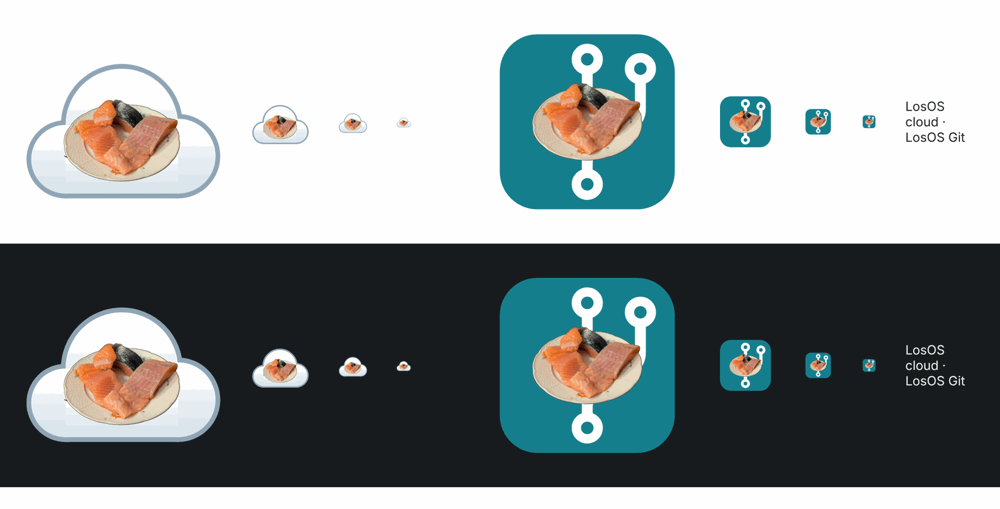

# What LosOS is

LosOS turns a small computer, typically a repurposed mini-PC, into an
appliance. You plug it into your network and power, install it once from a
USB stick, and after that you only use it through a web browser.

## What runs on it

| What you see          | What it is                                                                                      |
| --------------------- | ----------------------------------------------------------------------------------------------- |
| **LosOS cloud**       | Your files, photos, calendar, contacts, notes and tasks. Built on Nextcloud. At `/nextcloud`.   |
| **LosOS Git**         | Your code repositories, on by default. Built on Forgejo. At `/forgejo/`.                        |
| **The admin pages**   | Where you set up and look after the box. At `/`, reachable only from your local network.         |
| **The mesh**          | Optional. Spare disk and CPU lent to other LosOS boxes, and borrowed from them.                  |
| **Remote access**     | Optional. A public address for the box through an edge server, with no port opened at home.      |

## What makes it different from a NAS

- **It forgets everything it does not need.** The box rebuilds its system
  disk from scratch on every boot. Only your data, the settings you chose and
  a short list of system directories survive. They live on an encrypted
  volume. Anything an attacker, a bug or a mistake changed anywhere else is
  gone by the next morning.
- **It restarts itself every night** at 00:07 and updates itself at 03:00.
  That restart is how it repairs itself. That is also why it has no shell.
  Nothing on the box needs one.
- **It encrypts its disk and keeps the key in its own chip.** On a machine
  with a TPM, someone who pulls the disk out and plugs it into another
  computer cannot read it.
- **One password.** The password you set for LosOS cloud also unlocks the
  admin pages. A printed spare key lets you in on a day LosOS cloud is not
  running.
- **It can lend what it is not using.** A box can share its spare disk and
  CPU with other boxes, only within hours you choose and only while it is
  idle. The [market](../types/official-edge#what-the-edge-does-for-a-box) that pays owners for
  this is built. It will open once the business behind it exists.

## What it is not

- Not a general-purpose server. Without a shell, nobody can configure the box
  into a state that nobody wrote down.
- Not a backup. The box is one copy. Keep another copy of anything you cannot
  lose. LosOS cloud's desktop and phone clients are one way to keep it.
- Not finished. The market, one storage pool across boxes and a signed
  installer are still to come.
