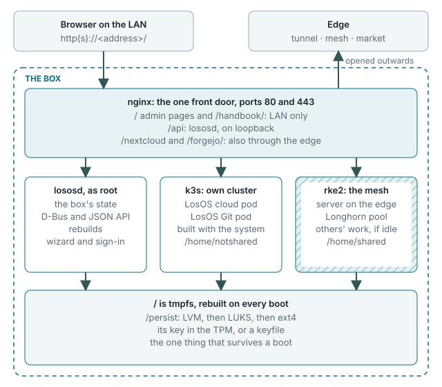
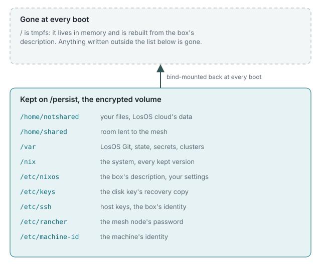

# What LosOS is

LosOS turns a small computer, typically a repurposed mini-PC, into an
appliance. You plug it into your network and power, install it once from a
USB stick, and from then on you only ever meet it through a web browser.

## What runs on it

| What you see          | What it is                                                                                      |
| --------------------- | ----------------------------------------------------------------------------------------------- |
| **LosOS cloud**       | Your files, photos, calendar, contacts, notes and tasks. Built on Nextcloud. At `/nextcloud`.   |
| **LosOS Git**         | Your code repositories, on by default. Built on Forgejo. At `/forgejo/`.                        |
| **The admin pages**   | Where the box is set up and looked after. At `/`, reachable only from your local network.        |
| **The mesh**          | Optional. Spare disk and CPU lent to other LosOS boxes, and borrowed from them.                  |
| **Remote access**     | Optional. A public address for the box through an edge server, with no port opened at home.      |

## What makes it different from a NAS

- **It forgets everything it does not need.** The system disk is rebuilt from
  scratch on every boot. Only your data, the settings you chose and a short
  list of system directories survive, on an encrypted volume. Whatever an
  attacker, a bug or a bad day changed elsewhere is gone by the next morning.
- **It restarts itself every night** at 00:07 and updates itself at 03:00.
  That restart is how it repairs itself, which is why there is no shell: there
  is nothing a shell would be needed for.
- **It encrypts its disk and keeps the key in its own chip.** On a machine
  with a TPM, the disk alone, pulled out and plugged into another computer,
  is unreadable.
- **One password.** The password you set for LosOS cloud is the password
  that unlocks the admin pages. A printed spare key covers the day LosOS
  cloud is not running.
- **It can lend what it is not using.** Within hours you choose, and only
  while it is idle, a box can share its spare disk and CPU with other boxes.
  The [market](../types/official-edge#what-the-edge-does-for-a-box) that pays owners for that
  is built and will open once the business behind it exists.

## What it is not

- Not a general-purpose server. There is no shell by design, and that is a
  feature: the box cannot be configured into a state that nobody wrote down.
- Not a backup. The box is one copy. Keep another copy of anything you cannot
  lose; LosOS cloud's desktop and phone clients make that easy.
- Not finished. The market, one storage pool across boxes and a signed
  installer are still to come.
