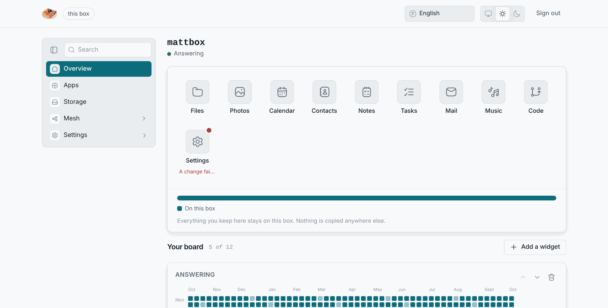

# Apply fails

**What you see:** after **Apply**, the notification says "That did not
start", "The changes could not be applied", or the Overview's **Changes**
widget lists the job as failed. The box keeps running its old settings.

## What a failed Apply means

Nothing changed. A rebuild either completes and the box switches to it, or
it fails and the previous system keeps running. A rebuild never touches your
files.

## Causes, most likely first

1. **A box from before 7 October 2026.** Every Apply on an installed box
   answered "That did not start" because the rebuild command was not on
   the daemon's path. Pull request #71 fixed it, and the 03:00 update brings
   the fix. The nightly update uses a different path and never had the bug.
   Until the fix arrives, you cannot change settings from the panes.
2. **A box that is already rebuilding.** The notification says so. Wait for
   the running job to finish, which the Changes widget shows, and apply
   again.
3. **The disk is full.** A rebuild needs room. See [Out of room](out-of-room).
4. **A setting the box cannot take.** A name with a character the checks did
   not catch, a port in use. **Discard**, change one thing at a time, apply
   again, and see which one fails.
5. **The upgrade source is unreachable.** If the box's upgrade source points
   at GitHub and the internet is down, a rebuild that needs to fetch fails.
   Wait, or apply once the internet is back. The box's own description never
   needs the internet.

## What to do when it keeps failing

- Wait for the next 03:00. The nightly rebuild runs the same job with the
  same settings file. If it fails too, it leaves the box as it is.
- **Settings → Reset** puts every setting back and rebuilds from the
  defaults. The defaults are the one description known to work on every
  box. Your files stay.
- [Get help](getting-help) with the Changes widget's text for the failed
  job.
