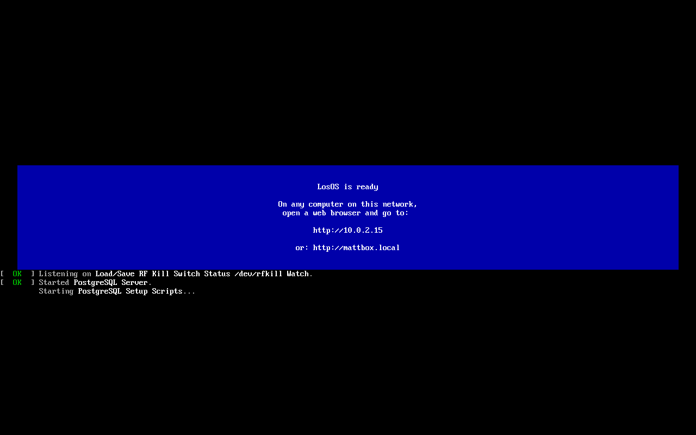

# Cannot reach the box

**What you see:** the browser says the site cannot be reached, the
connection timed out, or the page spins forever. Nothing on the box
answers.

## From the LAN

1. **Read the screen.** The banner shows the address the box has *now*. A
   router that restarted may have given it a new one; the banner redraws by
   itself. Type that address, as `http://`, not the name and not `https://`.
2. **Same network?** A laptop on the guest Wi-Fi, or on a VPN, is on a
   different network. Both the box and the computer need an address in the
   same range (both `192.168.1.x`, say). The admin pages also refuse any
   address that is not a private one, so a request arriving through a tunnel
   or from the internet gets **403**, by design.
3. **The banner says "No network address yet."** Plug the Ethernet cable in,
   or into a different port on the router; the box has no Wi-Fi setup. The
   screen updates on its own once the cable carries a link.
4. **No banner, black screen.** Give it two minutes after power-on. If the
   screen stays black, check the power light and the monitor input. A box
   that shows a text login prompt instead of the banner is the one state the
   nightly restart repairs: wait for 00:07, or pull the power.
5. **Only one page is down.** `http://<address>/api/health` answers but
   LosOS cloud does not: the app is still starting (a few minutes after any
   restart), or see [An app tile gives 404](app-tile-404).

## From outside the LAN

A box on its own is not reachable from outside, and that is not a fault. A
box with an edge is reachable at its public name for LosOS cloud and LosOS
Git only; the admin pages are never published. If the public name stops
answering, it is the tunnel: on the LAN, the Mesh pane shows whether the edge
is found ([No edge found](edge-not-found)), and the box reconnects on its
own when it is.

## Still nothing

If the banner shows an address, `http://<address>/api/health` answers, but
the admin pages do not load, the page may be cached from before an update:
reload with the cache bypassed (Ctrl+Shift+R) or open a private window.

If the banner shows an address and nothing at all answers on it, the box's
front door (nginx) is down and the nightly restart is the repair. If it is
still down the next morning, [get help](getting-help) with the banner's
text.
