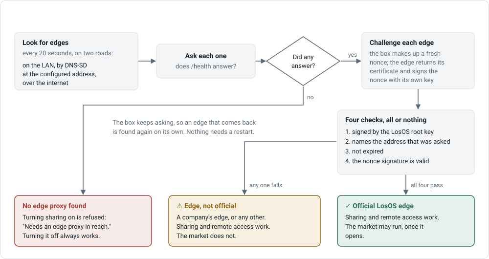
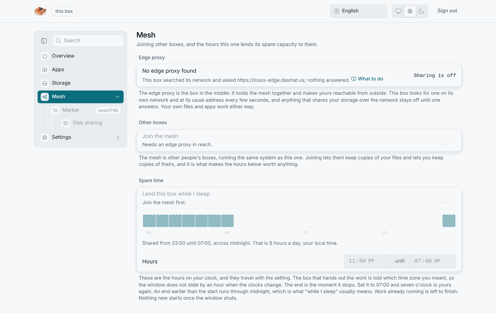

# No edge found

**What you see:** the Mesh pane says **No edge proxy found** and **Sharing is
off**; the mesh and disk-sharing switches are greyed with "Needs an edge
proxy in reach."; an apply was refused with "no edge proxy is reachable from
this box"; the public name of the box stops answering.

## What the box looks for

Every 20 seconds the box looks for an edge in two places: an announcement on
the local network (for a [company edge](../types/company-edge) on the same
LAN) and the configured address (for the [LosOS edge](../types/official-edge)
or a company edge elsewhere). An edge counts once its `/health` answers. The
Mesh pane shows every edge it found, with a sign saying whether it proved
itself official, or the sentence under **No edge proxy found** says what was
tried:

| The pane says                                                              | Meaning                                                                       |
| -------------------------------------------------------------------------- | ----------------------------------------------------------------------------- |
| "This box searched its network and asked `<address>`; nothing answered."   | Both roads were tried. The address is the configured one.                     |
| "This box searched its network and nothing answered."                      | No address is configured; only the local network was searched.                |
| "This box could not search its network, and nothing answered elsewhere."   | The box's mDNS service was not running, so a LAN edge could not be found even if present. A reboot brings it back. |

## From the LAN

1. **Does the box have the internet?** An edge on the internet needs it; a
   company edge on the LAN does not. The Overview says whether the box is
   answering; the box has no "internet" light, so try the edge's address in
   your own browser from the same network. If only the local network works,
   that page is [Only the local network works](only-the-lan-works).
2. **Is the address right?** Settings → Advanced, find
   `losos.proxy.registrarUrl`. It is the base address of the edge's API,
   `https://losos-edge.dasmat.us` for the LosOS edge's control plane. A
   company edge on the LAN announces its own, usually
   `http://<edge>.local:8443`.
3. **Company edge on the LAN: same network segment?** mDNS announcements
   do not cross routers or VLANs. Enter the edge's address instead of relying
   on discovery.
4. **Is the edge announcing itself?** A company edge is found on the LAN
   only with `losos.edge.lan.advertise` on; without it, boxes need its
   address. Whoever runs the edge sets that.
5. **Is this box enrolled?** An edge only accepts boxes on its allow-list,
   each with a token. Discovery does not need enrolment, the tunnel does: a
   box that was reinstalled has a new identity and must be enrolled again by
   whoever runs the edge.
6. **Was the edge reinstalled?** The box pins the edge's tunnel key on first
   contact. A rebuilt edge with a new key is refused, on purpose; the
   operator clears the pinned key on the box (a file under the box's
   secrets, reachable only via a rebuild) or re-enrols the box.

## The box reconnects on its own

Once the edge answers again, the next scan finds it, within 20 seconds, and
the Mesh pane follows a few seconds later; the tunnel comes back without a
restart. Nothing you turned on is turned off by an outage; only *turning on*
is refused while no edge is found, and that is
[Sharing is refused](sharing-refused).
