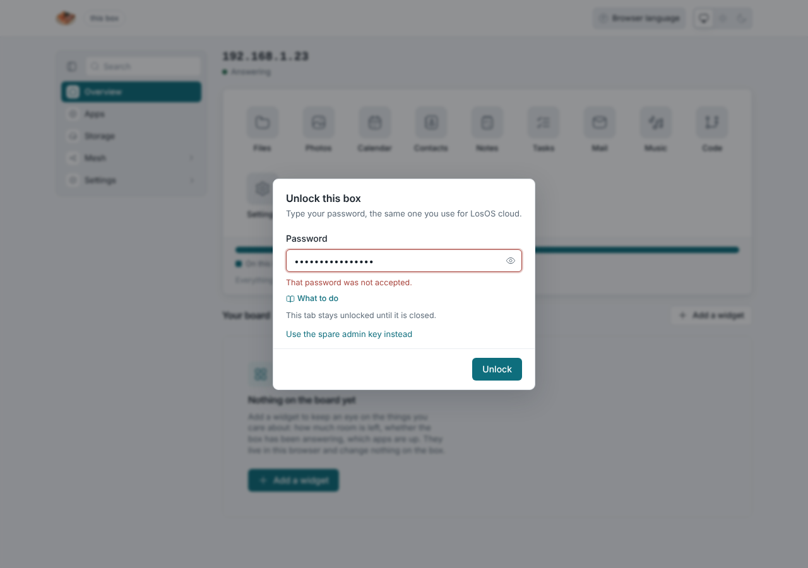
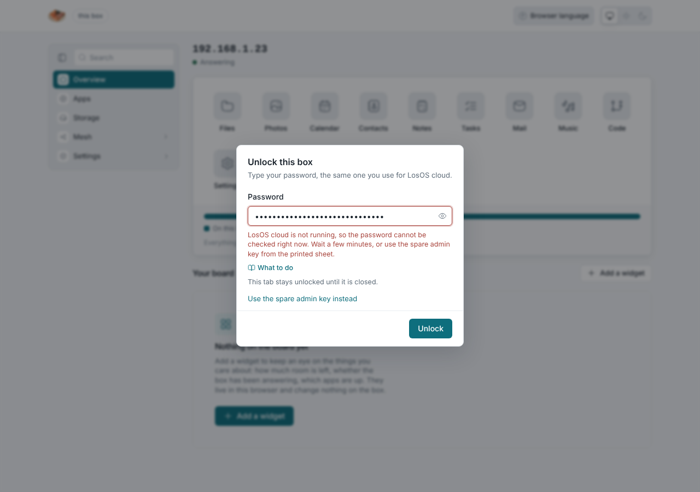
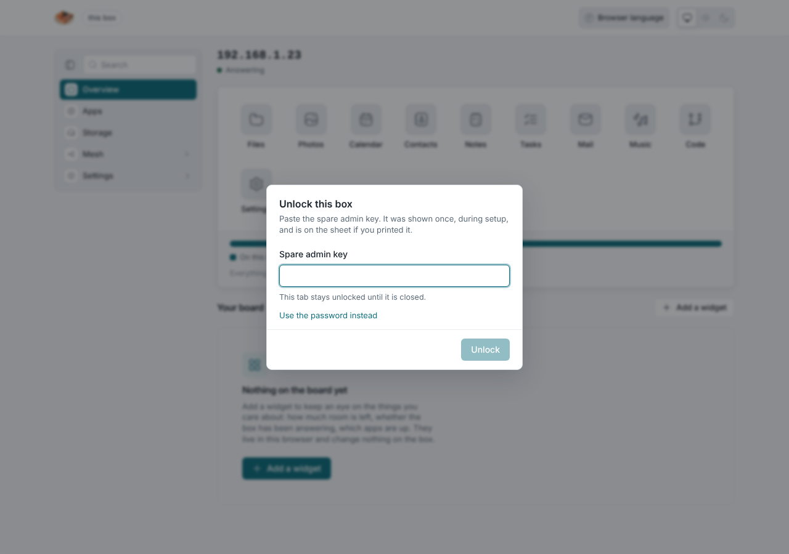

# Forgot the password

<div className="losos-symptom">

**What you see:** "That password was not accepted" on the unlock dialog, or
on LosOS cloud's sign-in page.

</div>

[](./img/unlock-refused.png)

## First, make sure it is the password

- **LosOS cloud is not running.** The unlock dialog then says so ("LosOS
  cloud is not running, so the password cannot be checked right now") rather
  than rejecting the password. Wait a few minutes after a restart, or use the
  spare key as below.
- **A box from before 7 October 2026** rejected every password on the admin
  pages even when LosOS cloud accepted it (the password never reached the
  check). That was fixed in pull request #71; the nightly update brings it.
  Until then, the spare key works.
- **Too many tries.** Ten wrong attempts lock the computer out for a growing
  while; wait a few minutes.

[](./img/unlock-cloud-down.png)

## You have the spare admin key

On the unlock dialog, choose **Use the spare admin key instead** and paste
the 64-character key from the printed sheet. The admin pages open.

[](../manual/img/unlock-spare-key.png)

The key also lets you set a **new owner password** for LosOS cloud, through
the same route the wizard used. There is no button for it on the panes yet,
so it is one command from a computer on the LAN (replace the key, the address
and the password; the new password must follow the four rules):

```bash
curl -H "Authorization: Bearer <spare key>" -H "Content-Type: application/json" \
  -d '{"password": "Correct-horse battery staple 1"}' \
  http://<address>/api/set-password
```

The answer names the account it reset. Sign in to LosOS cloud with the new
password; the admin pages take it from then on too.

## You have neither

LosOS cloud is the judge of the password and keeps the only copy. There is no
reset link (the box sends no mail) and no shell to run a reset on. The honest
answer is a **reinstall**, which wipes the disk, and a restore of your files
from the other copy you keep (the desktop client's folder, the phone's
uploads). Before reinstalling, if another account in LosOS cloud has the
admin role, that account can reset the owner's password from LosOS cloud's
Users page.

## Preventing the next time

Print the spare key when the wizard shows it, and keep it away from the box.
Put the password in a password manager. Give a second trusted person an admin
account in LosOS cloud.
