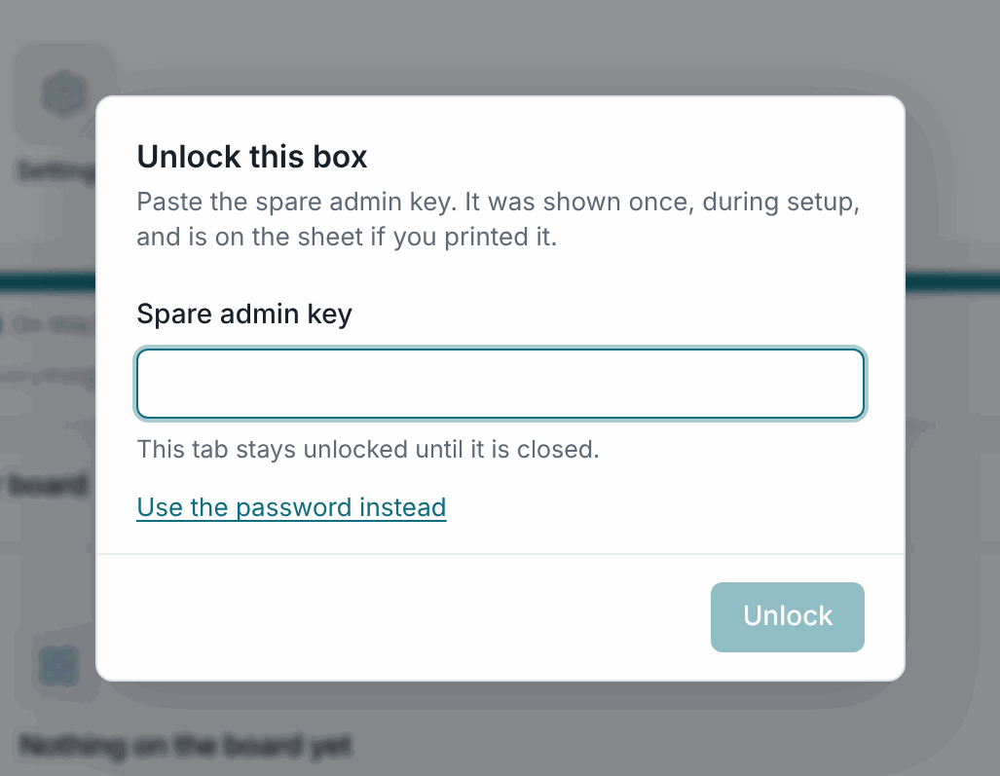

# Forgot the password

<div className="losos-symptom">

**What you see:** "That password was not accepted" on the unlock dialog, or
on LosOS cloud's sign-in page.

</div>

## First, make sure it is the password

- **LosOS cloud is not running.** The unlock dialog then says "LosOS cloud
  is not running, so the password cannot be checked right now" instead of
  rejecting the password. Wait a few minutes after a restart, or use the
  spare key as below.
- **A box from before 7 October 2026** rejected every password on the admin
  pages even when LosOS cloud accepted it, because the password never
  reached the check. Pull request #71 fixed that, and the nightly update
  brings the fix. Until it arrives, the spare key works.
- **Too many tries.** Ten wrong attempts lock the computer out for a growing
  while. Wait a few minutes.

## You have the spare admin key



On the unlock dialog, choose **Use the spare admin key instead** and paste
the 64-character key from the printed sheet. The admin pages open.

The key also lets you set a new owner password for LosOS cloud, through the
same route the wizard used. There is no button for it on the panes yet, so
you run one command from a computer on the LAN. Replace the key, the address
and the password. The new password must follow the four rules:

```bash
curl -H "Authorization: Bearer <spare key>" -H "Content-Type: application/json" \
  -d '{"password": "Correct-horse battery staple 1"}' \
  http://<address>/api/set-password
```

The answer names the account it reset. Sign in to LosOS cloud with the new
password. The admin pages accept it from then on too.

## You have neither

LosOS cloud checks the password and keeps the only copy. There is no reset
link, because the box sends no mail, and no shell to run a reset on. Before
you reinstall, check whether another account in LosOS cloud has the admin
role. That account can reset the owner's password from LosOS cloud's Users
page. Otherwise the only way back is a **reinstall**, which wipes the disk,
and then a restore of your files from the other copy you keep, such as the
desktop client's folder or the phone's uploads.

## Preventing the next time

Print the spare key when the wizard shows it, and keep it away from the box.
Put the password in a password manager. Give a second trusted person an admin
account in LosOS cloud.
