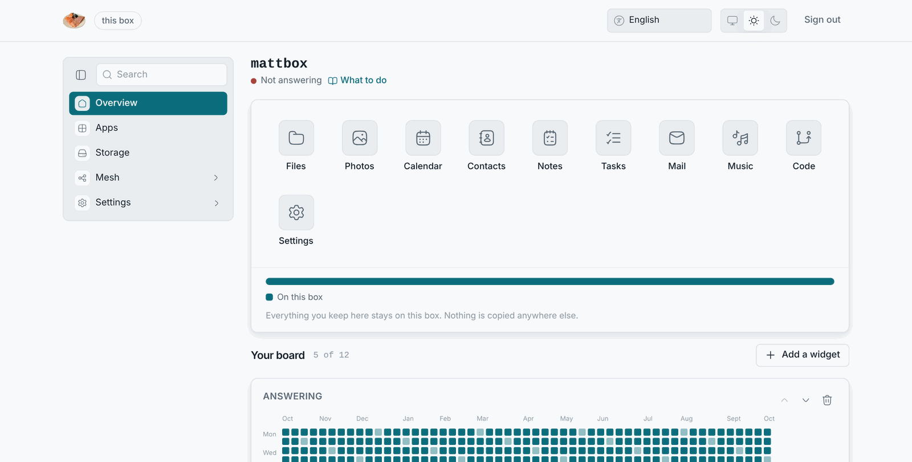

# When something goes wrong

This chapter assumes the worst case that is still worth anything: **you are
on the same local network as the box, and that is all you have.** No
internet, no edge, no shell. Every page is organised by what you see, and
every page starts with the steps that work from the LAN alone.

If the box's own pages open and only the outside is missing, that is not a
fault on the box: [Only the local network works](./only-the-lan-works.md)
lists what can cause it (the provider's line, the router's uplink, the edge),
what still works, what waits, and why there is nothing to reconfigure
afterwards.

## The first five minutes

Do these in order; most problems stop at one of them.

1. **Look at the box's screen.** A blue banner with `LosOS is ready` and an
   `http://` address means the box has booted and has a network. No banner,
   or a text login prompt, or a passphrase prompt, is a different problem:
   [Stuck at a passphrase prompt](./stuck-at-passphrase.md), or
   [Cannot reach the box](./cannot-reach-the-box.md) for a black screen.
2. **Use the IP address, not the name.** Type the `http://192.168.…` from
   the banner into a browser on the same network. Half of all "the box is
   down" reports are a computer that does not resolve `.local`:
   [The name does not resolve](./name-does-not-resolve.md).
3. **Try plain `http://`.** An `https://` address with a certificate
   warning is not an outage: [Certificate warning](./certificate-warning.md).
4. **Ask the box whether it is alive.** Open `http://<address>/api/health`.
   The answer `{"ok":true}` means the control daemon is up. Open
   `http://<address>/setup/state.json` for the box's name and address as it
   sees them.
5. **Wait for the next restart, or cause one.** The box restarts itself at
   00:07 and rebuilds its system disk from scratch when it does. Pulling the
   power and plugging it back in does the same thing now. Your files are on
   the encrypted volume and are not touched by a restart.

## What the box can tell you from the LAN

| Where                                   | What                                                                                         |
| --------------------------------------- | -------------------------------------------------------------------------------------------- |
| The screen (tty1)                       | The IP address and the `.local` name. Redraws when they change.                              |
| `http://<address>/api/health`           | Whether the control daemon answers.                                                           |
| `http://<address>/setup/state.json`     | Name, address, whether HTTPS is on, the certificate's fingerprint.                            |
| Overview page                           | Answering or not, uptime, apps up or down, the **Changes** widget with every rebuild's outcome. |
| About pane                              | Name, address, storage mode, mesh state, the two timers.                                      |
| Storage pane                            | How full the disk is.                                                                         |
| Mesh pane                               | Whether an edge was found, and which kind.                                                    |

## What it cannot tell you

There is no log viewer and no terminal, because there is no shell. A problem
that none of these surfaces explain is one of two things: something the
nightly restart will repair on its own, or something that needs a reinstall.
[Getting help](./getting-help.md) says what to collect before asking.

## The pages

- [Only the local network works](./only-the-lan-works.md)
- [Cannot reach the box](./cannot-reach-the-box.md)
- [The name does not resolve](./name-does-not-resolve.md)
- [Certificate warning](./certificate-warning.md)
- [Forgot the password](./forgot-password.md)
- [Stuck at a passphrase prompt](./stuck-at-passphrase.md)
- [The wizard keeps waiting](./wizard-waits.md)
- [An app tile gives 404, or "untrusted domain"](./app-tile-404.md)
- [Apply fails](./apply-fails.md)
- [Out of room](./out-of-room.md)
- [No edge found](./edge-not-found.md)
- [Sharing is refused](./sharing-refused.md)
- [Getting help](./getting-help.md)
