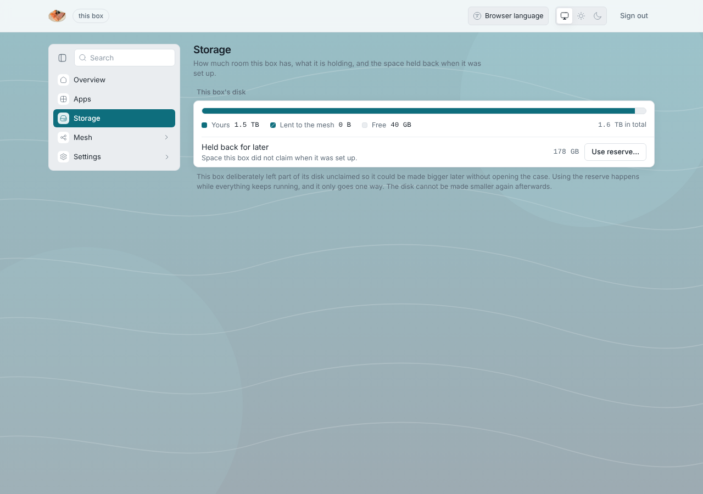

# Out of room

**What you see:** the Overview says **Almost full** or **Out of room**;
uploads to LosOS cloud fail; an Apply or the nightly update fails.

## Why it matters more than on a laptop

The box's own software lives on the same volume as your files, and each
update adds a version until the clean-up at 04:30 removes versions older
than 14 days. A full disk therefore blocks the one thing that repairs the
box, so act before **Out of room**.

## What to do, in order

1. **Claim the reserve.** Storage pane → **Use the reserve**. The installer
   held back 10 % of the disk for exactly this; claiming it takes a minute
   and needs no restart. See [Disk growth](../manual/disk-growth).
2. **Empty the trash in LosOS cloud.** Deleted files sit in "Deleted files"
   for 30 days and still take room. Photos app thumbnails and versions
   ("Versions" in a file's sidebar) add up too.
3. **Wait a night.** The 04:30 clean-up deletes old system versions. If the
   box was installed or updated a lot in the last two weeks, that can be
   several gigabytes.
4. **Move data off** with the desktop client or by downloading from LosOS
   cloud, then delete it there.
5. **Share less.** A box lending room to the mesh (Storage mode: shared)
   holds copies for other boxes; turning sharing off returns that room, after
   the pool has re-replicated.
6. **Add a disk** or reinstall onto a bigger one ([Disk growth](../manual/disk-growth)).

## The Storage pane does not report a size

"This box has not reported how full its disk is" right after a restart is
normal for a minute. If it stays, the control daemon is not answering:
`http://<address>/api/health` should say `{"ok":true}`; if not, the nightly
restart is the repair.
