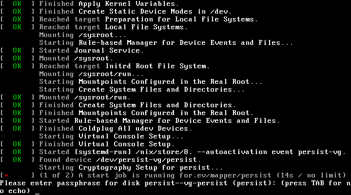

# Stuck at a passphrase prompt

**What you see:** instead of the box's address, the panel under the salmon
says `Please enter passphrase for disk persist` (or similar) and waits. On a
machine that boots in text, the same line is on a black screen. The box
never asks for a passphrase on a normal boot.

## Why it happens

The box could not unlock the encrypted volume the way it was installed to
unlock it:

| Install              | What went wrong                                                                                                           |
| -------------------- | ------------------------------------------------------------------------------------------------------------------------- |
| **TPM**              | The chip no longer holds the key, or no longer releases it. The firmware's TPM was cleared or reset, the chip was replaced, or the disk was moved to another machine. In a VM, the emulated TPM started with a different state directory than at install time. |
| **Keyfile**          | The boot partition lost or damaged the key file, or the disk was partially cloned.                                         |
| **Any, before 2 October 2026** | A bug in older installers formatted the volume with one key and tried to unlock it with another, because a stray byte was stripped on the way in. Every such box stopped at this prompt on its first boot. Pull request #47 fixed it. Install from a current ISO. |

## What you can do

There is no passphrase to type. The key is a random 4096-character string
that no one has ever seen. The recovery copy lives *inside* the encrypted
volume, so it cannot open that volume.

1. **Power off and on once.** A TPM that failed to answer during a hurried
   boot sometimes answers the next time.
2. **In a VM**, start the emulated TPM with the same state directory used
   at install time, before starting the VM.
3. **On hardware**, check that the firmware's TPM, Intel PTT or AMD fTPM,
   is still enabled, and that no firmware update or "reset to defaults"
   cleared it.
4. Otherwise, **reinstall**. Without the key the data on the volume is
   unreadable, which is what the encryption promised. Your files are in the
   copy you keep elsewhere.

## Preventing the next time

Keep another copy of your data. Do not clear the TPM in the firmware. In a
VM, keep the TPM state directory with the disk image. The
[install variants](../types/install-variants#how-the-disk-is-unlocked) page
explains the trade-off the TPM mode makes.
