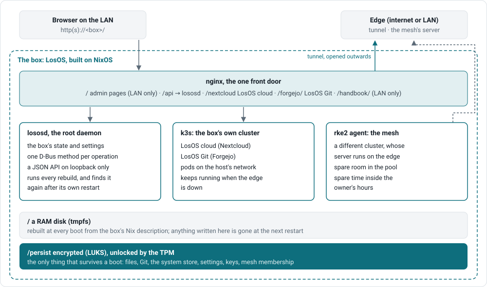
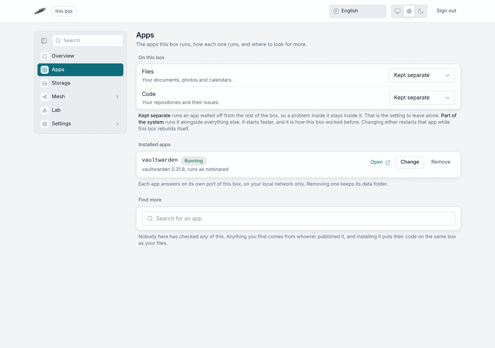

# App modes

LosOS cloud and LosOS Git each run in one of two modes. You see the
same app at the same address either way, and the Apps pane shows which mode
each one is in.

| Mode            | What runs where                                                                                           | Default |
| --------------- | --------------------------------------------------------------------------------------------------------- | ------- |
| **Workload**    | The app runs in a container inside the box's own small Kubernetes cluster (k3s), from an image built with the system. | yes     |
| **Native**      | The app runs directly on the box as a system service.                                                       | no      |

## Why workload is the default

- The app's image is built and tested together with the system, so an update
  brings a known-good pair.
- The box already runs a cluster for the mesh, and its own apps use the same
  machinery. Their cluster has no network plugin. The pods share the box's
  network, which is why they answer on loopback.
- Each app sees its own data directory and nothing else.

## Why native exists

Native is the older shape. It stays because the same Nextcloud
configuration feeds both modes, so the two cannot drift apart. You set the
mode in Nix, not in the admin pages, and switching needs a rebuild.

## Two clusters, on purpose

The box's own apps live in its own cluster. The [mesh](official-edge) is a
different cluster, and the edge runs it. LosOS never places the box's apps
in the mesh cluster. A cluster member cannot start while its server is
unreachable, and the box restarts every night at 00:07, so an edge outage
over midnight would take your own files offline.

## Where the apps are

| App          | Address             | Note                                                                                      |
| ------------ | ------------------- | ----------------------------------------------------------------------------------------- |
| LosOS cloud  | `/nextcloud`        | Trusts the box's name and the address each request arrived on, never a wildcard.          |
| LosOS Git    | `/forgejo/`         | Clone URLs use the box's name; turn it off in the Apps pane if you do not want it.         |
| Admin pages  | `/`                 | LAN only.                                                                                 |
| Handbook     | `/handbook/`        | LAN only.                                                                                 |

The admin pages' app tiles open LosOS cloud's apps through `index.php`
(`/nextcloud/index.php/apps/<app>/`), which every configuration answers.
