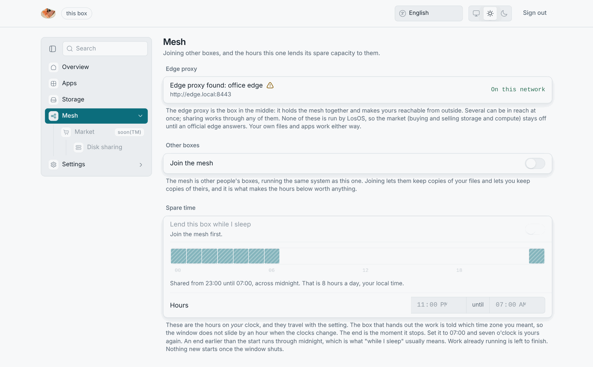
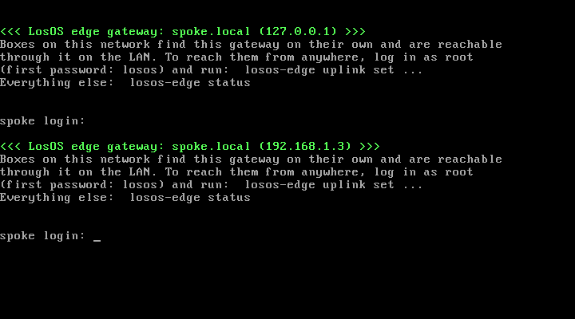

# A company with its own edge

A company runs several boxes on one network and an edge server of its own,
either on that network or on a server it rents. Everything stays inside the
company. The boxes find the edge on the LAN, share disk and CPU among
themselves, and answer under the company's domain through the company's
edge. On a network with no internet at all, this is how you pool storage.
One always-on machine on the LAN runs the edge, and the boxes find it on
their own.

## What is the same as the LosOS edge

- Remote access under the edge's domain, with no ports opened on the boxes.
- The mesh, with a shared, replicated disk pool and spare compute across the
  company's boxes, scheduled inside each box's own hours.
- Discovery on the LAN. A box on the same network finds the edge within one
  20-second scan without being told its address, and the Mesh pane shows it
  as **On this network**.
- The admin pages of every box stay LAN-only.

## What is different

- **No market.** A company's edge cannot present the LosOS signature, so
  every box treats it as unofficial;
  [official or not](official-edge#official-or-not) explains the check. Its
  row on the Mesh pane wears the warning sign, and the Market pane says "The edge proxy this box found is not run by LosOS.
  Sharing storage through it works; trading needs an official LosOS edge in
  reach." The company's own boxes share storage and compute among themselves
  for free, which is the point.
- **The company holds the keys.** The tunnel key pair, the cluster token and
  the allow-list of boxes live on the company's edge. Nothing about the
  company's data or traffic touches the LosOS project.
- **Updates still come from the project.** A company can point its boxes at
  a fork instead, because the upgrade source is a setting.

## Setting it up

The edge is a NixOS module that ships with LosOS, `nixosModules.edge`. You
install the edge server the same way a box is configured, with a short Nix
file. It names the public domain, the boxes allowed to connect, whether to
run the mesh control plane, and whether to announce itself on the LAN. The
operator's walkthrough is on the
[Master proxy](https://github.com/dasmatus/losos/wiki/Master-Proxy) and
[Mesh](https://github.com/dasmatus/losos/wiki/Mesh) wiki pages. The
repository also carries a demonstration of exactly this setup under
`demo/edge-lan/`: two boxes and an edge on one virtual network. `run.sh`
boots it, and `CHECKLIST.md` is the order it walks through.

In short:

1. Install NixOS on the edge server and import the module.
2. Set `losos.edge.publicDomain`, list each box under `losos.edge.tenants`
   with a token file, and turn `losos.edge.cluster.enable` on for the mesh.
3. For an edge on the company's own network, set `losos.edge.lan.advertise`
   to `true`. The edge then announces itself over mDNS, by default as
   `http://<edge>.local:8443`, and opens its API to the LAN. Every box on
   that network finds it with no configuration.
4. On each box, turn **Join the mesh** on, and **Reachable from outside your
   home** if the box should also be reached under the edge's domain. If the
   edge is *not* on the same network, first enter its address under
   Settings → Advanced, in `losos.proxy.registrarUrl`. mDNS announcements do
   not cross routers.

## Who this is for

Small companies that want the "one box per team, one pool for all" setup
with nothing leaving the building. They need someone who can run one NixOS
server. LosOS is meant to be sold in this shape.
