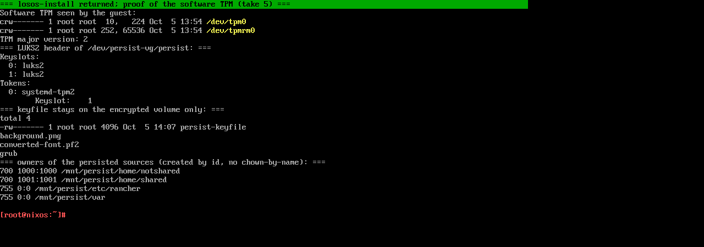
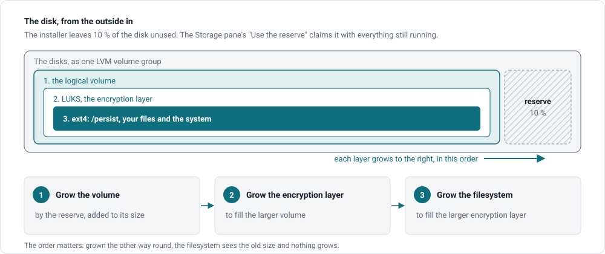

# Install variants

The installer makes two decisions and you make one. All of them are recorded
in a file on the box (`modules/install-target.nix`), so a reinstall from the
same medium repeats them and a nightly update never undoes them.

## How the disk is unlocked

Every box has an encrypted disk, formatted unattended from a random key the
installer generates. What differs is where that key lives at boot.

| Variant                    | When                                                     | What it means                                                                                                                         |
| -------------------------- | -------------------------------------------------------- | ------------------------------------------------------------------------------------------------------------------------------------- |
| **TPM** (the default)      | The installer found a TPM 2.0 chip                        | The key is sealed into the chip. The boot partition carries no secret. The disk on its own, pulled or cloned, is unreadable. The box still boots unattended. |
| **Keyfile**                | No chip, or `losos-ctl install --no-tpm`                  | The key is kept on the unencrypted boot partition so the box can boot unattended. Whoever takes the disk has the data. Fine for a VM or a test box. |

The installer prints which one it chose: `unlock: TPM` or `unlock: keyfile
in the initrd`. The TPM key is deliberately **not** bound to firmware
measurements: the box updates its firmware, bootloader and kernel on its own
and has no shell to recover a lockout from, so a thief who takes the whole
box with its chip can still boot it. The [security model](../reference/security-model)
is frank about that.

A box never asks for a passphrase at boot. If yours does, something is
wrong: see [Stuck at a passphrase prompt](../troubleshooting/stuck-at-passphrase).

## UEFI or BIOS

The installer's only question. **UEFI** gets systemd-boot; **BIOS** gets
GRUB and a 1 MiB boot partition on the first disk. **Autodetect** picks the
mode the stick was booted in and is what the menu takes after 30 seconds, so
an unattended boot still installs. UEFI needs the stick itself booted in UEFI
mode; from a BIOS-booted stick the installer refuses it before touching any
disk. BIOS is mainly for virtual machines. Under UEFI the stick is signed
and a firmware that has the LosOS certificate enrolled verifies it; the
installed box's own loader is not signed, so it needs Secure Boot off. See
[Secure Boot and signed media](../start/secure-boot).

## The three media

| Medium                       | Size      | Use                                                                                          |
| ---------------------------- | --------- | -------------------------------------------------------------------------------------------- |
| **Installer ISO**            | small     | The normal one, attached to every release. The target downloads the system it installs.      |
| **ISO with the full system** | large     | Carries the built system, so the install copies instead of downloads. Build it yourself.     |
| **Demo disk image** (QCOW2)  | large     | A preinstalled virtual disk for QEMU or virt-manager. No encryption, no installer. For demos. |

## Growing into the rest of the disk

The installer deliberately leaves 10 % of the disk unused, as a reserve the
box can grow into later without being opened. The Storage pane's **Use the
reserve** button claims it; see [Disk growth](../manual/disk-growth).

