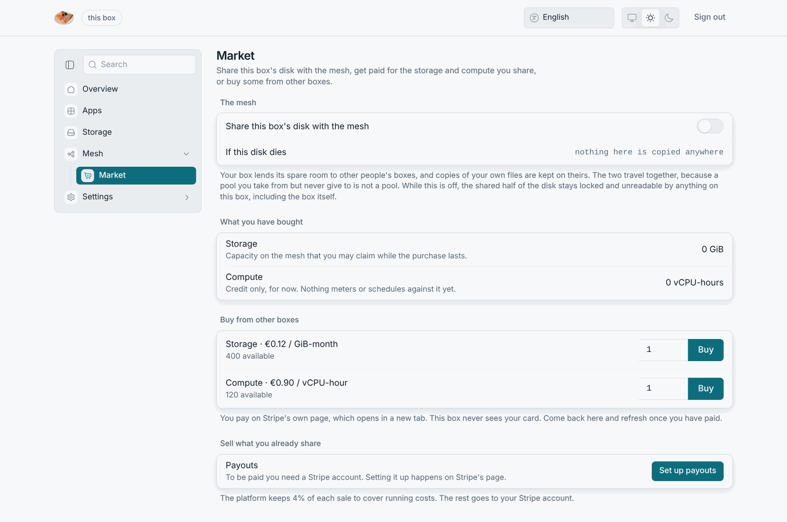
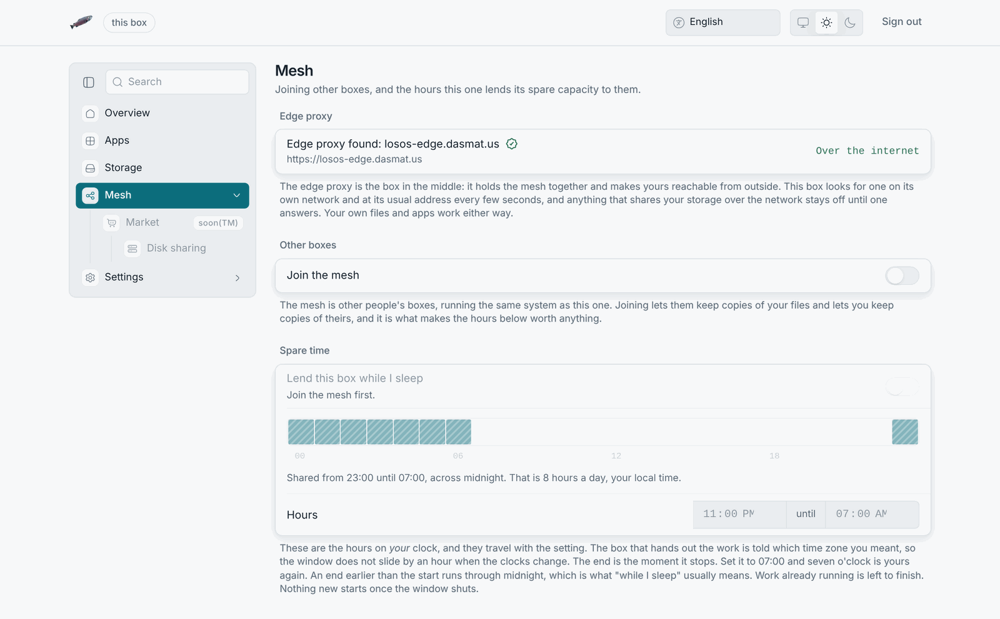
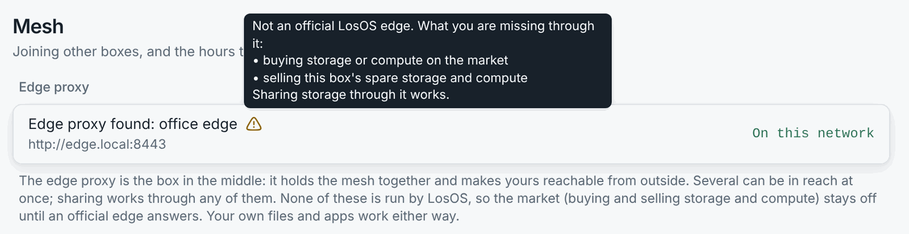

# A box with the LosOS edge

An **edge** is a server on the internet that a box keeps a tunnel open to.
Through it, the box gets a public address without opening a port at home,
and joins the mesh of other boxes. Once the market opens, the box can trade
there too. The project runs the **LosOS edge**, and only that edge's market
pays out.

## What the edge does for a box

| Feature                | How                                                                                                        |
| ---------------------- | ---------------------------------------------------------------------------------------------------------- |
| **Remote access**      | `https://<your-name>.<edge domain>` reaches LosOS cloud and LosOS Git through an encrypted tunnel the box opens outwards. The box never publishes the admin pages; they stay LAN-only, even through the tunnel. |
| **The mesh**           | The box joins a Kubernetes cluster the edge runs. Its spare disk becomes part of a shared, replicated pool; its spare CPU runs other people's work inside the hours you allow, only while the box is idle. |
| **The market**         | You get paid for the disk and CPU you share, and you can buy some from others. Buyers pay by card through Stripe, and the edge keeps a 4 % fee. The market is built end to end but not open yet, because a platform needs a registered business behind it. Until then the Market tab shows "soon". |
| **Find my box**        | The edge hosts the page that finds a box on your LAN from a browser.                                        |

## How a box finds its edge

Every 20 seconds the box looks for an edge in two places:

- **On the local network**, by DNS-SD. An edge set up to announce itself
  publishes `_losos-edge._tcp` over mDNS with the address of its API. The box
  finds it the same way it finds its own `.local` name.
- **At the configured address**. This is the LosOS edge's control plane
  unless the owner changed it under Settings → Advanced, in
  `losos.proxy.registrarUrl`. The box asks it whether or not **Reachable from
  outside your home** is on.

An edge counts as found once its `/health` answers. Several can be in reach
at once, for example a company's edge on the LAN and the LosOS edge over the
internet. The Mesh pane shows one row per edge, marked **On this network** or
**Over the internet**, with a sign saying whether the edge is official. The
next section explains that sign. If nothing answers, the pane shows **No edge
proxy found** and what the box tried: "This box searched its
network and asked `<address>`; nothing answered."

While nothing answers, the box refuses to turn network-dependent sharing
on. Switching storage to mesh mode, **Join the mesh** and **Share this
box's disk with the mesh** are greyed with "Needs an edge proxy in reach.",
and the box refuses any apply that turns one of them on anyway, with the same
reason. The box leaves settings that are already on alone. A box whose edge
went away keeps its configuration, can still change everything else, and can
always turn sharing *off*. Your own files and apps never depend on the edge.
The tunnel switch is not gated either. It reconnects when the edge answers
again.

## Official or not

Any edge that answers opens sharing. Only the LosOS edge may run the market,
so a box has to tell it apart from any other edge. Finding an edge and
trusting it with money are separate questions. Every box carries a LosOS root
public key. An official edge proves itself on every scan. It presents a
certificate signed with the matching private key, which only the project
holds, offline. It also signs a fresh challenge the box just made up, using
the certificate's own key. The box makes four checks, and the edge counts as
official only if all four pass.

The Mesh pane shows the result as a sign beside each edge's name. An
official edge gets a check. Any other edge gets a warning, with a tooltip
listing what that edge cannot do for this box: buy on the market, or sell
this box's spare storage and compute. A box that cannot verify the signature
treats the edge as a [company edge](company-edge). Discovery, remote access
and sharing work, trading does not, and the Market pane says "The edge proxy
this box found is not run by LosOS." Nothing a company configures can make
its own edge official. That is deliberate.

:::note[Until the key is published]
Every box ships with an empty root key file until the project publishes the
public key. Until then no edge is official, every edge wears the warning sign
and the market is off on every box. That is the safe direction to fail in.
:::

The project owner makes the key on their own computer, never on a box or an
edge. The tool that makes it first signs the person in with GitHub, and
refuses anyone whose account is not on a short list committed with the
project. The same tool signs each official edge's certificate and pushes it
to the edge over the web. The edge checks the same short list before it
accepts, and the edge's own key never leaves the edge. Operators will find
the steps in
[the provisioning runbook](https://github.com/dasmatus/losos/blob/main/provisioning/edge-identity/README.md).

Enrolment at the edge, which decides which box may tunnel through it, is a
separate matter. The edge keeps an allow-list of boxes, each with a token,
and whoever runs the edge adds a box to it.

## Settings that matter

| Pane     | Setting                                | What it does                                                            |
| -------- | -------------------------------------- | ----------------------------------------------------------------------- |
| Network  | Reachable from outside your home       | opens the tunnel to the edge                                            |
| Advanced | `losos.proxy.registrarUrl`             | the edge address asked over the internet, besides the local network     |
| Mesh     | Join the mesh                          | enrols this box in the edge's cluster; needs an edge in reach           |
| Mesh     | Lend this box while I sleep            | lends CPU inside the hours below, while idle; needs the mesh joined     |
| Mesh     | Hours                                  | the daily window, in this box's own time zone                           |
| Market   | Share this box's disk with the mesh    | lends spare room to the pool; needs an edge in reach; greyed with the market until it opens |

## What the edge sees

The edge sees the box's name, its heartbeat, which features it has on, and
the traffic it tunnels. That traffic is encrypted end to end with a key the
box pins on first contact. The edge does not see the admin pages, the owner's password or the disk key. The
[security model](../reference/security-model) lists the trust boundaries.

:::note[The demo edge]
For presentations, the edge's control plane also runs on Vercel at
`losos-edge.dasmat.us`, with its registry in a small database. That host can
register boxes and show them on a status page, but it cannot carry a tunnel,
run the mesh or take payments; those need the real edge server.
:::
