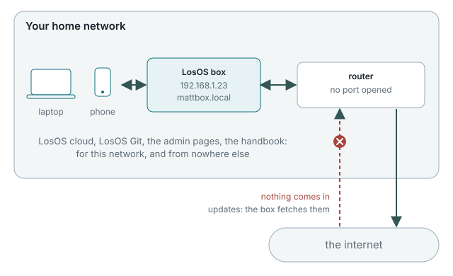

# A box on its own

The simplest LosOS, and what every box is right after the first run: one
machine on one local network, reachable from the computers and phones on
that network and from nowhere else.

## What you get

- LosOS cloud and LosOS Git at the box's address, for everyone on the
  network who has an account.
- The admin pages, unlocked with the owner's password.
- Nightly self-repair and self-update, an encrypted disk, the hardening
  baseline.
- The handbook you are reading, at `/handbook/`.

## What you do not get

- **No access from outside.** Nothing is published; no port is opened on your
  router. To reach your files from a café you would need the
  [LosOS edge](official-edge) or a VPN of your own into the home network.
- **No mesh.** The box has nobody to lend disk or CPU to, and the Mesh pane's
  switches stay off. Network-dependent storage sharing is refused when no
  edge is reachable, so the switch cannot be turned on by mistake.
- **No market.**

## When this is the right type

Most homes. A box on its own has the smallest surface: the only way in is a
browser on your LAN. Updates still arrive, because the box fetches them
itself; nothing about the update path needs an edge.

## Settings that matter

| Pane         | Setting                     | Default                                          |
| ------------ | --------------------------- | ------------------------------------------------ |
| Network      | Name                        | `losos` until you set one in the wizard           |
| Network      | Encrypt the connection      | on; the certificate is the box's own              |
| Network      | Reachable from outside      | off (this is what makes it a box on its own)      |
| Apps         | LosOS Git                   | on                                                |
| Hardware     | Graphics                    | off unless the box has a GPU you want pods to use |
| Security     | the four extra protections  | off; each one costs something                     |

Changing **Reachable from outside** to on, with an edge to talk to, turns the
box into the next type. Nothing is reinstalled.
