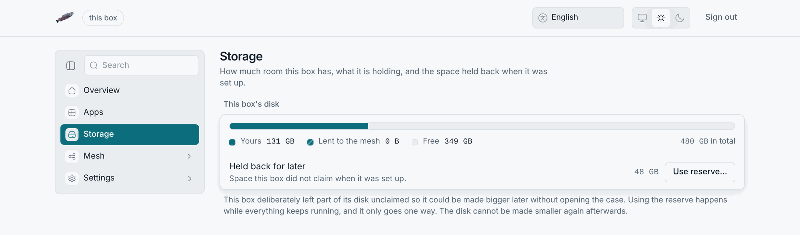
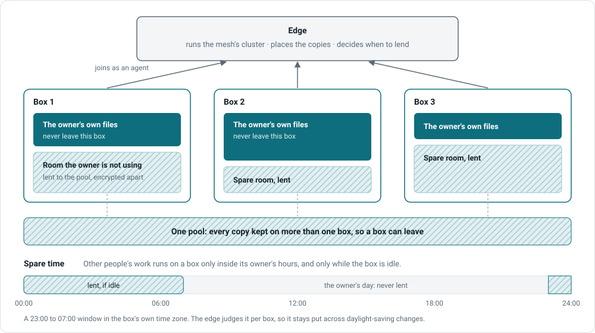
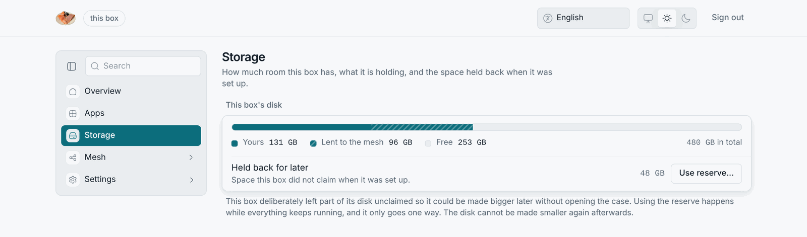
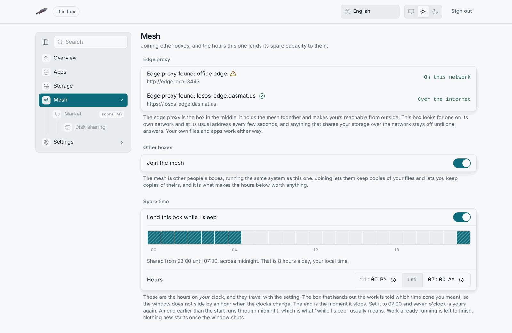

# Storage modes

The overview page's storage card shows one of two states, and the About
pane shows the same as a badge: **kept to itself**, drawn filled, or **shared
with the mesh**, drawn hatched. Wherever two things differ by texture rather
than colour, the admin pages use the same pairing: filled for this box,
hatched for the mesh.

## Kept to itself (default)

Everything you keep on the box stays on the box. The box copies nothing
anywhere else. The disk has two parts:

- the **room in use** by LosOS cloud, LosOS Git and the system;
- the **reserve**, the slice the installer held back. The Storage pane can
  claim it at any time; see [disk growth](../manual/disk-growth).

## Shared with the mesh

The box lends room it is not using to the mesh. That room joins a
replicated pool, which Longhorn runs across the boxes of one edge. In return
the box can claim room in the pool itself. Three things hold:

- Shared data lives in a separate account on the box, `shared`, in a
  directory encrypted with a key sealed to the TPM. When sharing is off, the
  box does not load the key, and the directory is unreadable even to the box
  itself. Your own files, under `notshared`, and the shared data cannot read
  each other.
- Sharing needs a reachable edge. Without one, the box refuses the switch.
- The switch sits on the **Market** pane, because lending disk and being paid
  for it are one decision. While the market shows "soon", the switch is
  greyed out along with it.

## Lending spare time (compute)

This is separate from disk and lives on the Mesh pane. A box runs other
people's work only when both of these hold:

1. the clock is inside the window you set, a start and an end in your time zone;
2. the box is idle.

Being busy can close the window early; nothing can open it outside the
hours. Anything unknown counts as busy. The edge judges the window in
your box's own time zone, so a 23:00 to 07:00 window stays 23:00 to 07:00
across daylight-saving changes.
