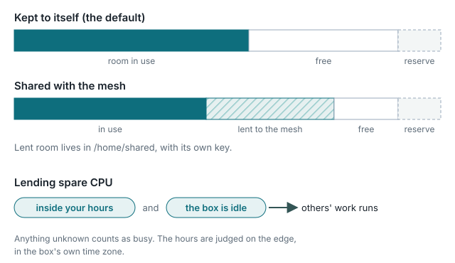
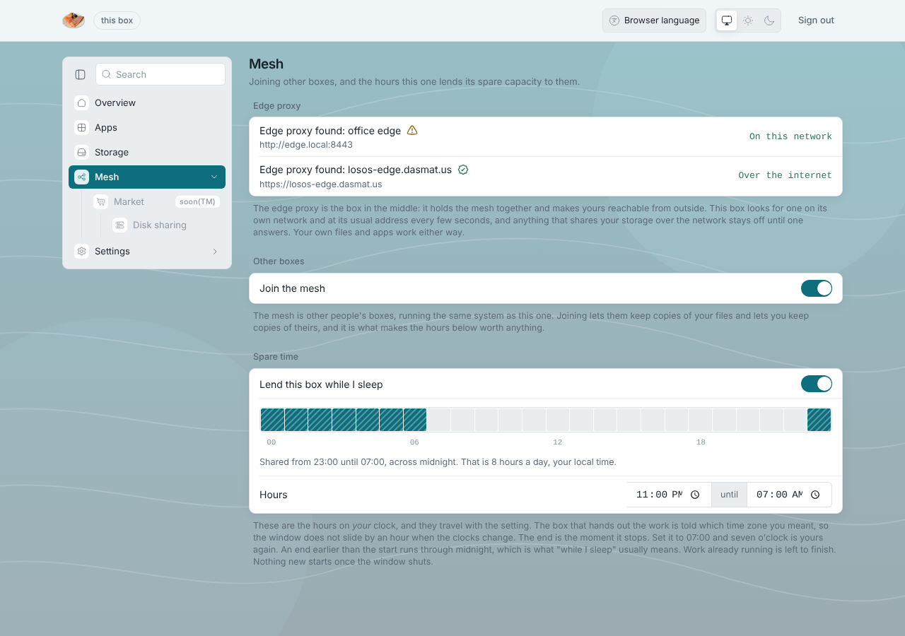

# Storage modes

The overview page's storage card shows one of two states, and the About
pane shows the same as a badge: **kept to itself** (filled) or **shared with
the mesh** (hatched). The same pairing, filled for this box and hatched for
the mesh, is used everywhere two things differ by texture rather than colour.

## Kept to itself (default)

Everything you keep on the box stays on the box. Nothing is copied anywhere
else. The disk has two parts:

- the **room in use** by LosOS cloud, LosOS Git and the system;
- the **reserve**: the slice the installer held back, which the Storage
  pane can claim at any time ([disk growth](../manual/disk-growth)).

## Shared with the mesh

Room the box is not using is lent to the mesh as part of a replicated pool
(Longhorn, across the boxes of one edge). In return the box can claim room
in the pool itself. Three things hold:

- Shared data lives in a separate account on the box (`shared`), in a
  directory encrypted with a key sealed to the TPM; when sharing is off, the
  key is not loaded and the directory is unreadable even to the box itself.
  Your own files (`notshared`) and the shared data cannot read each other.
- Sharing needs a reachable edge. Without one, the switch is refused.
- The switch sits on the **Market** pane, because lending disk and being paid
  for it are one decision. While the market is marked "soon", the switch is
  out of reach with it.

## Lending spare time (compute)

Separate from disk, and on the Mesh pane. A box runs other people's work
only when **both** hold:

1. the clock is inside the window you set (start and end, your time zone);
2. the box is idle.

Being busy can close the window early; nothing can open it outside the
hours. Anything unknown counts as busy. The window is judged on the edge, in
your box's own time zone, so a 23:00 to 07:00 window stays 23:00 to 07:00
across daylight-saving changes.
