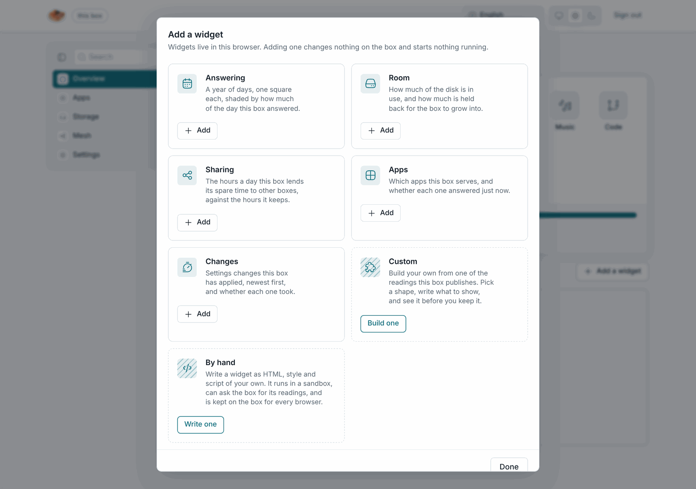
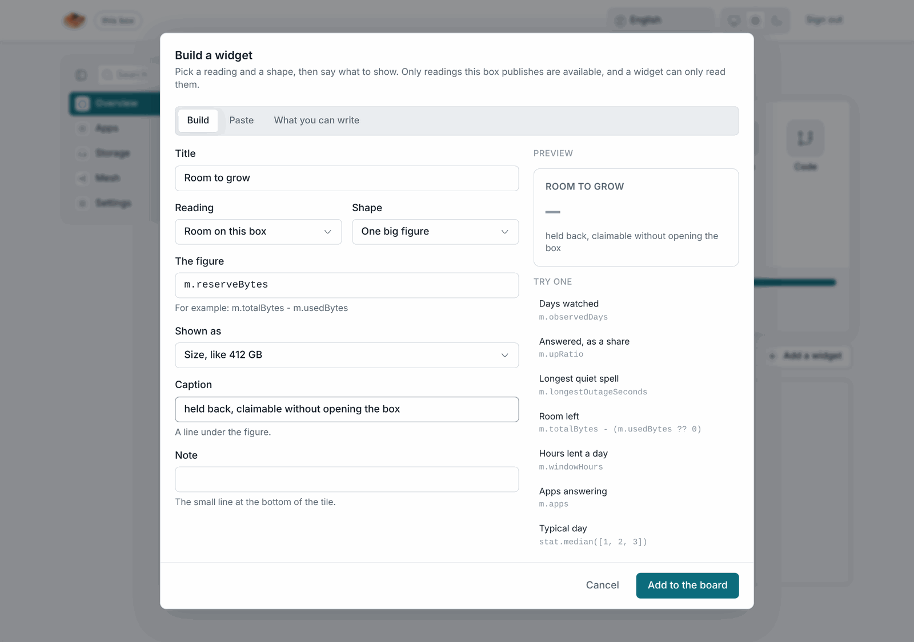

# Widget types

The overview page has a **board** of widgets, small tiles that each show
one thing about the box. **Add a widget** opens the gallery, which has
three kinds.

| Kind                     | Where it lives     | Can it run code?                 | How it gets the box's readings                       |
| ------------------------ | ------------------ | -------------------------------- | ---------------------------------------------------- |
| **Built-in**             | in the system      | yes, compiled into the admin page | directly                                             |
| **Built from readings**  | in this browser    | no                               | one reading, a few expressions in a small language    |
| **Written by hand**      | on the box         | yes, in a sandbox                | through the `losos` object, over messages             |

## Built-in

Five ship with the box. **Answering** shades a year of days by how much of
each day the box answered. **Room** shows disk in use and the reserve.
**Sharing** sets hours lent against hours kept. **Apps** shows which apps
answered just now. **Changes** lists the settings changes applied, newest
first. Each draws in one of four shapes: heatmap, number, bar or list.
Built-ins are part of the admin page's own code and arrive with system
updates.

## Built from readings

**Build one** makes a widget without code. You pick a reading the box
publishes, such as room on the disk, the mesh window or the settings, and a
shape. Then you write what to show with short expressions such as
`m.free / m.total`. **Build one** checks and previews the widget before you
keep it. The widget lives in the browser you made it in. It changes nothing
on the box and cannot reach the network, the page or anything but its one
reading. That also limits it: it cannot branch across readings, loop, or
remember anything between runs.

## Written by hand

**Write one** takes HTML, style and script of your own. The box stores the
widget, so every browser that opens the box sees it. It is listed on
**Settings → Look**, where you can edit and delete it.

A hand-written widget runs inside a sandboxed frame. The frame is an origin
of its own, with no access to the admin pages, the admin key or the box's
API. The widget talks to the box through a small `losos` object the frame
provides:

| Call                        | What it gives                                                                 |
| --------------------------- | ----------------------------------------------------------------------------- |
| `losos.metric(name)`        | a promise of one of the box's readings, the same names the built-ins use     |
| `losos.theme`, `losos.lang` | `light`/`dark` and the language the admin page is in                           |
| `losos.palette`             | the box's colours, also set as CSS variables (`var(--accent)` works)           |
| `losos.onTheme(fn)`         | called whenever the owner switches the theme                                  |
| `losos.resize()`            | asks the board to re-measure the tile                                         |

The editor's **Help** tab repeats this with an example. Its preview is the
real frame, so the tile shows exactly what the preview shows. A hand-written
widget may fetch from the internet, for a weather tile say, but it may not
reach the box's API. It runs in every browser that opens the box, so read
anything you paste from the internet before you keep it. The limit is 24
widgets of 64 KiB each.

See [Look and widgets](../manual/look-and-widgets) for the board itself,
backgrounds and the veil.
